# macOS Development

**You MUST use this skill for ANY macOS-specific development including windows, menus, sandboxing, distribution, AppKit bridging, and macOS SwiftUI differences.**

## Quick Reference

| Symptom / Task | Reference |
|----------------|-----------|
| Window management (WindowGroup, Window, MenuBarExtra, DocumentGroup) | See `skills/windows.md` |
| Menu bar, commands, keyboard shortcuts | See `skills/menus-and-commands.md` |
| Table, Inspector, NavigationSplitView, focus | See `skills/swiftui-differences.md` |
| App Sandbox, file access, security-scoped bookmarks | See `skills/sandbox-and-file-access.md` |
| Developer ID, notarization, Sparkle auto-updates | See `skills/direct-distribution.md` |
| NSViewRepresentable, NSHostingController, AppKit bridging, @Observable in AppKit, NSHostingMenu, SwiftUI scenes from AppKit | See `skills/appkit-interop.md` |
| Modernizing AppKit: mouseDown replacement, control events, status-item sessions, state restoration, concentric corners, touch (`OS27`) | See `skills/appkit-modernization.md` |
| Screen recording, sharing, or capture (ScreenCaptureKit) | See `skills/screencapturekit.md` |
| SCStream / SCContentFilter / screenshots / file recording API | See `skills/screencapturekit-ref.md` |
| Apple Pay on Mac / Catalyst | See `axiom-payments/skills/apple-pay.md` (Catalyst section) |

## Cross-Suite Routes

These topics overlap with macOS development but live in separate suites:

#### SwiftUI (shared iOS/macOS)
- View state, data flow, @Observable → See axiom-swiftui
- Navigation (NavigationStack basics) → See axiom-swiftui (skills/nav.md)
- Layout (ViewThatFits, AnyLayout) → See axiom-swiftui (skills/layout.md)
- Animations → See axiom-swiftui (skills/animation-ref.md)

#### Data & persistence
- SwiftData, Core Data, GRDB → See axiom-data
- CloudKit sync → See axiom-data

#### Concurrency
- Swift 6 concurrency, actors, Sendable → See axiom-concurrency

#### Other
- Accessibility (VoiceOver, Dynamic Type) → See axiom-accessibility
- Networking (URLSession, Network.framework) → See axiom-networking
- Security (Keychain, passkeys, encryption) → See axiom-security

## Conflict Resolution

**axiom-macos vs axiom-swiftui**: When working on a macOS SwiftUI app:
1. **Use axiom-macos** for macOS-only concerns: windows, menus, commands, sandboxing, distribution, Table, Inspector, AppKit bridging
2. **Use axiom-swiftui** for cross-platform SwiftUI: navigation, layout, state management, animations
3. **Both may apply**: A macOS app using NavigationSplitView with Table needs axiom-macos for Table specifics and axiom-swiftui for NavigationSplitView basics

**axiom-macos vs axiom-security**: For sandbox and code signing:
1. **Use axiom-macos** for macOS App Sandbox, security-scoped bookmarks, file access entitlements, Developer ID signing
2. **Use axiom-security** for Keychain storage, encryption, passkeys, certificate management

## Decision Tree

```dot
digraph macos {
    start [label="macOS development task" shape=ellipse];
    what [label="What area?" shape=diamond];

    start -> what;
    what -> "skills/windows.md" [label="windows/scenes"];
    what -> "skills/menus-and-commands.md" [label="menus/commands/shortcuts"];
    what -> "skills/swiftui-differences.md" [label="Table/Inspector/focus/macOS SwiftUI"];
    what -> "skills/sandbox-and-file-access.md" [label="sandbox/file access"];
    what -> "skills/direct-distribution.md" [label="distribution/notarization/updates"];
    what -> "skills/appkit-interop.md" [label="AppKit bridging"];
    what -> "skills/appkit-modernization.md" [label="modernize AppKit\n(input/restoration/27 look)"];
    what -> "skills/screencapturekit.md" [label="screen capture/\nrecording/sharing"];
    what -> "axiom-swiftui" [label="cross-platform SwiftUI"];
    what -> "axiom-security" [label="Keychain/encryption"];
}
```

> **iOS screen capture?** ScreenCaptureKit is macOS-only. For iOS screen recording, use ReplayKit — see axiom-media.

## Resources

**WWDC**: 2021-10062, 2022-10061, 2022-10075, 2023-10148, 2024-10149, 2026-272, 2026-289

**Docs**: /security/app-sandbox, /swiftui/windowgroup, /swiftui/table

**Skills**: axiom-swiftui, axiom-security, axiom-concurrency, axiom-uikit
