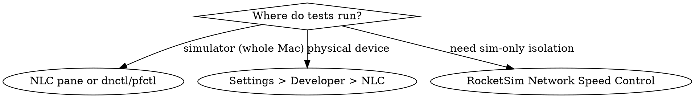

# UI Testing

## Overview

Wait for conditions, not arbitrary timeouts. **Core principle** Flaky tests come from guessing how long operations take. Condition-based waiting eliminates race conditions.

**NEW in WWDC 2025**: Recording UI Automation allows you to record interactions, replay across devices/languages, and review video recordings of test runs.

## Example Prompts

These are real questions developers ask that this skill is designed to answer:

#### 1. "My UI tests pass locally on my Mac but fail in CI. How do I make them more reliable?"
→ The skill shows condition-based waiting patterns that work across devices/speeds, eliminating CI timing differences

#### 2. "My tests use sleep(2) and sleep(5) but they're still flaky. How do I replace arbitrary timeouts with real conditions?"
→ The skill demonstrates waitForExistence, XCTestExpectation, and polling patterns for data loads, network requests, and animations

#### 3. "I just recorded a test using Xcode 26's Recording UI Automation. How do I review the video and debug failures?"
→ The skill covers Video Debugging workflows to analyze recordings and find the exact step where tests fail

#### 4. "My test is failing on iPad but passing on iPhone. How do I write tests that work across all device sizes?"
→ The skill explains multi-factor testing strategies and device-independent predicates for robust cross-device testing

#### 5. "I want to write tests that are not flaky. What are the critical patterns I need to know?"
→ The skill provides condition-based waiting templates, accessibility-first patterns, and the decision tree for reliable test architecture

---

## Red Flags — Test Reliability Issues

If you see ANY of these, suspect timing issues:
- Tests pass locally, fail in CI (timing differences)
- Tests sometimes pass, sometimes fail (race conditions)
- Tests use `sleep()` or `Thread.sleep()` (arbitrary delays)
- Tests fail with "UI element not found" then pass on retry
- Long test runs (waiting for worst-case scenarios)

## Quick Decision Tree

```
Test failing?
├─ Element not found?
│  └─ Use waitForExistence(timeout:) not sleep()
├─ Passes locally, fails CI?
│  └─ Replace sleep() with condition polling
├─ Animation causing issues?
│  └─ Wait for animation completion, don't disable
└─ Network request timing?
   └─ Use XCTestExpectation or waitForExistence
```

## Core Pattern: Condition-Based Waiting

**❌ WRONG (Arbitrary Timeout)**:
```swift
func testButtonAppears() {
    app.buttons["Login"].tap()
    sleep(2)  // ❌ Guessing it takes 2 seconds
    XCTAssertTrue(app.buttons["Dashboard"].exists)
}
```

**✅ CORRECT (Wait for Condition)**:
```swift
func testButtonAppears() {
    app.buttons["Login"].tap()
    let dashboard = app.buttons["Dashboard"]
    XCTAssertTrue(dashboard.waitForExistence(timeout: 5))
}
```

## Common UI Testing Patterns

### Pattern 1: Waiting for Elements

```swift
// Wait for element to appear
func waitForElement(_ element: XCUIElement, timeout: TimeInterval = 5) -> Bool {
    return element.waitForExistence(timeout: timeout)
}

// Usage
XCTAssertTrue(waitForElement(app.buttons["Submit"]))
```

### Pattern 2: Waiting for Element to Disappear

```swift
func waitForElementToDisappear(_ element: XCUIElement, timeout: TimeInterval = 5) -> Bool {
    let predicate = NSPredicate(format: "exists == false")
    let expectation = XCTNSPredicateExpectation(predicate: predicate, object: element)
    let result = XCTWaiter().wait(for: [expectation], timeout: timeout)
    return result == .completed
}

// Usage
XCTAssertTrue(waitForElementToDisappear(app.activityIndicators["Loading"]))
```

### Pattern 3: Waiting for Specific State

```swift
func waitForButton(_ button: XCUIElement, toBeEnabled enabled: Bool, timeout: TimeInterval = 5) -> Bool {
    let predicate = NSPredicate(format: "isEnabled == %@", NSNumber(value: enabled))
    let expectation = XCTNSPredicateExpectation(predicate: predicate, object: button)
    let result = XCTWaiter().wait(for: [expectation], timeout: timeout)
    return result == .completed
}

// Usage
let submitButton = app.buttons["Submit"]
XCTAssertTrue(waitForButton(submitButton, toBeEnabled: true))
submitButton.tap()
```

### Pattern 4: Accessibility Identifiers

**Set in app**:
```swift
Button("Submit") {
    // action
}
.accessibilityIdentifier("submitButton")
```

**Use in tests**:
```swift
func testSubmitButton() {
    let submitButton = app.buttons["submitButton"]  // Uses identifier, not label
    XCTAssertTrue(submitButton.waitForExistence(timeout: 5))
    submitButton.tap()
}
```

**Why**: Accessibility identifiers don't change with localization, remain stable across UI updates.

### Pattern 5: Network Request Delays

```swift
func testDataLoads() {
    app.buttons["Refresh"].tap()

    // Wait for loading indicator to disappear
    let loadingIndicator = app.activityIndicators["Loading"]
    XCTAssertTrue(waitForElementToDisappear(loadingIndicator, timeout: 10))

    // Now verify data loaded
    XCTAssertTrue(app.cells.count > 0)
}
```

### Pattern 6: Animation Handling

```swift
func testAnimatedTransition() {
    app.buttons["Next"].tap()

    // Wait for destination view to appear
    let destinationView = app.otherElements["DestinationView"]
    XCTAssertTrue(destinationView.waitForExistence(timeout: 2))

    // Do NOT add a fixed sleep to "let the animation settle." XCUITest
    // auto-waits for an element to become hittable before interacting, so the
    // next action already waits for the right condition. If you must assert
    // mid-transition, wait on a real post-animation element, never a delay.
    let primaryButton = app.buttons["Primary"]
    XCTAssertTrue(primaryButton.waitForExistence(timeout: 2))
}
```

## Testing Checklist

### Before Writing Tests
- [ ] Use accessibility identifiers for all interactive elements
- [ ] Avoid hardcoded labels (use identifiers instead)
- [ ] Plan for network delays and animations
- [ ] Choose appropriate timeouts (2s UI, 10s network)

### When Writing Tests
- [ ] Use `waitForExistence()` not `sleep()`
- [ ] Use predicates for complex conditions
- [ ] Test both success and failure paths
- [ ] Make tests independent (can run in any order)

### After Writing Tests
- [ ] Run tests 10 times locally (catch flakiness)
- [ ] Run tests on slowest supported device
- [ ] Run tests in CI environment
- [ ] Check test duration (if >30s per test, optimize)

## Xcode UI Testing Tips

### Launch Arguments for Testing

```swift
func testExample() {
    let app = XCUIApplication()
    app.launchArguments = ["UI-Testing"]
    app.launch()
}
```

In app code:
```swift
if ProcessInfo.processInfo.arguments.contains("UI-Testing") {
    // Use mock data, skip onboarding, etc.
}
```

### Faster Test Execution

```swift
override func setUpWithError() throws {
    continueAfterFailure = false  // Stop on first failure
}
```

### Debugging Failing Tests

```swift
func testExample() {
    // Take screenshot on failure
    addUIInterruptionMonitor(withDescription: "Alert") { alert in
        alert.buttons["OK"].tap()
        return true
    }

    // Print element hierarchy
    print(app.debugDescription)
}
```

## Common Mistakes

### ❌ Using sleep() for Everything
```swift
sleep(5)  // ❌ Wastes time if operation completes in 1s
```

### ❌ Not Handling Animations
```swift
app.buttons["Next"].tap()
XCTAssertTrue(app.buttons["Back"].exists)  // ❌ May fail during animation
```

### ❌ Hardcoded Text Labels
```swift
app.buttons["Submit"].tap()  // ❌ Breaks with localization
```

### ❌ Tests Depend on Each Other
```swift
// ❌ Test 2 assumes Test 1 ran first
func test1_Login() { /* ... */ }
func test2_ViewDashboard() { /* assumes logged in */ }
```

### ❌ No Timeout Strategy
```swift
element.waitForExistence(timeout: 100)  // ❌ Too long
element.waitForExistence(timeout: 0.1)  // ❌ Too short
```

**Use appropriate timeouts**:
- UI animations: 2-3 seconds
- Network requests: 10 seconds
- Complex operations: 30 seconds max

## Real-World Impact

**Before** (using sleep()):
- Test suite: 15 minutes (waiting for worst-case)
- Flaky tests: 20% failure rate
- CI failures: 50% require retry

**After** (condition-based waiting):
- Test suite: 5 minutes (waits only as needed)
- Flaky tests: <2% failure rate
- CI failures: <5% require retry

**Key insight** Tests finish faster AND are more reliable when waiting for actual conditions instead of guessing times.

---

## Recording UI Automation

### Overview

**NEW in Xcode 26**: Record, replay, and review UI automation tests with video recordings.

**Three Phases**:
1. **Record** — Capture interactions (taps, swipes, hardware button presses) as Swift code
2. **Replay** — Run across multiple devices, languages, regions, orientations
3. **Review** — Watch video recordings, analyze failures, view UI element overlays

**Supported Platforms**: iOS, iPadOS, macOS, watchOS, tvOS, visionOS (Designed for iPad)

### How UI Automation Works

**Key Principles**:
- UI automation interacts with your app **as a person does** using gestures and hardware events
- Runs **completely independently** from your app (app models/data not directly accessible)
- Uses **accessibility framework** as underlying technology
- Tells OS which gestures to perform, then waits for completion **synchronously** one at a time

**Actions include**:
- Launching your app
- Interacting with buttons and navigation
- Setting system state (Dark Mode, localization, etc.)
- Setting simulated location

### Accessibility is the Foundation

**Critical Understanding**: Accessibility provides information directly to UI automation.

What accessibility sees:
- Element types (button, text, image, etc.)
- Labels (visible text)
- Values (current state for checkboxes, etc.)
- Frames (element positions)
- **Identifiers** (accessibility identifiers — NOT localized)

**Best Practice**: Great accessibility experience = great UI automation experience.

### Preparing Your App for Recording

#### Step 1: Add Accessibility Identifiers

**SwiftUI**:
```swift
Button("Submit") {
    // action
}
.accessibilityIdentifier("submitButton")

// Make identifiers specific to instance
List(landmarks) { landmark in
    LandmarkRow(landmark)
        .accessibilityIdentifier("landmark-\(landmark.id)")
}
```

**UIKit**:
```swift
let button = UIButton()
button.accessibilityIdentifier = "submitButton"

// Use index for table cells
cell.accessibilityIdentifier = "cell-\(indexPath.row)"
```

**Good identifiers are**:
- ✅ Unique within entire app
- ✅ Descriptive of element contents
- ✅ Static (don't react to content changes)
- ✅ Not localized (same across languages)

**Why identifiers matter**:
- Titles/descriptions may change, identifiers remain stable
- Work across localized strings
- Uniquely identify elements with dynamic content

**Pro Tip**: Use Xcode coding assistant to add identifiers:
```
Prompt: "Add accessibility identifiers to the relevant parts of this view"
```

#### Step 2: Review Accessibility with Accessibility Inspector

**Launch Accessibility Inspector**:
- Xcode menu → Open Developer Tool → Accessibility Inspector
- Or: Launch from Spotlight

**Features**:
1. **Element Inspector** — List accessibility values for any view
2. **Property details** — Click property name for documentation
3. **Platform support** — Works on all Apple platforms

**What to check**:
- Elements have labels
- Interactive elements have types (button, not just text)
- Values set for stateful elements (checkboxes, toggles)
- Identifiers set for elements with dynamic/localized content

#### Step 3: Add UI Testing Target

1. Open project settings in Xcode
2. Click "+" below targets list
3. Select **UI Testing Bundle**
4. Click Finish

**Result**: New UI test folder with template tests added to project.

### Recording Interactions

#### Starting a Recording (Xcode 26)

1. Open UI test source file
2. **Popover appears** explaining how to start recording (first time only)
3. Click **"Start Recording"** button in editor gutter
4. Xcode builds and launches app in Simulator/device

**During Recording**:
- Interact with app normally (taps, swipes, text entry, etc.)
- Code representing interactions appears in source editor in real-time
- Recording updates as you type (e.g., text field entries)

**Stopping Recording**:
- Click **"Stop Run"** button in Xcode

#### Example Recording Session

```swift
func testCreateAustralianCollection() {
    let app = XCUIApplication()
    app.launch()

    // Tap "Collections" tab (recorded automatically)
    app.tabBars.buttons["Collections"].tap()

    // Tap "+" to add new collection
    app.navigationBars.buttons["Add"].tap()

    // Tap "Edit" button
    app.buttons["Edit"].tap()

    // Type collection name
    app.textFields.firstMatch.tap()
    app.textFields.firstMatch.typeText("Max's Australian Adventure")

    // Tap "Edit Landmarks"
    app.buttons["Edit Landmarks"].tap()

    // Add landmarks
    app.tables.cells.containing(.staticText, identifier:"Great Barrier Reef").buttons["Add"].tap()
    app.tables.cells.containing(.staticText, identifier:"Uluru").buttons["Add"].tap()

    // Tap checkmark to save
    app.navigationBars.buttons["Done"].tap()
}
```

#### Reviewing Recorded Code

After recording, **review and adjust queries**:

**Multiple Options**: Each line has dropdown showing alternative ways to address element.

**Selection Recommendations**:
1. **For localized strings** (text, button labels): Choose accessibility identifier if available
2. **For deeply nested views**: Choose shortest query (stays resilient as app changes)
3. **For dynamic content** (timestamps, temperature): Use generic query or identifier

**Example**:
```swift
// Recorded options for text field:
app.textFields["Collection Name"]              // ❌ Breaks if label localizes
app.textFields["collectionNameField"]          // ✅ Uses identifier
app.textFields.element(boundBy: 0)             // ✅ Position-based
app.textFields.firstMatch                      // ✅ Generic, shortest
```

**Choose shortest, most stable query** for your needs.

### Adding Validations

After recording, **add assertions** to verify expected behavior:

#### Wait for Existence

```swift
// Validate collection created
let collection = app.buttons["Max's Australian Adventure"]
XCTAssertTrue(collection.waitForExistence(timeout: 5))
```

#### Wait for Property Changes

```swift
// Wait for button to become enabled (first arg is a key path, not a literal)
let submitButton = app.buttons["Submit"]
XCTAssertTrue(submitButton.wait(for: \.isEnabled, toEqual: true, timeout: 5))
```

#### Combine with XCTAssert

```swift
// Fail test if element doesn't appear
let landmark = app.staticTexts["Great Barrier Reef"]
XCTAssertTrue(landmark.waitForExistence(timeout: 5), "Landmark should appear in collection")
```

### Advanced Automation APIs

#### Setup Device State

```swift
import XCTest
import CoreLocation  // XCUILocation wraps CLLocation

final class DeviceStateUITests: XCTestCase {
    private let app = XCUIApplication()  // instance property, shared across tests

    override func setUpWithError() throws {
        // Device orientation
        XCUIDevice.shared.orientation = .landscapeLeft

        // Force appearance mode (UIKit reads this from launch arguments)
        app.launchArguments += ["-UIUserInterfaceStyle", "Dark"]

        app.launch()

        // Simulate location — a settable property on the running device,
        // NOT a launch argument. There is no `-SimulatedLocation` argument.
        XCUIDevice.shared.location = XCUILocation(
            location: CLLocation(latitude: 37.7749, longitude: -122.4194)
        )
    }
}
```

#### Launch Arguments & Environment

```swift
func testWithMockData() {
    let app = XCUIApplication()

    // Pass arguments to app
    app.launchArguments = ["-UI-Testing", "-UseMockData"]

    // Set environment variables
    app.launchEnvironment = ["API_URL": "https://mock.api.com"]

    app.launch()
}
```

In app code:
```swift
if ProcessInfo.processInfo.arguments.contains("-UI-Testing") {
    // Use mock data, skip onboarding
}
```

#### Custom URL Schemes

```swift
// Launch the target app to a specific URL (instance method, iOS 16.4+)
let app = XCUIApplication()
app.openURL(URL(string: "myapp://landmark/123")!)

// Open a URL with the system's default app, via XCUISystem on XCUIDevice
XCUIDevice.shared.system.openURL(URL(string: "https://example.com")!)
```

#### Accessibility Audits in Tests

```swift
func testAccessibility() throws {
    let app = XCUIApplication()
    app.launch()

    // Perform accessibility audit
    try app.performAccessibilityAudit()
}
```

### Test Plans for Multiple Configurations

**Test Plans** let you:
- Include/exclude individual tests
- Set system settings (language, region, appearance)
- Configure test properties (timeouts, repetitions, parallelization)
- Associate with schemes for specific build settings

#### Creating Test Plan

1. Create new or use existing test plan
2. Add/remove tests on first screen
3. Switch to **Configurations** tab

#### Adding Multiple Languages

```
Configurations:
├─ English
├─ German (longer strings)
├─ Arabic (right-to-left)
└─ Hebrew (right-to-left)
```

**Each locale** = separate configuration in test plan.

**Settings**:
- Focused for specific locale
- Shared across all configurations

#### Video & Screenshot Capture

**In Configurations tab**:
- **Capture screenshots**: On/Off
- **Capture video**: On/Off
- **Keep media**: "Only failures" or "On, and keep all"

**Defaults**: Videos/screenshots kept only for failing runs (for review).

**"On, and keep all" use cases**:
- Documentation
- Tutorials
- Marketing materials

### Replaying Tests in Xcode Cloud

**Xcode Cloud** = built-in service for:
- Building app
- Running tests
- Uploading to App Store
- All in cloud without using team devices

**Workflow configuration**:
- Same test plan used locally
- Runs on multiple devices and configurations
- Videos/results available in App Store Connect

**Viewing Results**:
- Xcode: Xcode Cloud section
- App Store Connect: Xcode Cloud section
- See build info, logs, failure descriptions, video recordings

**Team Access**: Entire team can see run history and download results/videos.

### Reviewing Test Results with Videos

#### Accessing Test Report

1. Click **Test** button in Xcode
2. Double-click failing run to see video + description

**Features**:
- **Runs dropdown** — Switch between video recordings of different configurations (languages, devices)
- **Save video** — Secondary click → Save
- **Play/pause** — Video playback with UI interaction overlays
- **Timeline dots** — UI interactions shown as dots on timeline
- **Jump to failure** — Click failure diamond on timeline

#### UI Element Overlay at Failure

**At moment of failure**:
- Click timeline failure point
- **Overlay shows all UI elements** present on screen
- Click any element to see code recommendations for addressing it
- **Show All** — See alternative examples

**Workflow**:
1. Identify what was actually present (vs what test expected)
2. Click element to get query code
3. Secondary click → Copy code
4. **View Source** → Go directly to test
5. Paste corrected code

**Example**:
```swift
// Test expected:
let button = app.buttons["Max's Australian Adventure"]

// But overlay shows it's actually text, not button:
let text = app.staticTexts["Max's Australian Adventure"] // ✅ Correct
```

#### Running Test in Different Language

Click test diamond → Select configuration (e.g., Arabic) → Watch automation run in right-to-left layout.

**Validates**: Same automation works across languages/layouts.

### Recording UI Automation Checklist

#### Before Recording
- [ ] Add accessibility identifiers to interactive elements
- [ ] Review app with Accessibility Inspector
- [ ] Add UI Testing Bundle target to project
- [ ] Plan workflow to record (user journey)

#### During Recording
- [ ] Interact naturally with app
- [ ] Record complete user journeys (not individual taps)
- [ ] Check code generates as you interact
- [ ] Stop recording when workflow complete

#### After Recording
- [ ] Review recorded code options (dropdown on each line)
- [ ] Choose stable queries (identifiers > labels)
- [ ] Add validations (waitForExistence, XCTAssert)
- [ ] Add setup code (device state, launch arguments)
- [ ] Run test to verify it passes

#### Test Plan Configuration
- [ ] Create/update test plan
- [ ] Add multiple language configurations
- [ ] Include right-to-left languages (Arabic, Hebrew)
- [ ] Configure video/screenshot capture settings
- [ ] Set appropriate timeouts for network tests

#### Running & Reviewing
- [ ] Run test locally across configurations
- [ ] Review video recordings for failures
- [ ] Use UI element overlay to debug failures
- [ ] Run in Xcode Cloud for team visibility
- [ ] Download and share videos if needed

## Network Conditioning in Tests

### Overview

UI tests can pass on fast networks but fail on 3G/LTE. **Network Link Conditioner** simulates real-world network conditions to catch timing-sensitive crashes.

**Critical scenarios**:
- ❌ iPad Pro over Wi-Fi (fast) → pass
- ❌ iPad Pro over 3G (slow) → crash
- ✅ Test both to catch device-specific failures

### How conditioning actually works

Network Link Conditioner (NLC) is a **host-level macOS System Settings pane**. There is **no `XCUIApplication` launch argument, launch environment, or `simctl`/`devicectl` subcommand** that selects a profile — you enable conditioning *around* the test run, not from inside the test. Treat any `launchArguments`/`launchEnvironment` "network profile" switch as fiction; it is silently ignored.

**Critical caveat** NLC throttles the **entire Mac**. The Simulator shares the host network stack, so it inherits whatever NLC is doing — but conditioning cannot be scoped to one simulator or one app. SSH, package fetches, and everything else are throttled too while it runs.



**1. NLC pane (manual; simulator + host)** — install via *Xcode → Open Developer Tool → More Developer Tools* → download "Additional Tools for Xcode" → install the package from the **Hardware** folder. Then *System Settings → Network Link Conditioner*, pick a profile (3G, Edge, LTE, DSL, 100% Loss, High Latency DNS, Very Bad Network), Start, run tests, Stop.

**2. `dnctl`/`pfctl` (scriptable; CI — what NLC drives under the hood)** — NLC is a GUI over BSD `dummynet`. For headless CI, drive it directly (needs `sudo`; conditions the whole host, same caveat):
```bash
# 3G-like: 1.6 Mbit/s, 150 ms latency, 1% packet loss
sudo dnctl pipe 1 config bw 1600Kbit/s delay 150 plr 0.01
printf 'dummynet-anchor "nlc"\nanchor "nlc"\n' | sudo pfctl -f -
echo 'dummynet out proto tcp from any to any pipe 1' | sudo pfctl -a nlc -f -
sudo pfctl -E

xcodebuild test -scheme MyApp -destination 'platform=iOS Simulator,name=iPhone 16 Pro'

# Teardown
sudo pfctl -a nlc -F all && sudo pfctl -d && sudo dnctl -q flush
```
`pfctl -f -` replaces the **active** pf ruleset — fine on an ephemeral CI runner, but on a dev Mac that already runs pf, back up `/etc/pf.conf` first (and restore with `sudo pfctl -f /etc/pf.conf`).

**3. Physical device** — *Settings → Developer → Network Link Conditioner* (the Developer menu appears once the device has connected to Xcode). Built in, no install, and it conditions only that device.

**4. Simulator-only isolation** — to throttle just the Simulator without touching the rest of the Mac, RocketSim's Network Speed Control (third-party) scopes throttling to the Simulator app.

Because conditioning is external, the **test code itself stays normal** — it just needs realistic timeouts for the slow profile.

### No-sudo, automatable conditioning (app-layer `URLProtocol`)

Methods 1–4 condition the network *outside* the app (host kernel or a GUI). For **automated / CI / agent-driven** testing with **no sudo and no GUI**, condition *inside* the app: register a custom `URLProtocol` on the `URLSession` that returns a canned response with injected latency (optional jitter), a byte-rate cap (low bitrate), and deterministic or probabilistic failures.

Trade-off: app-layer sees only this app's `URLSession` traffic (not third-party SDKs or raw sockets) and needs a test hook — but no sudo, no host change, and deterministic by default (`jitter`/`failureRate` opt into controlled randomness). **It's the right default for unit/integration tests.**

It models *application-observable* network behavior (how fast bytes arrive, whether a request fails) — not transport-layer packet loss, jitter shape, or retransmit dynamics, which sit below `URLProtocol`. For true packet-level fidelity, use the OS-level (`dnctl`) or toxiproxy paths. Mocker (WeTransfer) and OHHTTPStubs wrap this if you'd rather not hand-roll it.

```swift
import Foundation
import Synchronization

/// Returns a canned response with injected conditions — latency (+ jitter), a
/// byte-rate cap (low bitrate), and hard or probabilistic failures. No sudo,
/// in-process; deterministic unless jitter/failureRate are set.
final class ThrottlingURLProtocol: URLProtocol {
    struct Conditions: Sendable {
        var latency: TimeInterval = 0       // seconds before first byte
        var jitter: TimeInterval = 0        // ± random seconds added to latency
        var bytesPerSecond: Int? = nil      // nil = unlimited (throughput cap)
        var failure: URLError.Code? = nil   // failure code (default .networkConnectionLost when only a rate is set)
        var failureRate: Double = 0         // 0...1 chance of failing this request; a failure code alone = always fail
        var body = Data()                   // canned response body (a whole, zero-based Data)
        var statusCode = 200
    }
    // Set by the test before launch. startLoading runs off the main thread
    // (an observed URLProtocol contract), so a lock keeps this Sendable-clean.
    static let conditions = Mutex(Conditions())

    override class func canInit(with request: URLRequest) -> Bool { true }
    override class func canonicalRequest(for request: URLRequest) -> URLRequest { request }
    override func stopLoading() {}

    override func startLoading() {
        guard let url = request.url else {
            client?.urlProtocol(self, didFailWithError: URLError(.badURL)); return
        }
        let c = Self.conditions.withLock { $0 }

        let delay = c.latency + (c.jitter > 0 ? Double.random(in: -c.jitter...c.jitter) : 0)
        if delay > 0 { Thread.sleep(forTimeInterval: delay) }   // off-main loading thread

        // A failure code alone = always fail; a failureRate rolls per request (flaky).
        let rate = c.failureRate > 0 ? c.failureRate : (c.failure != nil ? 1.0 : 0.0)
        if rate > 0, Double.random(in: 0..<1) < rate {
            client?.urlProtocol(self, didFailWithError: URLError(c.failure ?? .networkConnectionLost)); return
        }

        let response = HTTPURLResponse(url: url, statusCode: c.statusCode,
                                       httpVersion: "HTTP/1.1", headerFields: nil)!
        client?.urlProtocol(self, didReceive: response, cacheStoragePolicy: .notAllowed)

        if let rate = c.bytesPerSecond, rate > 0 {        // drip to simulate low bitrate
            let chunk = max(rate / 10, 1)
            var offset = 0
            while offset < c.body.count {
                let end = min(offset + chunk, c.body.count)
                client?.urlProtocol(self, didLoad: Data(c.body[offset..<end]))
                Thread.sleep(forTimeInterval: Double(end - offset) / Double(rate))
                offset = end
            }
        } else {
            client?.urlProtocol(self, didLoad: c.body)
        }
        client?.urlProtocolDidFinishLoading(self)
    }
}
```

Named profiles (NLC quotes bits/s; this harness is bytes/s, so ÷8):
```swift
extension ThrottlingURLProtocol.Conditions {
    static let edge    = Self(latency: 0.4, jitter: 0.1,  bytesPerSecond:    30_000)  // ~240 kbps
    static let threeG  = Self(latency: 0.1, jitter: 0.05, bytesPerSecond:   200_000)  // ~1.6 Mbps
    static let lte     = Self(latency: 0.05, bytesPerSecond: 6_250_000)               // ~50 Mbps
    static let flaky   = Self(failureRate: 0.3)                                       // 30% of requests drop
    static let offline = Self(failure: .notConnectedToInternet)
}
```

**Unit / integration tests** — inject directly, no app hook:
```swift
let config = URLSessionConfiguration.ephemeral
config.protocolClasses = [ThrottlingURLProtocol.self]
ThrottlingURLProtocol.conditions.withLock {
    $0 = .init(latency: 0.8, bytesPerSecond: 20_000, body: Data(#"{"ok":true}"#.utf8))
}
let session = URLSession(configuration: config)   // inject into code under test
```

**UI tests** — the harness lives in the app process, so gate it behind a launch argument the app reads at startup (works when UI tests stub the backend for determinism). To throttle a UI test's *real* backend traffic instead, use the OS-level paths (1–2) or the proxy below.
```swift
app.launchArguments += ["-NetworkProfile", "edge"]; app.launch()   // in the test

// app startup, test builds only:
let args = ProcessInfo.processInfo.arguments
if let i = args.firstIndex(of: "-NetworkProfile"), i + 1 < args.count {
    URLProtocol.registerClass(ThrottlingURLProtocol.self)
    // map args[i+1] ("edge"/"3g"/"loss"/"offline") → Conditions, then set it:
    ThrottlingURLProtocol.conditions.withLock { $0 = .init(latency: 0.4, bytesPerSecond: 30_000) }
}
```

### Proxy-level conditioning (toxiproxy) — optional, not bundled

When you must condition traffic the app's own `URLSession` doesn't own (third-party SDKs, raw sockets), or throttle a UI test's real backend, route it through [toxiproxy](https://github.com/Shopify/toxiproxy) — a TCP proxy whose "toxics" inject latency, bandwidth caps, and timeouts. **Axiom does not ship it; it is an optional dependency you install.** Skills/agents reaching for it MUST first check and, if absent, say the proxy path is unavailable and fall back to the `URLProtocol` harness above — never silently skip.

```bash
if command -v toxiproxy-server &> /dev/null && command -v toxiproxy-cli &> /dev/null; then
  toxiproxy-server &                                              # control API on :8474
  toxiproxy-cli create api --listen localhost:6443 --upstream api.example.com:443
  toxiproxy-cli toxic add api -t latency   -a latency=400 -a jitter=100
  toxiproxy-cli toxic add api -t bandwidth -a rate=30             # KB/s → low bitrate
else
  echo "toxiproxy NOT installed - proxy conditioning unavailable until you install it."
  echo "  Install: brew install toxiproxy"
  echo "  Docs:    https://github.com/Shopify/toxiproxy  ·  https://formulae.brew.sh/formula/toxiproxy"
  echo "  Fallback: the in-process URLProtocol harness above needs no install."
fi
```

**HTTPS caveat** toxiproxy forwards raw TCP, so it throttles encrypted bytes without MITM — but the app must connect to the proxy's `host:port`, which fails default TLS validation against a real public host (cert is for `api.example.com`, you connected to `localhost`). Clean only when the app's base URL is configurable to point at the proxy (a test backend, or a test-only trust override). No sudo either way. For app-traffic-only testing, prefer the `URLProtocol` path — no proxy, no cert wrinkle.

### Real-World Example: Photo Upload with Network Throttling

**❌ Without Network Conditioning**:
```swift
func testPhotoUpload() {
    app.buttons["Upload Photo"].tap()

    // Passes locally (fast network)
    XCTAssertTrue(app.staticTexts["Upload complete"].waitForExistence(timeout: 5))
}
// ✅ Passes locally, ❌ FAILS on 3G with timeout
```

**✅ With Network Conditioning**:
```swift
func testPhotoUploadOn3G() {
    let app = XCUIApplication()
    // Network Link Conditioner running (3G profile)
    app.launch()

    app.buttons["Upload Photo"].tap()

    // Increase timeout for 3G
    XCTAssertTrue(app.staticTexts["Upload complete"].waitForExistence(timeout: 30))

    // Verify no crash occurred
    XCTAssertFalse(app.alerts.element.exists, "App should not crash on 3G")
}
```

**Key differences**:
- Longer timeout (30s instead of 5s)
- Check for crashes
- Run on slowest expected network

---

## Multi-Factor Testing: Device Size + Network Speed

### The Problem

Tests can pass on device A but fail on device B due to layout differences + network delays. **Multi-factor testing** catches these combinations.

**Common failure patterns**:
- ✅ iPhone 14 Pro (compact, fast network)
- ❌ iPad Pro 12.9 (large, 3G network) → crashes
- ✅ iPhone 15 (compact, LTE)
- ❌ iPhone 12 (older GPU, 3G) → timeout

### Running the same tests across devices

**Device is not a test-plan setting** — you select it with `-destination` at `xcodebuild` time (or in the scheme). Run one test plan against several destinations to cover the device matrix. **Network is not a test-plan setting either** — condition it externally (NLC or `dnctl`, above) for the run.

A test plan *configuration* varies launch arguments, environment variables, localization (language/region), simulated location, sanitizers, and code coverage — not device, not network.

**Device matrix via destinations**:
```bash
# device names: xcrun simctl list devicetypes
for dest in \
  'platform=iOS Simulator,name=iPhone 16 Pro' \
  'platform=iOS Simulator,name=iPad Pro 13-inch (M4)' ; do
  xcodebuild test -scheme MyApp -testPlan UITests -destination "$dest"
done
```

Pair this with NLC/`dnctl` started beforehand to add a slow-network dimension (⚠️ large device + slow network is where most failures surface).

### Programmatic Device-Specific Testing

```swift
import XCTest
import UIKit

final class MultiFactorUITests: XCTestCase {
    private let app = XCUIApplication()

    private var deviceModel: String { UIDevice.current.model }

    // Larger/slower devices need longer waits — scale the timeout, never sleep.
    private var loadTimeout: TimeInterval {
        switch deviceModel {
        case "iPad" where UIScreen.main.bounds.width > 1000: return 30  // iPad Pro
        case "iPhone": return 10
        default: return 15
        }
    }

    override func setUpWithError() throws {
        continueAfterFailure = false
        app.launch()
    }

    func testListLoadingAcrossDevices() {
        app.buttons["Refresh"].tap()

        // Wait on a real condition with the device-scaled timeout. `count`
        // alone is read eagerly and would race the load.
        let firstCell = app.tables.cells.firstMatch
        XCTAssertTrue(
            firstCell.waitForExistence(timeout: loadTimeout),
            "List should load on \(deviceModel)"
        )

        // No crash dialog
        XCTAssertFalse(app.alerts.element.exists)
    }
}
```

### Real-World Example: iPad Pro + 3G Crash

**Scenario**: App works on iPhone 14, crashes on iPad Pro over 3G.

**Why it crashes**:
1. iPad Pro has larger layout (landscape)
2. 3G network is slow (latency 100ms+)
3. Images don't load in time, layout engine crashes
4. Single-device testing misses this combo

**Test that catches it**:
```swift
func testLargeLayoutOn3G() {
    let app = XCUIApplication()
    // Running with Network Link Conditioner on 3G profile
    app.launch()

    // iPad Pro: Large grid of images
    app.buttons["Browse"].tap()

    // Wait longer for images on slow network
    let firstImage = app.images["photoGrid-0"]
    XCTAssertTrue(
        firstImage.waitForExistence(timeout: 20),
        "First image must load on slow network"
    )

    // Verify grid loaded without crash
    // matching(_:) takes an NSPredicate (matching(identifier:) takes a String)
    let loadedCount = app.images.matching(NSPredicate(format: "identifier BEGINSWITH 'photoGrid'")).count
    XCTAssertGreaterThan(loadedCount, 5, "Multiple images should load on 3G")

    // No alerts (no crashes)
    XCTAssertFalse(app.alerts.element.exists, "App should not crash on large device + slow network")
}
```

### Running Multi-Factor Tests in CI

A single `xcodebuild test` runs on **one** destination with **whatever network the host currently has**. To cover the matrix, loop destinations and condition the network around the loop:
```yaml
- name: Run tests across devices (3G-conditioned)
  run: |
    sudo dnctl pipe 1 config bw 1600Kbit/s delay 150 plr 0.01
    printf 'dummynet-anchor "nlc"\nanchor "nlc"\n' | sudo pfctl -f -
    echo 'dummynet out proto tcp from any to any pipe 1' | sudo pfctl -a nlc -f -
    sudo pfctl -E
    for dest in \
      'platform=iOS Simulator,name=iPhone 16 Pro' \
      'platform=iOS Simulator,name=iPad Pro 13-inch (M4)' ; do
      xcodebuild test -scheme MyApp -testPlan UITests -destination "$dest"
    done
    sudo pfctl -a nlc -F all && sudo pfctl -d && sudo dnctl -q flush
```

**Result**: Catch device-specific + slow-network crashes before App Store submission. Hosted CI that disallows `sudo` (e.g. Xcode Cloud) can't shape the network this way — condition on a physical device or drop the network dimension there.

---

## Simulator control from CI: devicectl

`devicectl` manages **simulators and physical devices through one interface** — every `device` leaf command takes `-d/--device <udid|name|ecid|…>`, which accepts a simulator UDID or a physical-device identifier, so the same script drives a real iPhone in the dev loop and a simulator in CI with no branching. This is **not new in Xcode 27**: the `devicectl` CLI is byte-identical across the Xcode 26 and 27 toolchains (binary 629.3, verified on 26.6 and 27.0). **Device Hub** (the Xcode 27 GUI that replaces `Simulator.app`) is a front-end over these same operations — see `axiom-build (skills/xcode-debugging.md)` for the Device Hub workflow and the unified `list devices` inventory.

**Parse `--json-output <path>`, never stdout.** devicectl guarantees the JSON file is versioned and stable across releases; its stdout is explicitly *not* stable. `simctl`'s human output never carried that guarantee — the stability contract, not the unified syntax, is the real CI win.

### Interaction vs lifecycle — devicectl does NOT replace simctl

devicectl **configures and interacts** with a device/sim; it has no `create`/`boot`/`erase`. simctl still owns the simulator lifecycle and is still required.

| Need | Tool |
|------|------|
| create / boot / shutdown / erase a sim | `xcrun simctl boot\|shutdown\|erase` |
| pick the test destination | `xcodebuild -destination` |
| configure / interact with a booted sim or device | `xcrun devicectl` |

CI order is unchanged at the front: simctl or xcodebuild boots the sim → devicectl configures it → run tests.

### Simulator-capable subcommands (verified on Xcode 26.6 + 27.0)

| Subcommand | On simulator | Use |
|------------|--------------|-----|
| `device info displays` | works (verified) | bounds, pointScale, nativeSize, `framebufferMaskIdentifier` (exact JSON keys) |
| `device orientation get` (also `set`, `rotate`) | works (`get` verified) | orientation without entering the app |
| `device settings biometrics [--enable\|--disable]` | works (verified) | enroll / unenroll Face ID / Touch ID |
| `device simulate biometrics --success\|--failure` | works (verified) | drive a match / no-match |
| `device settings appearance --mode light\|dark` | works (verified) | force Dark/Light; also `--look-and-feel clear\|tinted`, text size, contrast |
| `device simulate location` / `device simulate statusBar` | available | inject location; clean status bar for screenshots |
| `device process sendMemoryWarning` | available | memory-pressure scenarios |
| `device info lockState` / `info files` / `copy` / `profile *` | physical-device-only | see caveat below |

### Face ID in CI (verified end-to-end on a simulator)

simctl has **no** biometric command — enrolling/matching was a GUI-only Simulator menu, unscriptable. devicectl makes it a CI primitive:

```bash
SIM=$(xcrun simctl list devices booted | grep -Eo '[0-9A-F-]{36}' | head -1)

xcrun devicectl device settings biometrics -d "$SIM" --enable    # enroll
xcrun devicectl device simulate biometrics -d "$SIM" --success   # match (use --failure for the reject path)
# … run the XCUITest that asserts the unlocked state …
xcrun devicectl device settings biometrics -d "$SIM" --disable   # restore
```

The flags are `--success` / `--failure` (mutually exclusive) — **not** `--match`.

### Capability not supported on a simulator

Some capabilities are physical-device-only on a simulator. They fail with a **distinct, detectable** error — not a crash, not a silent no-op:

```
ERROR: The capability "Get Lock State" is not supported by this device.
       (com.apple.dt.CoreDeviceError error 1001)
```

`info lockState` is confirmed device-only; `info files`, `copy`, and `profile *` are reported device-only on simulators. In CI, treat `CoreDeviceError 1001` as "skip on simulator" rather than a failure.

### simctl still owns simulator-only features

devicectl works on simulators across Xcode 26+, so this is not a Xcode-27-only path and needs no toolchain gate. But `simctl` stays primary for simulator-only control devicectl doesn't cover — push notifications, privacy permissions, media injection, and the `status_bar` / `location` / `ui appearance` overrides. Use whichever you already script; reach for devicectl when you want one `-d` selector and stable JSON across device + simulator.

For the in-test (in-process) counterpart to this out-of-process control — `XCUIDevice.shared.orientation` / `.location` set inside the test — see [Setup Device State](#setup-device-state) above. devicectl configures the sim *around* the run; XCUIDevice configures it *from inside* the run.

---

## Debugging Crashes Revealed by UI Tests

### Overview

UI tests sometimes reveal crashes that don't happen in manual testing. **Key insight** Automated tests run faster, interact with app differently, and can expose concurrency/timing bugs.

**When crashes happen**:
- ❌ Manual testing: Can't reproduce (works when you run it)
- ✅ UI Test: Crashes every time (automated repetition finds race condition)

### Recognizing Test-Revealed Crashes

**Signs in test output**:
```
Failing test: testPhotoUpload
Error: The app crashed while responding to a UI event
App died from an uncaught exception
Stack trace: [EXC_BAD_ACCESS in PhotoViewController]
```

**Video shows**: App visibly crashes (black screen, immediate termination).

### Systematic Debugging Approach

#### Step 1: Capture Crash Details

**Enable detailed logging**:
```swift
override func setUpWithError() throws {
    let app = XCUIApplication()

    // Enable all logging (configure via launchEnvironment before launch())
    app.launchEnvironment = [
        "OS_ACTIVITY_MODE": "debug",
        "DYLD_PRINT_STATISTICS": "1"
    ]

    app.launch()
}
```

#### Step 2: Reproduce Locally

```swift
func testReproduceCrash() {
    let app = XCUIApplication()
    app.launch()

    // Run exact sequence that causes crash
    app.buttons["Browse"].tap()
    app.buttons["Photo Album"].tap()
    app.buttons["Select All"].tap()
    app.buttons["Upload"].tap()

    // Should crash here
    let uploadButton = app.buttons["Upload"]
    XCTAssertFalse(uploadButton.exists, "App crashed (expected)")

    // Don't assert - just let it crash and read logs
}
```

**Run test with Console logs visible**:
- Xcode: View → Navigators → Show Console
- Watch for exception messages

#### Step 3: Analyze Crash Logs

**Locations**:
1. Xcode Console (real-time, less detail)
2. `~/Library/Logs/DiagnosticReports/*.ips` (full crash reports on current macOS)
3. Device Settings → Privacy & Security → Analytics & Improvements → Analytics Data

For parsing and symbolicating `.ips`/MetricKit/`.crash` reports, use Axiom's `xcsym` tool or the crash-analyzer agent instead of reading them by hand.

**Look for**:
- Thread that crashed
- Exception type (EXC_BAD_ACCESS, EXC_CRASH, etc.)
- Stack trace showing which method crashed

**Example crash log**:
```
Exception Type: EXC_BAD_ACCESS (SIGSEGV)
Exception Codes: KERN_INVALID_ADDRESS at 0x0000000000000000
Thread 0 Crashed:
0  MyApp    0x0001a234 -[PhotoViewController reloadPhotos:] + 234
1  MyApp    0x0001a123 -[PhotoViewController viewDidLoad] + 180
```

**This tells us**:
- Crash in `PhotoViewController.reloadPhotos(_:)`
- Likely null pointer dereference
- Called from `viewDidLoad`

#### Step 4: Connection to Swift Concurrency Issues

**Most UI test crashes are concurrency bugs** (not specific to UI testing). Reference related skills:

```swift
// Common pattern: Race condition in async image loading
class PhotoViewController: UIViewController {
    var photos: [Photo] = []

    override func viewDidLoad() {
        super.viewDidLoad()

        // ❌ WRONG: Accessing photos array from multiple threads
        Task {
            let newPhotos = await fetchPhotos()
            self.photos = newPhotos  // May crash if main thread access
            reloadPhotos()  // ❌ Crash here
        }
    }
}

// ✅ CORRECT: UIViewController is already @MainActor-isolated, so a Task
// started in viewDidLoad runs on the main actor and resumes there after the
// await — no per-property @MainActor and no MainActor.run hop needed. The
// original bug wasn't the assignment; it was doing UI work without that
// guarantee.
class PhotoViewController: UIViewController {
    var photos: [Photo] = []

    override func viewDidLoad() {
        super.viewDidLoad()

        Task {
            let newPhotos = await fetchPhotos()  // suspends, resumes on MainActor
            self.photos = newPhotos
            reloadPhotos()  // ✅ Safe — still on the main actor
        }
    }
}
```

**For deep crash analysis**: See `axiom-concurrency` (swift-concurrency reference) for @MainActor patterns and `axiom-performance (skills/memory-debugging.md)` skill for thread-safety issues.

#### Step 5: Add Crash-Prevention Tests

**After fixing**:
```swift
func testPhotosLoadWithoutCrash() {
    let app = XCUIApplication()
    app.launch()

    // Rapid fire interactions that previously caused crash
    app.buttons["Browse"].tap()
    app.buttons["Photo Album"].tap()

    // Load should complete without crash
    let photoGrid = app.otherElements["photoGrid"]
    XCTAssertTrue(photoGrid.waitForExistence(timeout: 10))

    // No alerts (no crash dialogs)
    XCTAssertFalse(app.alerts.element.exists)
}
```

#### Step 6: Stress Test to Verify Fix

```swift
func testPhotosLoadUnderStress() {
    let app = XCUIApplication()
    app.launch()

    // Repeat the crash-causing action multiple times
    for iteration in 0..<10 {
        app.buttons["Browse"].tap()

        // Wait for load
        let grid = app.otherElements["photoGrid"]
        XCTAssertTrue(grid.waitForExistence(timeout: 10), "Iteration \(iteration)")

        // Go back
        app.navigationBars.buttons["Back"].tap()
        app.buttons["Refresh"].tap()
    }

    // Completed without crash — assert a real end state, not `true`
    XCTAssertTrue(app.otherElements["photoGrid"].exists, "Grid should survive 10 navigation cycles")
    XCTAssertFalse(app.alerts.element.exists, "No crash dialog after stress loop")
}
```

### Prevention Checklist

#### Before releasing
- [ ] Run UI tests on slowest network (3G)
- [ ] Run on largest device (iPad Pro)
- [ ] Run on oldest supported device (iPhone 12)
- [ ] Record video of test runs (saves debugging time)
- [ ] Check for crashes in logs
- [ ] Run stress tests (10x repeated actions)
- [ ] Verify UI-state mutations run on the main actor
- [ ] Check for race conditions in async code

---

## Resources

**WWDC**: 2025-344, 2024-10179, 2023-10269, 2023-10175, 2023-10035, 2022-110371

**Docs**: /xctest, /xcuiautomation/recording-ui-automation-for-testing, /xctest/xctwaiter, /accessibility/delivering_an_exceptional_accessibility_experience, /accessibility/performing_accessibility_testing_for_your_app

**Note**: This skill focuses on reliability patterns and Recording UI Automation. For TDD workflow, see superpowers:test-driven-development.

---

**History:** See git log for changes
