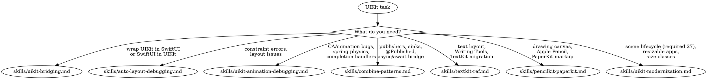

# UIKit & Bridging

**You MUST use this skill for ANY UIKit bridging, Auto Layout, Combine, TextKit, or UIKit animation work.**

## Quick Reference

| Symptom / Task | Reference |
|----------------|-----------|
| UIViewRepresentable, UIViewControllerRepresentable | See `skills/uikit-bridging.md` |
| Embedding SwiftUI in UIKit (UIHostingController) | See `skills/uikit-bridging.md` |
| Coordinator pattern, updateUIView lifecycle | See `skills/uikit-bridging.md` |
| "Unable to simultaneously satisfy constraints" | See `skills/auto-layout-debugging.md` |
| Constraint conflicts, ambiguous layout | See `skills/auto-layout-debugging.md` |
| Views not appearing, positioned incorrectly | See `skills/auto-layout-debugging.md` |
| CAAnimation completion handler not firing | See `skills/uikit-animation-debugging.md` |
| Spring physics wrong on device, duration mismatch | See `skills/uikit-animation-debugging.md` |
| Animation jank, CATransaction timing | See `skills/uikit-animation-debugging.md` |
| Combine publishers, AnyCancellable lifecycle | See `skills/combine-patterns.md` |
| @Published properties, Combine ↔ async/await | See `skills/combine-patterns.md` |
| When to use Combine vs async/await | See `skills/combine-patterns.md` |
| UIScene lifecycle required, resizable apps, size classes, tab sidebar `OS27` | See `skills/uikit-modernization.md` |
| TextKit 2 architecture, NSTextLayoutManager | See `skills/textkit-ref.md` |
| Writing Tools integration (iOS 26) | See `skills/textkit-ref.md` |
| Viewport rendering surfaces, attachment reuse, collapsible text `OS27` | See `skills/textkit-ref.md` |
| SwiftUI TextEditor, TextKit 1 migration | See `skills/textkit-ref.md` |
| PencilKit canvas, PKToolPicker, drawing persistence | See `skills/pencilkit-paperkit.md` |
| Apple Pencil Pro (squeeze, barrel roll, hover, haptics) | See `skills/pencilkit-paperkit.md` |
| Handwriting recognition (PKStrokeRecognizer), stroke identity/slicing `OS27` | See `skills/pencilkit-paperkit-ref.md` |
| PaperKit markup canvas (shapes, images, text + drawing) | See `skills/pencilkit-paperkit-ref.md` |
| PaperKit programmatic markup model (subelements, adornments) `OS27` | See `skills/pencilkit-paperkit-ref.md` |

## Decision Tree

0. Scene-lifecycle migration, "app won't launch on 27", resizability, size classes, tab sidebar? → `skills/uikit-modernization.md`
1. UIViewRepresentable / UIViewControllerRepresentable / UIHostingController? → `skills/uikit-bridging.md`
2. "Unable to simultaneously satisfy constraints" / layout bugs? → `skills/auto-layout-debugging.md`
3. CAAnimation completion missing / spring physics wrong / animation jank? → `skills/uikit-animation-debugging.md`
4. Combine publishers / AnyCancellable / @Published / Combine ↔ async bridge? → `skills/combine-patterns.md`
5. TextKit 2 / Writing Tools / TextEditor / TextKit 1 migration? → `skills/textkit-ref.md`
6. PencilKit canvas / Apple Pencil / PaperKit markup? → `skills/pencilkit-paperkit.md`
7. Pure SwiftUI view question (no UIKit bridging)? → `/skill axiom-swiftui`
8. Design decisions, HIG, Liquid Glass, SF Symbols, typography? → `/skill axiom-design`
9. Block retain cycles in UIKit callbacks? → See axiom-performance (`skills/objc-block-retain-cycles.md`)
10. Memory leaks from Combine subscriptions? → Start with `skills/combine-patterns.md`, then axiom-performance if leak persists

## Conflict Resolution

**uikit vs swiftui**: When working with UI code:
- **Use uikit** when wrapping UIKit in SwiftUI or vice versa, or debugging UIKit-specific issues (Auto Layout, CAAnimation)
- **Use swiftui** for pure SwiftUI views, navigation, layout, animations

**uikit vs concurrency**: When Combine interacts with async/await:
- **Use uikit** (`skills/combine-patterns.md`) for bridging Combine pipelines with async/await
- **Use concurrency** for pure async/await patterns, actors, Sendable

**uikit vs performance**: When animations or layout cause performance issues:
1. **Try uikit FIRST** — Most animation jank is CATransaction timing or layer state, not a profiling issue
2. **Only use performance** if animation logic is correct but rendering is slow

**uikit vs axiom-data**: When @Published properties relate to data persistence:
- **Use uikit** for Combine publisher patterns and @Published lifecycle
- **Use axiom-data** for SwiftData/Core Data model layer concerns

## Anti-Rationalization

| Thought | Reality |
|---------|---------|
| "I'll just use UIHostingController, it's simple" | Hosting has sizing, lifecycle, and navigation edge cases. `skills/uikit-bridging.md` covers the gotchas. |
| "Auto Layout error is just a warning, I'll ignore it" | Unsatisfied constraints cause unpredictable layout at runtime. Fix them now. |
| "I know how CAAnimation works" | 90% of CAAnimation bugs are CATransaction timing, not Core Animation. Check `skills/uikit-animation-debugging.md`. |
| "Combine is dead, just rewrite with async/await" | Combine has no deprecation notice. Rewriting working pipelines wastes time. `skills/combine-patterns.md` covers when to migrate vs maintain. |
| "TextKit 1 still works fine" | TextKit 1 misses Writing Tools integration and has known layout bugs Apple won't fix. See `skills/textkit-ref.md`. |
| "I'll store cancellables in a local variable" | Local AnyCancellable deallocates immediately, killing the subscription. |
| "I'll archive the PKCanvasView to save the drawing" | Archiving the view loses editability. Persist `drawing.dataRepresentation()`. See `skills/pencilkit-paperkit.md`. |
| "My tool picker won't show, the API must be broken" | The canvas must `becomeFirstResponder()` after `setVisible(_:forFirstResponder:)`. See `skills/pencilkit-paperkit.md`. |

## Example Invocations

User: "How do I wrap a UIKit view in SwiftUI?"
→ Read: `skills/uikit-bridging.md`

User: "I'm getting 'Unable to simultaneously satisfy constraints'"
→ Read: `skills/auto-layout-debugging.md`

User: "My CAAnimation completion handler never fires"
→ Read: `skills/uikit-animation-debugging.md`

User: "Should I use Combine or async/await for this?"
→ Read: `skills/combine-patterns.md`

User: "How do I integrate Writing Tools with my text editor?"
→ Read: `skills/textkit-ref.md`

User: "How do I add an Apple Pencil drawing canvas with the tool picker?"
→ Read: `skills/pencilkit-paperkit.md`

User: "How do I add a PaperKit markup canvas with shapes and text?"
→ Read: `skills/pencilkit-paperkit-ref.md`

User: "My SwiftUI view has a memory leak from a Combine subscription"
→ Read: `skills/combine-patterns.md`

User: "How do I embed SwiftUI in my UIKit app?"
→ Read: `skills/uikit-bridging.md`
