# watchOS Development

**You MUST use this skill for ANY watchOS-specific development including app structure, independent apps, Watch Connectivity, complications and Smart Stack widgets, controls, Live Activities on watch, background tasks, and ClockKit migration.**

## Quick Reference

| Symptom / Task | Reference |
|----------------|-----------|
| App structure, independent apps, watchOS 26 submission requirements | See `skills/platform-basics.md` |
| watchOS HIG, glanceable UX, navigation model | See `skills/design-for-watchos.md` |
| Smart Stack widgets, complications, ClockKit→WidgetKit, RelevanceKit | See `skills/smart-stack-and-complications.md` |
| Controls on watch surfaces, Live Activities on watch | See `skills/controls-and-live-activities.md` |
| Watch Connectivity (WCSession), paired-device data transfer, Family Setup | See `skills/watch-connectivity.md` |
| Background tasks, freshness scheduling, TN3135 networking limits | See `skills/background-and-networking.md` |
| BGTaskScheduler migration, deprecated WK background scheduling `OS27` | See `skills/background-and-networking.md` |
| Foundation Models / Private Cloud Compute on the watch `OS27` | See `skills/platform-basics.md` |
| WatchKit→SwiftUI migration, ClockKit→WidgetKit migration | See `skills/modernization.md` |

## Cross-Suite Routes

These topics overlap with watchOS development but live in separate suites:

#### SwiftUI (shared iOS/watchOS/macOS)
- View state, data flow, @Observable → See axiom-swiftui
- Navigation basics (NavigationStack) → See axiom-swiftui
- Layout, animations → See axiom-swiftui

#### Design
- General HIG, Liquid Glass, SF Symbols, typography → See axiom-design

#### Accessibility
- General VoiceOver, Dynamic Type, WCAG → See axiom-accessibility
- watchOS-specific (VoiceOver rotor on Digital Crown, AssistiveTouch, Double Tap) → See axiom-accessibility (`skills/watchos-a11y.md`)

#### Health and workouts
- HealthKit, `HKWorkoutSession`, `HKLiveWorkoutBuilder`, WorkoutKit → See axiom-health
- Workout recovery, multi-device coordination → See axiom-health (`skills/workouts.md`)

#### iOS-side widgets and App Intents
- iOS/iPadOS widgets, configuration intents, App Intents → See axiom-integration
- Live Activities on iPhone (initiation + ActivityKit) → See axiom-integration

#### Concurrency
- Swift 6 concurrency, actors, Sendable → See axiom-concurrency

#### New-on-watch frameworks (27 releases)
- Foundation Models depth (sessions, @Generable, tools, PCC) → See axiom-ai; watch scoping is in `skills/platform-basics.md`
- Vision framework (new on watchOS 27) → See axiom-vision
- NowPlaying / MusicUnderstanding (new on watchOS 27) → See axiom-media

## Conflict Resolution

**axiom-watchos vs axiom-swiftui**: When building a watchOS SwiftUI app:
1. **Use axiom-watchos** for watch-specific patterns: glanceable UI, constrained navigation, Digital Crown focus, Smart Stack placement
2. **Use axiom-swiftui** for cross-platform SwiftUI: state management, layout primitives, animations
3. **Both may apply**: A watchOS NavigationStack with complications needs axiom-watchos for complication surfaces and axiom-swiftui for NavigationStack basics

**axiom-watchos vs axiom-integration**: For widgets and Live Activities:
1. **Use axiom-watchos** for watch complications, Smart Stack placement, watch-side Live Activity presentation, RelevanceKit
2. **Use axiom-integration** for iOS/iPadOS widgets, core ActivityKit API, App Intents

**axiom-watchos vs axiom-health**: For workouts on Apple Watch:
1. **Use axiom-watchos** for watch-specific presentation: Always On display, Smart Stack placement, background mode coordination
2. **Use axiom-health** for `HKWorkoutSession` lifecycle, `HKLiveWorkoutBuilder`, recovery, multi-device mirroring

## Decision Tree

```dot
digraph watchos {
    start [label="watchOS development task" shape=ellipse];
    what [label="What area?" shape=diamond];

    start -> what;
    what -> "skills/platform-basics.md" [label="app structure, independent apps, submission"];
    what -> "skills/design-for-watchos.md" [label="watch HIG, glanceable UX"];
    what -> "skills/smart-stack-and-complications.md" [label="complications, Smart Stack, RelevanceKit"];
    what -> "skills/controls-and-live-activities.md" [label="controls, watch Live Activities"];
    what -> "skills/watch-connectivity.md" [label="WCSession, paired-device transfer"];
    what -> "skills/background-and-networking.md" [label="background tasks, BGTaskScheduler, networking limits"];
    what -> "skills/platform-basics.md" [label="Foundation Models / PCC on watch"];
    what -> "skills/modernization.md" [label="WatchKit/ClockKit migration"];
    what -> "axiom-health" [label="workouts, HealthKit, WorkoutKit"];
    what -> "axiom-swiftui" [label="general SwiftUI patterns"];
    what -> "axiom-accessibility" [label="VoiceOver rotor, AssistiveTouch"];
    what -> "axiom-integration" [label="iOS-side widgets, App Intents"];
}
```

## Resources

**WWDC**: 2021-10003, 2022-10133, 2023-10138, 2023-10029, 2023-10309, 2024-10098, 2024-10157, 2024-10205, 2025-334

**Docs**: /watchos-apps/building-a-watchos-app, /watchos-apps/creating-independent-watchos-apps, /watchconnectivity, /widgetkit/creating-accessory-widgets-and-watch-complications, /widgetkit/converting-a-clockkit-app, /relevancekit, /technotes/tn3135-low-level-networking-on-watchos, /technotes/tn3157-updating-your-watchos-project-for-swiftui-and-widgetkit

**Skills**: axiom-swiftui, axiom-design, axiom-accessibility, axiom-health, axiom-integration, axiom-concurrency, axiom-ai, axiom-vision, axiom-media
