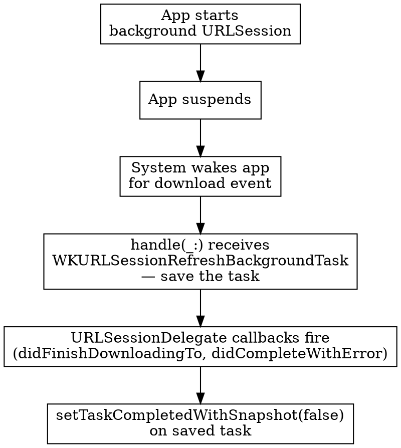

# Background Tasks and Networking

## When to Use This Skill

Use when:
- Picking between SwiftUI `.backgroundTask(_:action:)` and a WatchKit app-delegate `handle(_:)` implementation
- Scheduling app refresh — `BGTaskScheduler` on the 27 SDK, or legacy `scheduleBackgroundRefresh(withPreferredDate:userInfo:scheduledCompletion:)`
- Migrating WatchKit background-refresh scheduling to BGTaskScheduler
- Deciding between URLSession configurations (default, ephemeral, background) on a Watch target
- Hitting `ENETDOWN` when starting `NWConnection` on watchOS (TN3135)
- Handling `WKURLSessionRefreshBackgroundTask` or `WKWatchConnectivityRefreshBackgroundTask` wake-ups
- Debugging mystery `EXC_CRASH (SIGKILL)` crashes after a background wake

#### Related Skills

- Use `platform-basics.md` for the SwiftUI `.backgroundTask` hook in the `App` body and delegate adoption
- Use `watch-connectivity.md` for `WCSession` queued transfers and the background-task completion contract
- Use `smart-stack-and-complications.md` for widget push updates that replace some background-refresh flows on watchOS 26
- Use `axiom-networking` for general URLSession patterns; this skill covers watchOS-specific constraints
- Use `axiom-concurrency` for `withTaskCancellationHandler` patterns and Swift concurrency semantics

## Core Principle

**URLSession over everything. Low-level networking is blocked unless you're an audio streamer, a CallKit VoIP app, or a tvOS companion.** TN3135 is explicit — `NWConnection`, Network framework TCP/UDP, `URLSessionStreamTask`, `URLSessionWebSocketTask`, `NWBrowser`, `NetService`, BSD sockets: all blocked for "normal" apps, enforced from watchOS 9.

> "If a normal app attempts to start an NWConnection, that connection will stay in the `.waiting(_:)` state with an error of ENETDOWN. Similarly, an NWPathMonitor will remain in the `.unsatisfied` state." — Apple, TN3135

The three exceptions:

| App type | Low-level window | Minimum version |
|---|---|---|
| Audio streaming (background audio session) | While actively streaming | watchOS 6 |
| VoIP + CallKit | While running a CallKit call | watchOS 9 |
| tvOS pairing (DeviceDiscoveryUI application service listener) | Persistent | watchOS 9, tvOS 16 |

If your app isn't in one of those lanes, route every byte through URLSession. The simulator happily runs low-level networking even when the device would refuse — test on real hardware before drawing conclusions.

## URLSession Choice Matrix

| Session | Use when |
|---|---|
| Default (`URLSessionConfiguration.default`) | Foreground and active; quick-latency requests; normal cookie/cache behavior |
| Ephemeral (`URLSessionConfiguration.ephemeral`) | Foreground; no persistence (sensitive requests, private-browsing-style fetches) |
| Background (`URLSessionConfiguration.background(withIdentifier:)`) | App may become inactive or terminate before the request finishes; guarantees eventual completion |

Background sessions come with a cost: the system may delay or defer them based on resource conditions. For foreground work, default or ephemeral is faster and more predictable.

## Background Scheduling Moves to BGTaskScheduler `OS27`

The 27 SDK brings the BackgroundTasks framework to watchOS and deprecates WatchKit's scheduling methods. `WKApplication.scheduleBackgroundRefresh(withPreferredDate:userInfo:scheduledCompletion:)` (and the `WKExtension` variant) is deprecated with replacement `BGTaskScheduler.submitTaskRequest`; `scheduleSnapshotRefresh` is deprecated outright — "Snapshots may no longer be manually scheduled." SwiftUI's bare `.backgroundTask(.appRefresh)` (the `String?` userInfo form below) is deprecated in favor of the identifier form.

SDK nuance: the headers annotate `BGTaskScheduler` and the core task types as `watchos(26.0)`, but the 26.5 SDK marked them watch-unavailable — building requires the Xcode 27 SDK; deployment back to watchOS 26 then works.

```swift
import BackgroundTasks

// Schedule — one identifier per refresh flow (replaces userInfo dispatch)
let request = BGAppRefreshTaskRequest(identifier: "com.example.weather-refresh")
request.earliestBeginDate = Date(timeIntervalSinceNow: 15 * 60)
try await BGTaskScheduler.shared.submitTaskRequest(request)

// Handle — identifier-based SwiftUI hooks
.backgroundTask(.appRefresh("com.example.weather-refresh")) {
    await fetchWeather()
}
.backgroundTask(.processingTask("com.example.maintenance")) {  // OS27
    await runMaintenance()
}
```

What changes, exactly:

| Legacy (deprecated in 27) | Replacement |
|---|---|
| `WKApplication.scheduleBackgroundRefresh(withPreferredDate:userInfo:...)` | `BGAppRefreshTaskRequest(identifier:)` + `earliestBeginDate` + `submitTaskRequest` |
| `userInfo` string dispatch in one handler | One identifier (and one `.backgroundTask` hook) per flow; identifiers must be listed in Info.plist `BGTaskSchedulerPermittedIdentifiers` |
| Bare `.backgroundTask(.appRefresh)` receiving `String?` | `.backgroundTask(.appRefresh("identifier"))` |
| `scheduleSnapshotRefresh` | Nothing — snapshots can no longer be manually scheduled |
| `BGTaskScheduler.submit(_:)` (annotated watchOS 26) — deprecated in 27 "to capture all error conditions" | `submitTaskRequest(_:)` async (all BGTaskScheduler platforms) |

Also available on watch via the 27 SDK: `BGProcessingTaskRequest` (longer maintenance work; the header allows 1 pending refresh + 10 pending processing tasks), `BGHealthResearchTaskRequest`, and — new at watchOS 27 — `BGContinuedProcessingTaskRequest` for user-visible continued work (no GPU resources on watch; not tvOS/visionOS). The new SwiftUI `.processingTask(_ identifier:)` hook is `OS27` (not macOS/visionOS).

Delivery is unchanged: `handle(_:)` and the `WKRefreshBackgroundTask` types still exist for Watch Connectivity and URLSession wake-ups, and the budget realities below still apply.

## Background Refresh — The Pre-27 SwiftUI Way

`.backgroundTask(_:action:)` on the `App`'s scene is preferred over the delegate path below. The system marks the task complete when the closure returns, and you only handle the task types you care about. On 27, schedule with `BGTaskScheduler` and the identifier form above; the `WKApplication` scheduling and bare `.appRefresh` below are deprecated but keep working for existing apps.

```swift
import SwiftUI

@main
struct MyWatch_Watch_App: App {
    var body: some Scene {
        WindowGroup { ContentView() }
            .backgroundTask(.appRefresh) { context in
                await refreshData()
            }
    }
}
```

### Distinguishing refresh flows by `userInfo` (deprecated in 27)

Schedule with a specific `userInfo` string, then branch on it inside the handler — on 27, use one `BGAppRefreshTaskRequest` identifier per flow instead. `userInfo` must conform to both `NSSecureCoding` and `NSObjectProtocol`; a Swift `String` bridges cleanly via `NSString`:

```swift
// Scheduling
WKApplication.shared().scheduleBackgroundRefresh(
    withPreferredDate: Date(timeIntervalSinceNow: 15 * 60),
    userInfo: "WEATHER_UPDATE" as NSString
) { error in
    if let error { /* handle */ }
}

// Handling — one handler, dispatch by the scheduled userInfo string.
// On watchOS the bare `.appRefresh` is BackgroundTask<String?, Void>: the
// closure receives the scheduled userInfo bridged to a String? DIRECTLY —
// it is NOT a context object (there is no `context.userInfo`), and NOT the
// SwiftUI identifier form `.appRefresh("id")` that iOS uses.
.backgroundTask(.appRefresh) { reason in   // reason: String? == the scheduled userInfo
    switch reason {
    case "WEATHER_UPDATE":
        await fetchWeather()
    case "WIDGET_RELOAD":
        await reloadWidgetData()
    default:
        await performDefaultRefresh()
    }
}
```

### Cancellation handling on long tasks

The system cancels tasks before killing the app on budget exhaustion. Wrap in `withTaskCancellationHandler`:

```swift
.backgroundTask(.appRefresh) { _ in
    await withTaskCancellationHandler {
        // The main work
    } onCancel: {
        // Clean up, persist partial progress, release resources
    }
}
```

## Background Refresh — WatchKit App Delegate

For apps that still use `WKApplicationDelegate`, implement `handle(_:)`. This path is fully supported but more work: you receive **every** background task — yours, Watch Connectivity, URLSession background transfers — and must call `setTaskCompletedWithSnapshot(_:)` on each.

```swift
func handle(_ backgroundTasks: Set<WKRefreshBackgroundTask>) {
    for task in backgroundTasks {
        switch task {
        case let t as WKApplicationRefreshBackgroundTask:
            handleAppRefresh(t)
        case let t as WKSnapshotRefreshBackgroundTask:
            t.setTaskCompleted(
                restoredDefaultState: false,
                estimatedSnapshotExpiration: .distantFuture,
                userInfo: nil
            )
        case let t as WKURLSessionRefreshBackgroundTask:
            handleURLSessionRefresh(t)  // save task; complete after delegate callbacks
        case let t as WKWatchConnectivityRefreshBackgroundTask:
            handleWatchConnectivity(t)  // save task; complete via KVO (see watch-connectivity.md)
        default:
            task.setTaskCompletedWithSnapshot(false)
        }
    }
}
```

**Every task must reach `setTaskCompletedWithSnapshot(_:)`.** Missing this drains the budget and eventually crashes with `EXC_CRASH (SIGKILL)`. For URLSession and Watch Connectivity tasks, complete **after** the session delegate callbacks fire, not inside `handle(_:)`.

### `expirationHandler` on WKRefreshBackgroundTask

```swift
task.expirationHandler = {
    // Clean up; convert in-flight work to a background URLSession if possible.
}
```

Apple recommends converting a synchronous download into a background URLSession from the expiration handler — the URL fetch keeps running after the app suspends.

## Background URLSession — The Wake-Up Flow

When you start a background `URLSession` from the watch, the system delivers completion events through a `WKURLSessionRefreshBackgroundTask`. The shape is:



1. In `handle(_:)`, save the `WKURLSessionRefreshBackgroundTask` — don't complete it yet.
2. The system calls your `URLSessionDelegate` methods (`urlSession(_:downloadTask:didFinishDownloadingTo:)`, then `urlSession(_:task:didCompleteWithError:)`).
3. Inside `didCompleteWithError:`, call `setTaskCompletedWithSnapshot(false)` on the saved task.

Move the downloaded file out of the temp location inside `didFinishDownloadingTo:` — the system deletes the temp file when the delegate returns.

## Budget Reality

Apple is explicit about what gates background time:

- **The system chooses.** Every app has an allocation; the system chooses when to trigger tasks based on current conditions.
- **Complication helps.** Apps with a complication on the active watch face get higher background priority.
- **Dock helps.** Apps in the user's Dock get higher priority than apps that aren't.
- **User activity throttles.** Workouts, navigation, and other high-priority activities deprioritize your background work.
- **Low battery throttles.** Background tasks suspend when the battery is low even if your budget has room.
- **Don't expect every task.** Design a fallback: the app must still update when the user foregrounds it.

Schedule with a preferred date (`earliestBeginDate` on a `BGAppRefreshTaskRequest`, or legacy `scheduleBackgroundRefresh(withPreferredDate:...)`); expect the actual wake time to slip. Never promise the user a precise background-update schedule.

## Fresh-Data Strategy

The briefing from `watch-connectivity.md` applies in reverse here — Watch Connectivity is an optimization, not the primary path:

| Scenario | Best primary path |
|---|---|
| Paired iPhone online | URLSession on the watch; system auto-routes through the iPhone via Bluetooth |
| LTE watch, iPhone asleep or out of range | URLSession over known Wi-Fi or cellular |
| CloudKit-backed data | `CKSubscription` + notifications (watchOS 6+) |
| Live refresh needed on-device | `TimelineView` for date/time redraws, a `.backgroundTask` app-refresh hook for data |
| Instant update from iPhone | Opportunistic `WCSession.transferUserInfo` + `transferCurrentComplicationUserInfo` |
| Widget refresh from server | APNs widget push updates (watchOS 26+, see `smart-stack-and-complications.md`) |

Test over all three network routes the watch uses — iPhone proxy via Bluetooth, known Wi-Fi, and cellular (Series 3+). Turn off both Wi-Fi and Bluetooth **in the iPhone Settings app** (not Control Center, which only disconnects) to force the watch to use Wi-Fi or LTE.

## Watch-Specific Constraints

Use `URLSession` instead of `Foundation` convenience loaders. Apple explicitly calls out that synchronous byte-loading from URLs is unsupported on watchOS:

> "Foundation has various APIs for synchronously creating a value using bytes loaded from a URL… Using these APIs with network URLs is not best practice on any Apple platform and is not supported by watchOS." — TN3135

Avoid `Data(contentsOf: url)`, `String(contentsOf: url)`, and similar. Use `URLSession.shared.data(from:)` or configure a session properly.

## Debugging Checklist

| Symptom | Probable cause | Check |
|---|---|---|
| `NWConnection` stays `.waiting(_:)` with `ENETDOWN` on device, works in simulator | Low-level networking blocked — TN3135 | Switch to URLSession; the simulator does not enforce the rule |
| `EXC_CRASH (SIGKILL)` shortly after background wake | One or more `WKRefreshBackgroundTask`s never got `setTaskCompletedWithSnapshot(_:)` | Audit every branch in `handle(_:)`; for async work, complete after all delegate callbacks fire |
| Background refresh never fires | No complication on active watch face; app not in Dock; low battery; high-priority user activity; on 27, identifier missing from `BGTaskSchedulerPermittedIdentifiers` or request never submitted | Add a complication; confirm Settings → Passcode → Allow Background App Refresh; verify the Info.plist identifier list; test with the device on charger |
| Download completes but data loss | `urlSession(_:downloadTask:didFinishDownloadingTo:)` didn't move the file before returning | Copy to a permanent location synchronously inside the delegate |
| `NWPathMonitor` always `.unsatisfied` | Blocked path monitor on watchOS outside the three exceptions | Use `URLSession` error state instead of attempting to pre-check the path |

## Common Mistakes

| Mistake | Symptom | Fix |
|---|---|---|
| Starting `NWConnection` from a non-audio, non-CallKit app | Connection stuck in `.waiting`; `ENETDOWN` errors | Switch to URLSession; low-level networking is blocked on watchOS by policy, not bug |
| Testing only in the simulator | Code works in simulator, fails on device | Always test networking on a real device; the simulator permits what the device doesn't |
| Not saving `WKURLSessionRefreshBackgroundTask` / `WKWatchConnectivityRefreshBackgroundTask` before returning from `handle(_:)` | Tasks complete before URLSession delegate finishes; data loss; mystery crashes | Save the task; complete only after the session delegate finishes |
| Using `Data(contentsOf: url)` on a network URL | Blocked / unsupported path | Use `URLSession.shared.data(from:)` |
| Mixing SwiftUI `.backgroundTask` with a delegate's `handle(_:)` | Duplicate or dropped tasks; unpredictable completion | Pick one path — SwiftUI for new work, delegate only if the rest of the app already uses it |
| Expecting every scheduled refresh to fire | UI shows stale data even when the app "scheduled" a refresh | Design for missed refreshes; always refresh on foregrounding |
| Not adding `expirationHandler` on long tasks | SIGKILL when the budget expires mid-task | Set `expirationHandler` (delegate path) or wrap in `withTaskCancellationHandler` (SwiftUI path) |
| Using `URLSession.shared` for a background transfer | Download cancels when the app suspends | Use a dedicated `URLSession` with `URLSessionConfiguration.background(withIdentifier:)` |
| Toggling Bluetooth/Wi-Fi from iPhone Control Center thinking it isolates the watch | Control Center disconnects but doesn't fully disable; tests unreliable | Toggle from iPhone Settings app for a real test |
| Migrating to `BGTaskScheduler` but keeping one handler with `userInfo` dispatch `OS27` | Tasks fire but the dispatch string is gone — identifier form passes no payload | One identifier + one `.backgroundTask(.appRefresh("id"))` hook per flow; list each in `BGTaskSchedulerPermittedIdentifiers` |
| Calling `BGTaskScheduler` in a project built with the 26.5 SDK | `'BGTaskScheduler' is unavailable in watchOS` compile error | The watch surface ships in the Xcode 27 SDK (annotated back to watchOS 26) — build with Xcode 27 |
| Still scheduling snapshots on 27 | Deprecation warnings; no effect to rely on | Remove `scheduleSnapshotRefresh` — snapshots can no longer be manually scheduled |

## Resources

**WWDC**: 2019-716 (audio streaming on watchOS 6)

**Docs**: /technotes/tn3135-low-level-networking-on-watchos, /watchkit/using-background-tasks, /watchos-apps/making-background-requests, /watchos-apps/keeping-your-watchos-app-s-content-up-to-date, /swiftui/scene/backgroundtask(_:action:), /backgroundtasks/bgtaskscheduler, /backgroundtasks/bgapprefreshtaskrequest, /watchkit/wkapplication/schedulebackgroundrefresh(withpreferreddate:userinfo:scheduledcompletion:), /watchkit/wkrefreshbackgroundtask, /watchkit/wkurlsessionrefreshbackgroundtask, /foundation/urlsession, /foundation/urlsessionconfiguration/background(withidentifier:)

**Skills**: axiom-watchos (platform-basics, watch-connectivity, smart-stack-and-complications), axiom-networking, axiom-concurrency
