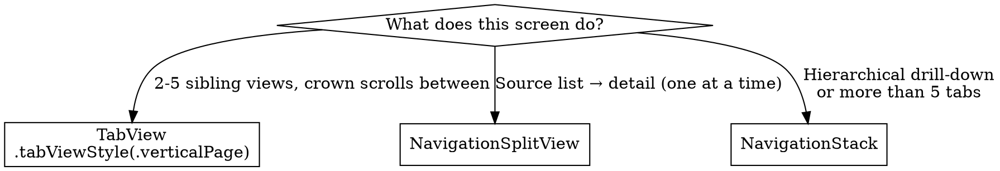

# Designing for watchOS

## When to Use This Skill

Use when:
- Picking the right top-level navigation for a watchOS screen — `TabView(.verticalPage)`, `NavigationSplitView`, or `NavigationStack`
- Placing toolbar buttons correctly (leading, trailing, bottom bar with up to 3 items)
- Adding full-color backgrounds that flow through navigation and tab transitions
- Designing for Always On — privacy, cadence, luminance, preview
- Reviewing a screen for glance-ability and vertical-scroll appropriateness
- Auditing a watchOS 10+ app for watchOS 26 Liquid Glass material consistency

#### Related Skills

- Use `platform-basics.md` for app structure, `@main`, delegate adoption, and `WKSupportsAlwaysOnDisplay` Info.plist key
- Use `smart-stack-and-complications.md` for widget layouts on the watch face and Smart Stack
- Use `axiom-accessibility` for general VoiceOver / Dynamic Type guidance; watchOS-specific a11y (rotor, AssistiveTouch, Double Tap) lives in `axiom-accessibility/skills/watchos-a11y.md`
- Use `axiom-swiftui` for cross-platform SwiftUI state, layout, and animation primitives

## Core Principle

**Glanceable first, vertical by default, fewest taps to the destination.** watchOS 10 redesigned the OS around vertical scrolling with the Digital Crown and single-screen views. watchOS 26 layers Liquid Glass materials on top. Design for two seconds of attention — anything that needs a third tap probably belongs on iPhone.

## Pick the Right Navigation Primitive



| Primitive | Use when | Avoid when |
|---|---|---|
| `TabView(.verticalPage)` | 2–5 peer views, mostly single-screen, Digital Crown is primary nav | More than 5 peers; deep hierarchy |
| `NavigationSplitView` | Source list → detail pattern (weather locations, chat threads, world clock) | One-off detail; no natural list pivot |
| `NavigationStack` | Arbitrary hierarchy with drill-down; richer than "list → detail" | Flat peer views (`TabView` is better) |

### TabView — vertical paging

```swift
@Binding var selected: Item

var body: some View {
    TabView(selection: $selected) {
        ForEach(Item.allCases) { item in
            Text("\(item.title) tab")
        }
    }
    .tabViewStyle(.verticalPage)
}
```

The system draws the page indicator beside the Digital Crown. Mixing single-screen pages with one long `ScrollView` works — place the long page last. The dot expands to show scroll position inside the long view.

### NavigationSplitView — source + detail

The watchOS `NavigationSplitView` shows one column at a time, like an iPhone in portrait. Selecting a list row animates to the detail; tapping the list-icon back-button returns.

```swift
@Binding var selected: Item?

var body: some View {
    NavigationSplitView {
        List(selection: $selected) {
            ForEach(Item.allCases, id: \.self) { item in
                NavigationLink(item.rawValue.uppercased(), value: item)
            }
        }
        .containerBackground(.green.gradient, for: .navigation)
        .listStyle(.carousel)
    } detail: {
        DetailView(selected: $selected)
    }
}
```

**API rule that catches everyone once.** `List` unwraps `selected` and matches its `id`. `TabView` doesn't — it compares the raw value to each child's `tag`. When a `NavigationSplitView`'s detail is itself a `TabView`, wrap tags in `Optional(item)` so the types line up.

### NavigationStack — hierarchy

```swift
@State var stack = [Int]()

var body: some View {
    NavigationStack(path: $stack) {
        Text("Main page")
            .toolbar {
                ToolbarItem(placement: .topBarTrailing) {
                    NavigationLink(value: 2) {
                        Image(systemName: "chevron.right")
                    }
                }
            }
            .navigationDestination(for: Int.self) { value in
                Text("Second page")
            }
    }
}
```

Keep the stack shallow. Use a large title on the root view, no title on any view where a back button is present.

## Toolbar Placement

The toolbar is the only durable place to put buttons that survive scrolling. Placement rules:

| Placement | Capacity | Behavior |
|---|---|---|
| `.topBarLeading` | 1 button | System may auto-insert back/list icon; place your own only when that slot is free |
| `.topBarTrailing` | 1 button | Most common placement for a single action |
| `.bottomBar` | Up to 3 buttons | Make the center button prominent with `.controlSize(.large)` + a capsule tint for a primary action |
| `.primaryAction` | 1 button | Inline in scrolling view; hidden until user scrolls up; re-discovery is free |

```swift
.toolbar {
    ToolbarItem(placement: .topBarLeading) {
        Button { /* action */ } label: { Image(systemName: "suit.heart") }
    }
    ToolbarItem(placement: .topBarTrailing) {
        Button { /* action */ } label: { Image(systemName: "suit.club") }
    }
    ToolbarItemGroup(placement: .bottomBar) {
        Button { /* action */ } label: { Image(systemName: "suit.diamond") }
        Button { /* action */ } label: { Image(systemName: "star") }
            .controlSize(.large)
            .background(.red, in: Capsule())
        Button { /* action */ } label: { Image(systemName: "suit.spade") }
    }
}
```

## Full-Color Backgrounds

`containerBackground(_:for:)` paints the color behind the navigation bar, toolbar, and safe-area — without it, colors stop at the content bounds. The modifier supports gradients natively:

```swift
.containerBackground(.blue.gradient, for: .tabView)
.containerBackground(.green.gradient, for: .navigation)
```

Use color to communicate, not decorate:

- **Branding** — instantly recognizable first frame
- **Emotion** — calming blue (Sleep), urgent orange (Timer complete)
- **Spatial sense** — Fitness uses black for the home, then red/green/blue for Move/Exercise/Stand
- **Information at a glance** — World Clock's solar gradients convey time of day without reading a number
- **State transitions** — Timer flips black → orange when done

Normal views use `.background(alignment:content:)`. Views inside `NavigationSplitView`, `NavigationStack`, or `TabView` need `containerBackground(_:for:)` because the container owns the chrome area.

## Matched Geometry Between Pages

Making a shared element flow between tabs creates a sense of place. Use `matchedGeometryEffect` with `isSource` pinned to the currently-visible page:

```swift
NavigationStack {
    TabView(selection: $pageNumber) {
        VStack {
            Image(systemName: "books.vertical.fill")
                .matchedGeometryEffect(
                    id: bookIcon, in: library,
                    properties: .frame,
                    isSource: pageNumber == 0)
            Text("Books")
        }
        .tag(0)

        VStack { BookList() }.tag(1)
    }
    .tabViewStyle(.verticalPage)
    .toolbar {
        ToolbarItem(placement: .topBarLeading) {
            Image(systemName: "books.vertical.fill")
                .matchedGeometryEffect(
                    id: bookIcon, in: library,
                    properties: .frame,
                    isSource: pageNumber != 0)
        }
    }
}
```

The system animates the icon between positions in sync with the Digital Crown.

## Material Vibrancy and Hierarchy

Lean on system materials — don't hand-roll blurs or transparency.

- System auto-adds a vibrant fill behind buttons and list cells
- Sheets and full-screen covers get a full-screen thin material automatically (lets the covered view show through as a place marker)
- Navigation bar gets a blur behind it
- Text foreground styles `.primary`, `.secondary`, `.tertiary`, `.quaternary` give a four-step hierarchy that stays legible over any background

```swift
Text(item.title)
    .font(.headline)
    .foregroundStyle(.primary)

Text(item.subtitle)
    .foregroundStyle(.secondary)
```

For prominent buttons, use `.buttonStyle(.borderedProminent)`. That handles tint, material, and sizing correctly on Liquid Glass.

**watchOS 26 specific.** Toolbar and control styles were refreshed. Apps built for watchOS 10 and later pick up the new look automatically. Custom styles need an audit — verify legibility on the new materials. See `modernization.md` for the migration pattern.

## Always On — Design for Two Brightness Levels

Always On is enabled by default for apps compiled on watchOS 8+. The system dims the display, updates at a reduced cadence, and keeps controls tappable so a tap wakes the app.

### Frontmost vs background rules

| State | Display behavior | Who controls timing |
|---|---|---|
| Active (interacting) | Full brightness, full update rate | User |
| Frontmost-inactive (wrist down, app still shown) | Dimmed; default cadence reduced | User: Settings → General → Wake Screen → Return to Clock (max 1 hour custom per app) |
| Background with session (workout, audio) | Dimmed; reduced update frequency; app continues running | App (while session active) |
| Background suspended | Screen off unless another app is frontmost | — |

### Respond to the two environments you care about

```swift
@Environment(\.isLuminanceReduced) private var isLuminanceReduced
@Environment(\.redactionReasons) private var redactionReasons

Text("Hello!")
    .opacity(isLuminanceReduced ? 0.5 : 1.0)

if !redactionReasons.contains(.privacy) {
    Text("Balance: \(balance)")
}
```

### Privacy-sensitive fields — blur automatically

The `privacySensitive()` modifier opts a view into auto-blur whenever `redactionReasons` contains `.privacy`:

```swift
Text("Account Number:")
    .font(.headline)
Text(accountNumber)
    .privacySensitive()
```

Always blur highly sensitive data — balances, account numbers, health readings. Default to showing information that may or may not be sensitive (messages, appointments); users can disable Always On per-app if they prefer.

### Match update cadence with `TimelineView`

```swift
TimelineView(PeriodicTimelineSchedule(from: Date(), by: 1.0/60.0)) { context in
    switch context.cadence {
    case .live:     /* up to 60 updates/sec */
    case .seconds:  /* ~1 update/sec */
    case .minutes:  /* ~1 update/min */
    @unknown default: fatalError()
    }
}
```

For non-timeline views, switch on `scenePhase`:

```swift
@Environment(\.scenePhase) private var scenePhase

var body: some View {
    if scenePhase == .active {
        // animations and subsecond updates
    } else {
        // low-frequency representation — static icon, nearest-second time
    }
}
```

### Preview both appearances in Xcode

```swift
#Preview("Active") { ContentView() }

#Preview("Always On") {
    ContentView()
        .environment(\.isLuminanceReduced, true)
        .environment(\.redactionReasons, [.privacy])
}
```

Xcode previews do not auto-dim. To see the actual dim effect, run on a device or simulator with Toggle Always On.

### Opt-out — rare and usually wrong

Set `WKSupportsAlwaysOnDisplay = false` in the Watch target's `Info.plist` only when the app has a legal or contractual reason to never display in the Always On state. This excludes Apple Watch SE and Series 4 and earlier by default — they never show Always On regardless.

## Common Mistakes

| Mistake | Symptom | Fix |
|---|---|---|
| Using `NavigationView` in new code | Deprecation warnings; broken path binding; missing toolbar placements | Use `NavigationStack` with a `path: Binding<[T]>` — see `platform-basics.md` |
| More than 5 tabs in a `TabView(.verticalPage)` | Users lose orientation; page dots become unreadable | Use `NavigationStack` or `NavigationSplitView` for more than 5 peer views |
| Adding a title to the detail view inside a `NavigationSplitView` | Back button loses space; detail feels boxed in | Omit the title; make the detail unmistakable at a glance |
| Using `.background(_:)` for color inside a `NavigationStack` | Color stops at content bounds; nav bar stays system-default | Use `containerBackground(_:for: .navigation)` on the content view |
| `TabView` and `List` both binding to the same selection without Optional wrapping | Tabs never activate on selection | `List` unwraps `Optional<Selection>`; `TabView` doesn't — wrap tags with `Optional(item)` |
| Leaving subsecond animations running during Always On | Battery drain; bouncing between cadences | Gate subsecond content on `scenePhase == .active` or `TimelineView` cadence `.live` |
| Showing raw balances or health readings during Always On | Information visible to casual observers; privacy complaint | `.privacySensitive()` on the specific text, or gate on `redactionReasons.contains(.privacy)` |
| Hand-rolled blur behind a custom nav bar | Looks right on watchOS 10 and breaks on watchOS 26 Liquid Glass | Use system toolbar; let the system provide the blur |
| Custom button styles that assume the old watchOS 9 material | Low-contrast buttons on watchOS 26 | Adopt `.buttonStyle(.borderedProminent)` or audit the style against Liquid Glass materials |

## Resources

**WWDC**: 2023-10138, 2023-10031, 2022-10133, 2022-10051

**Docs**: /watchos-apps/creating-an-intuitive-and-effective-ui-in-watchos-10, /watchos-apps/designing-your-app-for-the-always-on-state, /swiftui/tabview, /swiftui/navigationsplitview, /swiftui/navigationstack, /swiftui/containerbackground, /swiftui/privacysensitive, /swiftui/matchedgeometryeffect, /swiftui/timelineview, /swiftui/scenephase, /design/human-interface-guidelines/designing-for-watchos

**Skills**: axiom-watchos (platform-basics, smart-stack-and-complications, modernization), axiom-swiftui, axiom-accessibility
