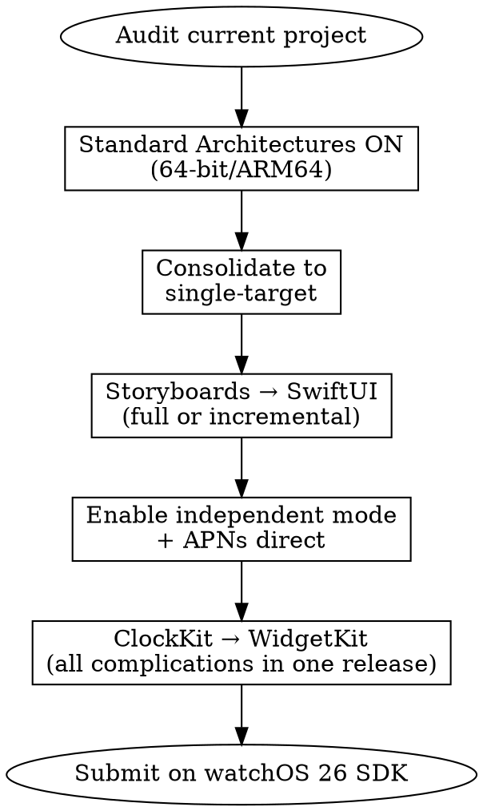

# Modernizing a watchOS Project

## When to Use This Skill

Use when:
- Migrating a WatchKit storyboard / `WKExtensionDelegate` project to SwiftUI + `WKApplicationDelegate`
- Converting a dual-target project (Watch App + WatchKit Extension) to a single-target app
- Replacing ClockKit complications with WidgetKit accessory widgets
- Adding an iOS companion to a watch-only project
- Planning an incremental migration when a full rewrite isn't viable
- Getting a legacy watchOS 6-era app ready for watchOS 26 submission (64-bit + SDK rule)

#### Related Skills

- Use `platform-basics.md` for the target SwiftUI App / `WKApplicationDelegate` shape
- Use `smart-stack-and-complications.md` for the destination WidgetKit complication architecture
- Use `controls-and-live-activities.md` for watchOS 26 control surfaces that didn't exist in legacy projects
- Use `design-for-watchos.md` for the watchOS 10 navigation model to aim at after UIKit bridging
- Use `axiom-swiftui` for general SwiftUI patterns
- Use `axiom-shipping` for the April 2026 submission gate

## Core Principle

**Modernize deliberately, in four axes, on the way to watchOS 26.** The targets, in order of leverage:

1. Dependent → **independent** app (the user expects it)
2. Dual-target → **single-target** (simplifies everything)
3. WatchKit storyboards → **SwiftUI** (cross-platform, modern)
4. ClockKit → **WidgetKit complications** (Smart Stack + shared code)

None of these are optional for new development on watchOS 10+. All four are achievable without a full rewrite.

## Historical Timeline (Context)

TN3157's framing helps set expectations:

| Year | Milestone |
|---|---|
| 2015 | watchOS 1 launches with WatchKit + ClockKit |
| 2020 | watchOS 7 ships; WatchKit storyboards deprecated; SwiftUI is new baseline |
| 2022 | Xcode 14 removes storyboard template creation; introduces single-target watchOS apps |
| 2023 | watchOS 10 ships; ClockKit complications deprecated; WidgetKit replaces them; redesigned UI |
| 2026 | watchOS 26 SDK + 64-bit/ARM64 required for App Store submission (April 2026) |

> "If you have an existing watchOS app, now is the time to get rid of the deprecated WatchKit storyboards and ClockKit complications, and adopt the modern features." — Apple, TN3157

## Axis 1 — Dependent to Independent

If the watchOS app can't function when the iPhone isn't reachable, it's dependent. Apple's user-expectation line:

> "Apple Watch users expect that the apps to just work, even when they don't have their iPhones with them." — Apple, TN3157

Switch to independent: project editor → Watch App target → General → Deployment Info → check "Supports Running Without iOS App Installation". Then:

- Move account creation to the watch (sign-in, authorization)
- Route data fetching through URLSession directly from the watch
- Demote `WCSession` usage from primary data path to opportunistic optimization (see `watch-connectivity.md`)
- Register for APNs directly on the watch; don't rely on iPhone push handoff

Full detail: `platform-basics.md`.

## Axis 2 — Dual-Target to Single-Target

A dual-target app has a Watch App target **and** a WatchKit Extension target. Xcode's consolidation tool does most of the work:

1. Back up the project (full copy — rollback is otherwise painful)
2. Xcode → Editor → **Validate Settings**
3. Check "Project — Upgrade to a single-target watch app"
4. **Perform Changes**
5. If there are storyboards: re-point each interface controller's Class module to the watchOS app module (Identity inspector → Custom Class)
6. Delete the extension's Info.plist and other extension-only files
7. Clean up project-navigator groups

Xcode's tool performs the code-level swaps:

- `WKExtension` → `WKApplication`
- `WKExtensionDelegate` → `WKApplicationDelegate`

This swap is no longer optional cleanup: the 27 SDK formally deprecates `WKExtension` and `WKExtensionDelegate` for apps with a minimum deployment target of watchOS 9.2 or later (watchOS 27 release notes; the headers carry `WK_DEPRECATED_WITH_REPLACEMENT(2.0, 9.2, "WKApplication")`). Background-refresh scheduling is also deprecated in 27 in favor of `BGTaskScheduler` — see axiom-watchos (skills/background-and-networking.md).
- Merges Info.plist content (e.g., moves `CLKComplicationPrincipalClass` + `CLKComplicationSupportedFamilies` from the extension's plist to the app's)
- Moves complication-controller code to the app target

### Single-target minimum versions

| Requirement | Minimum |
|---|---|
| Single-target watchOS app | watchOS 7 |
| HealthKit authorization inheritance from companion iOS app | watchOS 9.2 |

**If the app needs to support watchOS 9.1 or earlier and uses HealthKit, keep the dual-target configuration.** The HealthKit-inheritance behavior requires watchOS 9.2+. Everyone else should migrate.

## Axis 3 — WatchKit Storyboards to SwiftUI

SwiftUI is the only path forward — storyboards have been deprecated since 2020. Two viable migration strategies:

### Strategy A — Full rewrite (recommended for smaller apps)

1. Add a `@main` SwiftUI App struct:

```swift
import SwiftUI

@main
struct MyWatchApp: App {
    var body: some Scene {
        WindowGroup {
            RootView()
        }
    }
}
```

2. If the old `WKApplicationDelegate` still needs to run (remote notifications, workout recovery, Now Playing), attach it:

```swift
@main
struct MyWatchApp: App {
    @WKApplicationDelegateAdaptor var appDelegate: MyAppDelegate
    var body: some Scene {
        WindowGroup { RootView() }
    }
}
```

3. Rebuild each storyboard scene as a SwiftUI view. Use the patterns in `design-for-watchos.md` — `NavigationStack`, `NavigationSplitView`, `TabView(.verticalPage)` — rather than reimplementing the old paging model.

4. Delete the storyboard files after the last scene is migrated.

### Strategy B — Incremental (for large apps)

Use `WKHostingController` to host SwiftUI views inside existing WatchKit interface controllers. Each screen can migrate independently:

```swift
class MySettingsController: WKHostingController<SettingsView> {
    override var body: SettingsView {
        SettingsView()
    }
}
```

Keep the storyboard, swap one scene at a time to a `WKHostingController`, and eventually delete the storyboard when every scene is SwiftUI.

### If you also have `WKExtensionDelegate`

Migrate to `WKApplicationDelegate` as part of this step — it's a rename-and-move, not a rewrite. The two protocols have the same methods, and the app-delegate path integrates with SwiftUI via `@WKApplicationDelegateAdaptor`.

## Axis 4 — ClockKit to WidgetKit Complications

The migration target is `smart-stack-and-complications.md`. This skill covers the transition mechanics.

### The partial-migration trap

The single most important rule — from Apple, emphasized:

> "As soon as your WidgetKit extension begins providing widget-based complications, the system disables your app's ClockKit complications. It no longer wakes your app to call your CLKComplicationDataSource object's methods to request timeline entries." — Apple, Migrating ClockKit complications to WidgetKit

There is no "both at once" state. The moment WidgetKit provides any complication, ClockKit stops running.

**Rule: migrate every ClockKit complication to WidgetKit in a single release.** A partial migration silently disables the remaining ClockKit complications on every user's device.

### Migration steps

1. **Add a Widget Extension target** (watchOS tab → Widget Extension). Enable "Include Configuration App Intent" if the app supports multiple complication variants dynamically.

2. **Build one WidgetKit widget for each existing ClockKit complication.** Implement the three required `TimelineProvider` methods:

   - `placeholder(in:)` — returns a generic entry for redacted state
   - `getSnapshot(in:completion:)` — gate on `context.isPreview` to show generic data in the picker; else return current live data
   - `getTimeline(in:completion:)` — returns `Timeline<Entry>` with a reload policy

   Example timeline entry:

   ```swift
   struct CoffeeTrackerEntry: TimelineEntry {
       let date: Date
       let mgCaffeine: Double
       let totalCups: Double
   }
   ```

3. **Add `CLKComplicationWidgetMigrator`** to the existing `CLKComplicationDataSource`:

   ```swift
   extension ComplicationController: CLKComplicationWidgetMigrator {
       func getWidgetConfiguration(
           from complicationDescriptor: CLKComplicationDescriptor,
           completionHandler: @escaping (CLKComplicationWidgetMigrationConfiguration?) -> Void
       ) {
           // When the descriptor uses CLKDefaultComplicationIdentifier,
           // ignore it and return the default widget kind.
           // CLKComplicationWidgetMigrationConfiguration is an abstract base
           // (init is NS_UNAVAILABLE) — construct a concrete subclass.
           // Static widgets use CLKComplicationStaticWidgetMigrationConfiguration;
           // intent-configured widgets use CLKComplicationIntentWidgetMigrationConfiguration.
           let config = CLKComplicationStaticWidgetMigrationConfiguration(
               kind: "com.example.app.coffee-caffeine",
               extensionBundleIdentifier: widgetExtensionBundleID
           )
           completionHandler(config)
       }
   }
   ```

   When a user updates the app, watchOS uses the migrator to map existing ClockKit complications on watch faces to the new WidgetKit complications — preserving the user's watch-face customization.

4. **Bundle multiple complications** via `WidgetBundle`:

   ```swift
   @main
   struct ComplicationBundle: WidgetBundle {
       var body: some Widget {
           CaffeineComplication()
           TotalCupsComplication()
           CombinedComplication()
       }
   }
   ```

5. **Remove the ClockKit target and code** once every complication is migrated. The migrator stays around for as long as the deployment target supports users who installed while ClockKit was live.

### Budget changes from ClockKit to WidgetKit

| ClockKit budget | WidgetKit budget |
|---|---|
| Custom per-data-source negotiation with the system | Up to 75 timeline reloads per day per complication, weighted by visibility on an active watch face |

Complications on the active face tend toward the higher end (~75); hidden ones get fewer. Design timelines with enough entries that the 75/day budget gives adequate freshness without needing explicit reloads.

## From Watch-Only to Watch+iOS Companion

Adding an iOS companion to a watch-only app is a one-way change — you can't roll back to watch-only after the iOS app ships:

1. Back up the project
2. Xcode → Add a new iOS app target
3. Signing & Capabilities → pick team, set bundle ID. **Critical**: the iOS bundle ID must be the prefix of the watchOS bundle ID (e.g., `com.yourco.coffee` vs `com.yourco.coffee.watchkitapp`)
4. General tab → Frameworks, Libraries, and Embedded Content → add the watchOS app as embedded content of the iOS app
5. Confirm the watchOS app's `WKCompanionAppBundleIdentifier` matches the iOS app's bundle ID
6. (Optional) Set `WKRunsIndependentlyOfCompanionApp = NO` in the watchOS Info.plist if Xcode should install the iOS app automatically during watch-app runs

The result is an independent watchOS app **with** a companion iOS app — which is the ideal modern shape (see `platform-basics.md`).

## Migration Sequencing



Order matters: fix the build architecture first (submission hard gate), then the project shape (so everything builds cleanly against a single target), then the UI (where the work is), then independence + complication migration (which share the widget-extension infrastructure), then submit.

## When to Use the `modernization-helper` Agent

The Axiom `modernization-helper` agent (see `/agents/modernization-helper.md`) scans for deprecated APIs across the codebase — `WKExtensionDelegate`, `NavigationView`, `CLKComplicationDataSource` without a migrator, `WKHostingController` left after full migration, and similar. Run it after each axis to catch residue:

```
/axiom:modernize
```

## Common Mistakes

| Mistake | Symptom | Fix |
|---|---|---|
| Migrating half of the ClockKit complications to WidgetKit | Remaining ClockKit complications silently stop updating on every user device | Migrate every complication in a single release; use `CLKComplicationWidgetMigrator` for watch-face customization preservation |
| Consolidating a HealthKit dual-target app to single-target on watchOS < 9.2 | HealthKit permissions no longer inherited from iOS companion; users get re-prompted | Keep dual-target if supporting watchOS 9.1 or earlier with HealthKit |
| Skipping `@WKApplicationDelegateAdaptor` after migrating to SwiftUI App | Remote notifications and workout recovery stop working | Attach the delegate to the SwiftUI App; delete it only if the app truly doesn't need any delegate callback |
| Building a new WidgetKit extension and not setting up `CLKComplicationWidgetMigrator` | User's watch-face customization disappears on update; users have to re-add complications | Always implement the migrator before shipping the WidgetKit replacement |
| iOS companion bundle ID not a prefix of watchOS bundle ID | Watch app won't install from the iOS app | Rename so iOS is `com.yourco.app` and watchOS is `com.yourco.app.watchkitapp` |
| Keeping `WKHostingController` wrappers after every scene is SwiftUI | Storyboard infrastructure lingers and blocks full single-target consolidation | Once all scenes are SwiftUI, delete the storyboard, the hosting controllers, and the WatchKit extension target |
| Relying on `NavigationView` after migration | Deprecation warnings; broken deep-link / state-restore paths | Use `NavigationStack` with `path: Binding<[T]>` — see `design-for-watchos.md` |
| Submitting a build on an older watchOS SDK after April 2026 | Rejection at App Store Connect | Audit `WATCHOS_DEPLOYMENT_TARGET` and SDK version; see `axiom-shipping` for the submission rules |
| Forgetting to remove the `WKWatchOnly = YES` flag when adding an iOS companion | iOS app is built but watchOS target still claims watch-only distribution | Flip `WKWatchOnly` to `NO` on the Watch App target after adding an iOS companion |

## Resources

**WWDC**: 2023-10029, 2022-10051, 2022-10050, 2020-10177

**Docs**: /technotes/tn3157-updating-your-watchos-project-for-swiftui-and-widgetkit, /widgetkit/converting-a-clockkit-app, /widgetkit/creating-accessory-widgets-and-watch-complications, /watchkit/wkapplication, /watchkit/wkapplicationdelegate, /swiftui/wkapplicationdelegateadaptor, /watchkit/wkhostingcontroller, /clockkit/clkcomplicationwidgetmigrator, /clockkit/clkcomplicationwidgetmigrationconfiguration, /clockkit/clkcomplicationstaticwidgetmigrationconfiguration, /clockkit/clkcomplicationintentwidgetmigrationconfiguration, /watchos-apps/creating-independent-watchos-apps

**Skills**: axiom-watchos (platform-basics, design-for-watchos, smart-stack-and-complications, controls-and-live-activities, watch-connectivity), axiom-swiftui, axiom-shipping
