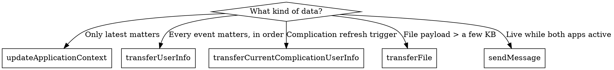

# Watch Connectivity

## When to Use This Skill

Use when:
- Picking between `updateApplicationContext`, `transferUserInfo`, `transferFile`, `transferCurrentComplicationUserInfo`, and `sendMessage` for a data hand-off
- Setting up `WCSession` on both sides (iOS + watchOS) with a `WCSessionDelegate`
- Completing a `WKWatchConnectivityRefreshBackgroundTask` correctly so the app doesn't blow its background-time budget
- Updating a complication from the companion iPhone app
- Handling Family Setup and independent-app scenarios where the paired iPhone isn't always available
- Debugging why data doesn't arrive, arrives late, or crashes the watchOS app on wake

#### Related Skills

- Use `platform-basics.md` for independent-app configuration and `WKRunsIndependentlyOfCompanionApp`
- Use `background-and-networking.md` for URLSession background tasks and TN3135 networking limits — which often replace Watch Connectivity entirely
- Use `smart-stack-and-complications.md` for widget timeline reloads driven by incoming transfers
- Use `axiom-networking` for URLSession patterns when the watch fetches directly

## Core Principle

**Watch Connectivity is an opportunistic optimization, never the primary data path.** Apple's own guidance:

> "In watchOS 6 and later, users may not install the iOS companion for their independent watchOS apps… you can't rely on WatchConnectivity as your only means of updating the watchOS app. Instead, use the WatchConnectivity framework as an opportunistic optimization, rather than the primary means of supplying fresh data." — Apple, Keeping your watchOS content up to date

Design the app to fetch from the network or CloudKit. Layer Watch Connectivity on top when the paired iPhone happens to be available and reachable.

## Session Activation

One session singleton per process, activated once at launch on both sides:

```swift
import WatchConnectivity

final class ConnectivityProvider: NSObject, WCSessionDelegate {
    static let shared = ConnectivityProvider()

    override init() {
        super.init()
        guard WCSession.isSupported() else { return }
        WCSession.default.delegate = self
        WCSession.default.activate()
    }

    func session(_ session: WCSession,
                 activationDidCompleteWith activationState: WCSessionActivationState,
                 error: Error?) { /* handle */ }

    // iOS-only callbacks (required on iOS for pairing with multiple watches):
    #if os(iOS)
    func sessionDidBecomeInactive(_ session: WCSession) { }
    func sessionDidDeactivate(_ session: WCSession) {
        WCSession.default.activate()  // reactivate for next watch
    }
    #endif
}
```

Set the delegate **before** activating. On iOS, implementing both `sessionDidBecomeInactive(_:)` and `sessionDidDeactivate(_:)` is required to support multiple paired watches.

## Choose the Right Transfer Method

Five methods, five jobs. Pick by primary purpose:

| Method | Queued | Overwrites prior | Wakes receiver | Best for |
|---|---|---|---|---|
| `updateApplicationContext(_:)` | No | **Yes** — new context replaces old | Next launch | State snapshots where only the latest matters (current song, settings, last sync time) |
| `transferUserInfo(_:)` | Yes | No — FIFO | Next launch (background) | Events that all matter in order (new messages, appointments, score updates) |
| `transferCurrentComplicationUserInfo(_:)` | Yes | No — FIFO | Immediately (50/day limit) | Complication refresh triggers — the only method that wakes the watch for complications |
| `transferFile(_:metadata:)` | Yes | No — FIFO | On receipt (background) | File payloads (images, audio clips, large JSON) |
| `sendMessage(_:replyHandler:errorHandler:)` | No | — | Only if both apps are reachable/active | Live request-response while both apps run |

### Decision tree



### `updateApplicationContext` — latest-wins state

```swift
try WCSession.default.updateApplicationContext([
    "lastSync": Date().timeIntervalSince1970,
    "trackTitle": currentTrack.title,
])
```

Receiver implements `session(_:didReceiveApplicationContext:)`. If three updates are queued while the receiver sleeps, only the newest arrives on wake.

### `transferUserInfo` — ordered queue

```swift
let transfer = WCSession.default.transferUserInfo([
    "event": "new-message",
    "id": messageID,
    "text": messageText,
])
```

Each call creates a `WCSessionUserInfoTransfer`. Check `session.outstandingUserInfoTransfers` to see what's still in flight; cancel a queued transfer with `transfer.cancel()` to avoid piling stale data on the receiver.

### `transferCurrentComplicationUserInfo` — budgeted

```swift
if WCSession.default.isComplicationEnabled {
    WCSession.default.transferCurrentComplicationUserInfo(payload)
}
let left = WCSession.default.remainingComplicationUserInfoTransfers  // check budget
```

**Rate limit — 50 transfers per day per complication.** Fixed in 27: the watchOS 27 release notes resolve "`transferCurrentComplicationUserInfo` does not work with complications built using WidgetKit on watchOS" (FB12819178) — on earlier releases this method did not work with WidgetKit complications. The receiver persists the payload (usually to shared `UserDefaults` via an App Group) and calls `WidgetCenter.shared.reloadTimelines(ofKind:)` so WidgetKit rebuilds the entries:

```swift
WidgetCenter.shared.getCurrentConfigurations { result in
    if case .success(let list) = result {
        for info in list {
            WidgetCenter.shared.reloadTimelines(ofKind: info.kind)
        }
    }
}
```

### `transferFile` — background file transfer

```swift
let transfer = WCSession.default.transferFile(fileURL, metadata: ["kind": "image"])
// transfer.progress gives Progress for UI
```

Delete the file after the transfer completes in `session(_:didFinish:error:)` — the file stays on disk until you remove it.

### `sendMessage` — live only

```swift
WCSession.default.sendMessage(
    ["request": "nowPlaying"],
    replyHandler: { reply in /* runs on background thread */ },
    errorHandler: { error in /* WCSession not reachable or timed out */ }
)
```

Requires `isReachable == true` on both sides. Reply handler must return quickly — the system times it out. On watchOS, `sendMessage` from the watch wakes a reachable companion iPhone app.

## Always Complete Every Background Task

**This is the single most common Watch Connectivity crash pattern.** watchOS wakes the app for `WKWatchConnectivityRefreshBackgroundTask` to deliver queued transfers. If the app fails to call `setTaskCompletedWithSnapshot(_:)` on every task, the background-time budget drains — and the next time it runs out, the app crashes.

The correct shape: retain the tasks in an array, complete them when (a) your handler is done, (b) `activationState` settles to `.activated`, and (c) `hasContentPending` becomes `false`:

```swift
private var wcBackgroundTasks: [WKWatchConnectivityRefreshBackgroundTask] = []

func handle(_ backgroundTasks: Set<WKRefreshBackgroundTask>) {
    for task in backgroundTasks {
        if let wcTask = task as? WKWatchConnectivityRefreshBackgroundTask {
            wcBackgroundTasks.append(wcTask)
        } else {
            task.setTaskCompletedWithSnapshot(false)
        }
    }
    completeBackgroundTasks()
}

private var activationObs: NSKeyValueObservation?
private var pendingObs: NSKeyValueObservation?

func bootstrap() {
    activationObs = WCSession.default.observe(\.activationState) { _, _ in
        DispatchQueue.main.async { self.completeBackgroundTasks() }
    }
    pendingObs = WCSession.default.observe(\.hasContentPending) { _, _ in
        DispatchQueue.main.async { self.completeBackgroundTasks() }
    }
}

private func completeBackgroundTasks() {
    guard WCSession.default.activationState == .activated,
          !WCSession.default.hasContentPending else { return }
    wcBackgroundTasks.forEach { $0.setTaskCompletedWithSnapshot(false) }
    wcBackgroundTasks.removeAll()
}
```

## Reachability and Companion State

```swift
let s = WCSession.default

s.activationState         // .notActivated / .inactive / .activated
s.isPaired                // iOS only — is any watch paired
s.isWatchAppInstalled     // iOS only — does the paired watch have the companion
s.isComplicationEnabled   // is a complication on an active watch face
s.isReachable             // both apps active and reachable right now
```

**Guard every send against the right precondition.** `transferUserInfo` works offline, but `sendMessage` fails if `isReachable == false`. Check `isComplicationEnabled` before spending one of the 50 daily complication transfers.

**`isReachable` is a hint, not a delivery guarantee.** It can read `true` while a `sendMessage`/`sendMessageData` still fails or never arrives — don't gate sends on it as proof of delivery. Always pass the `errorHandler`, and for data that must arrive use the queued/background APIs (`transferUserInfo` / `updateApplicationContext` / `transferFile`). For genuine real-time, low-latency needs when both devices share a network, a direct HTTP/SSE channel is a known escape hatch around Watch Connectivity's reliability limits.

## App Group Required for Complication Updates

Watch Connectivity hands the payload to the watchOS app, but WidgetKit reads from the widget's own process. Share a container:

1. Enable App Groups on the watchOS app target and the widget target (same group identifier).
2. Write the incoming payload to `UserDefaults(suiteName: "group.com.yourco.app")` or to a file inside the shared container.
3. Call `WidgetCenter.shared.reloadTimelines(ofKind:)` so WidgetKit re-reads and regenerates timeline entries.

The widget's `TimelineProvider` reads the same shared storage when it generates entries.

## Design for the Disconnected Watch

Independent apps ship without an iPhone companion in some configurations — or the companion isn't installed, or the phone is out of Bluetooth range. Watch Connectivity must degrade cleanly:

| Configuration | Behavior you must support |
|---|---|
| Independent app on Family Setup watch | No iPhone companion exists — Watch Connectivity never activates on the watch |
| Independent app, companion not installed | `isWatchAppInstalled = false` on the iPhone side; fall back to network/CloudKit |
| Paired watch, iPhone asleep / Bluetooth range exceeded | `isReachable = false`; queued transfers deliver on reconnection |
| LTE watch, iPhone off | `isReachable = false`; app should still fetch from the network directly |

**Concrete pattern.** Fetch primary data over URLSession or CloudKit. When `WCSession.activationState == .activated` and `isReachable == true`, opportunistically cache or refresh via Watch Connectivity. Never wait for a transfer to render core content.

## Common Mistakes

| Mistake | Symptom | Fix |
|---|---|---|
| Forgetting to `setTaskCompletedWithSnapshot` on every `WKWatchConnectivityRefreshBackgroundTask` | App crashes at random times after a Watch Connectivity wake; background time budget exhausted | Retain tasks in an array, complete them in `handle(_:)` **and** via KVO on `activationState` / `hasContentPending` |
| Using `sendMessage` as the primary data sync | Updates fail silently when the companion app is suspended; reply timeout errors | Switch to `transferUserInfo` (queued, background-delivered) or `updateApplicationContext` (latest-wins) |
| Relying on Watch Connectivity as the only data path | Family Setup watches show empty; LTE watches away from iPhone show stale data | Fetch primary data over URLSession or CloudKit; use Watch Connectivity opportunistically |
| Spamming `transferCurrentComplicationUserInfo` on every small change | Silent throttling past 50 transfers/day; complication stops updating | Batch updates; call `remainingComplicationUserInfoTransfers` to gate; fall back to widget push notifications (watchOS 26+) for higher frequency |
| Updating a widget without an App Group | Transfer arrives, but widget never shows new data | Enable App Groups on both targets; share via `UserDefaults(suiteName:)` or shared container file; call `WidgetCenter.shared.reloadTimelines(ofKind:)` |
| Missing `sessionDidBecomeInactive` / `sessionDidDeactivate` on iOS | Second paired watch never receives data | Implement both on iOS; call `WCSession.default.activate()` in `sessionDidDeactivate` to reactivate |
| Activating `WCSession` before assigning a delegate | Activation callback arrives before the delegate exists; events silently dropped | Assign the delegate, then activate — in that order |
| Assuming `sendMessage`/`sendMessageData` errors fire at most once | Duplicate retries or duplicated side effects for a message that already succeeded | WC offers no exactly-once delivery and the error handler can fire more than once — tag each message with your own frame/message ID and dedupe (add an app-level ack when delivery must be confirmed) |
| Overwriting `applicationContext` when ordered delivery is needed | Receiver misses events between wake intervals | Use `transferUserInfo` when every event matters, not `updateApplicationContext` |
| Not deleting files after `transferFile` completes | Files accumulate on the sender's disk indefinitely | Remove the source file in `session(_:didFinish:error:)` |

## Resources

**WWDC**: 2021-10003, 2018-218

**Docs**: /watchconnectivity, /watchconnectivity/wcsession, /watchconnectivity/wcsessiondelegate, /watchconnectivity/transferring-data-with-watch-connectivity, /watchos-apps/keeping-your-watchos-app-s-content-up-to-date, /widgetkit/widgetcenter, /watchkit/wkwatchconnectivityrefreshbackgroundtask

**Skills**: axiom-watchos (platform-basics, background-and-networking, smart-stack-and-complications), axiom-networking
