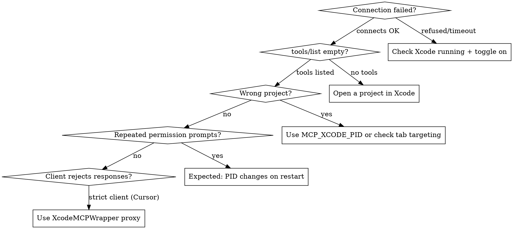

# Xcode MCP Setup

## Prerequisites

- **Xcode 26.3+** with MCP support
- **macOS** with Xcode installed and running
- At least one project/workspace open in Xcode

## Step 1: Allow external agents in Xcode

Agents you launch *outside* Xcode (Claude Code, Codex in Terminal) reach your project through the MCP server Xcode provides. Authorize them first:

1. Open Xcode **Settings** (Cmd+,)
2. Select **Intelligence** in the sidebar
3. Under **Model Context Protocol**, turn on **"Allow external agents to use Xcode tools"**

Without this, `xcrun mcpbridge` connects but Xcode exposes no tools. Xcode alerts you when an external agent connects and when it's active, so you always know when an agent is driving your project.

## Step 2: Connect Your MCP Client

### Claude Code

```bash
claude mcp add --transport stdio xcode -- xcrun mcpbridge
```

Verify: `claude mcp list` should show `xcode` server.

### Codex

```bash
codex mcp add xcode -- xcrun mcpbridge
```

### Cursor

Create or edit `.cursor/mcp.json` in your project root:

```json
{
  "mcpServers": {
    "xcode": {
      "command": "xcrun",
      "args": ["mcpbridge"]
    }
  }
}
```

**Cursor-specific note**: Cursor is a strict MCP client. Xcode's mcpbridge omits `structuredContent` when tools declare `outputSchema`, which violates the MCP spec. If Cursor rejects responses, use [XcodeMCPWrapper](https://github.com/SoundBlaster/XcodeMCPWrapper) as a proxy:

```json
{
  "mcpServers": {
    "xcode": {
      "command": "/path/to/XcodeMCPWrapper",
      "args": []
    }
  }
}
```

### VS Code + GitHub Copilot

Create or edit `.vscode/mcp.json`:

```json
{
  "servers": {
    "xcode": {
      "type": "stdio",
      "command": "xcrun",
      "args": ["mcpbridge"]
    }
  }
}
```

### Gemini CLI

```bash
gemini mcp add xcode -- xcrun mcpbridge
```

## Step 3: Verify Connection

After configuration, call `XcodeListWindows` (no parameters). You should see:

```
tabIdentifier: <uuid>, workspacePath: /path/to/YourProject.xcodeproj
```

If you see an empty list, ensure a project is open in Xcode.

## Permission Dialog

When an MCP client first connects, Xcode shows a **permission dialog**:

- Identifies the connecting process by **PID**
- Asks to allow MCP tool access
- Must be approved in Xcode's UI (not terminal)

**PID-based approval**: Permission is granted per-process. If the client restarts (new PID), you'll see the dialog again. This is expected behavior.

## Letting Xcode Launch the Agent (`run-agent`)

Instead of wiring the agent yourself (Step 2), have Xcode launch it *with Xcode's own configuration* — resolved binary path, auth tokens, environment, and the Xcode MCP tools, all injected for you. `run-agent` connects to the running Xcode (same `MCP_XCODE_PID` auto-detection as the bridge), fetches the agent's config, then `exec`s the agent with full terminal access.

```bash
# Launch Claude Code, configured by the running Xcode
xcrun mcpbridge run-agent claude

# Pass args straight through to the agent
xcrun mcpbridge run-agent claude --model opus -p "fix the failing test"

# Print the resolved command without running it
xcrun mcpbridge run-agent --dry-run claude

# Launch without injecting Xcode's MCP tools
xcrun mcpbridge run-agent claude --no-xcode-tools
```

Use `run-agent` when you want one command that both authorizes and starts the agent against the open project, rather than maintaining a separate `mcp add` registration.

### Exporting Xcode's Skill Bundles `OS27`

Xcode ships built-in skill bundles — the expertise it injects for tasks like localization and accessibility. Export every globally available `SKILL.md` bundle to disk to inspect what guidance Xcode's agent works from, or to reuse those bundles elsewhere:

```bash
xcrun mcpbridge run-agent skills export                                  # writes ./xcode-skills
xcrun mcpbridge run-agent skills export --output-dir ~/skills --replace-existing
```

## Multi-Xcode Targeting

When multiple Xcode instances are running:

### Auto-Detection (default)

mcpbridge auto-selects using this fallback:
1. If exactly one Xcode process is running → uses that
2. If multiple → uses the one matching `xcode-select`
3. If none → exits with error

### Manual PID Selection

Set `MCP_XCODE_PID` to target a specific instance:

```bash
# Find Xcode PIDs
pgrep -x Xcode

# Claude Code with specific PID
claude mcp add --transport stdio xcode -- env MCP_XCODE_PID=12345 xcrun mcpbridge
```

### Session ID (optional)

`MCP_XCODE_SESSION_ID` provides a stable UUID for tool sessions, useful when tracking interactions across reconnections.

## Troubleshooting



### Common Issues

| Symptom | Cause | Fix |
|---------|-------|-----|
| "Connection refused" | Xcode not running or MCP toggle off | Launch Xcode, enable MCP in Settings > Intelligence |
| tools/list returns empty | No project open, or permission not granted | Open a project, check for permission dialog in Xcode |
| Tools target wrong project | Multiple Xcode windows, wrong tab | Call `XcodeListWindows`, use correct `tabIdentifier` |
| Repeated permission prompts | Client restarted (new PID) | Expected behavior — approve each time |
| Cursor/strict client errors | Missing `structuredContent` in response | Use XcodeMCPWrapper as proxy |
| "No such command: mcpbridge" | Xcode < 26.3 | Update to Xcode 26.3+ |
| Slow/hanging tool calls | Large project indexing | Wait for Xcode indexing to complete |

## Extending the Agent That Runs Inside Xcode

Agents you launch *in* Xcode — the coding assistant, or one started with `run-agent` — can be customized beyond Intelligence settings. These customizations affect only Xcode-launched agents, **not** external clients you wired in Step 2.

**Per-agent config files** live in subfolders of `~/Library/Developer/Xcode/CodingAssistant` (a folder Xcode uses exclusively). Use them to set a default model, add your own MCP servers, or define skills:

```
~/Library/Developer/Xcode/CodingAssistant/ClaudeAgentConfig   # Claude
~/Library/Developer/Xcode/CodingAssistant/codex               # Codex
~/Library/Developer/Xcode/CodingAssistant/gemini              # Gemini
```

**Permissions** — Intelligence settings → **Agents → Permissions**. Add command-line tools under *Allowed Commands*; revoke tools under *Allowed Tools*. Anything you previously granted in the coding assistant appears here.

**Built-in skills via slash commands** — type `/` in the message field to list them. `/plan` enters plan mode (explore without editing code); `/exit` → `/exit-plan` leaves it. Xcode also invokes skills automatically from your prompt (e.g. a "translate" prompt triggers localization subagents).

**Plug-ins** — Intelligence settings → **Agents → Plug-ins → Add Plug-in**. A plug-in bundles additional subagents, MCP servers, and skills; "Add from URL" imports one, then you select which components to install.

## Resources

**Docs**: /xcode/mcp-server, /xcode/giving-external-agents-access-to-xcode, /xcode/extending-and-customizing-agents, /xcode/coding-intelligence

**WWDC**: 2026-258, 2026-259

**Skills**: axiom-xcode-mcp (skills/xcode-mcp-tools.md), axiom-xcode-mcp (skills/xcode-mcp-ref.md)
