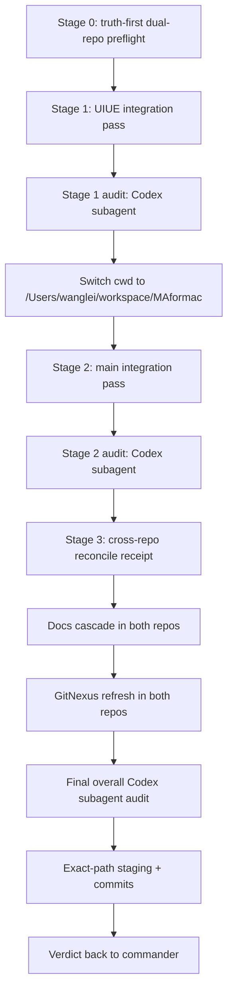

# Dispatch 6 - UIUE R5 Dual-Repo Integration Train

## 0. Route Metadata

- **TO**: mixed integration Codex window `019f0ebc-8e13-74a0-a2fb-7a8d402645bf`
- **FROM**: UIUE R5 commander
- **MODE**: serial dual-repo integration train with exact-path staging/commit only after audits, docs cascade, and GitNexus refresh
- **One-line deliverable**: integrate accepted R5 D1-D5 artifacts across UIUE and main in a strict serial train: UIUE integration pass, main integration pass, cross-repo reconcile receipt, documentation cascade, GitNexus refresh, final overall audit, then exact-path commits if all gates pass.
- **Proof ceiling**: `docs/local + local_unit + local_static + openspec_contract`.
- **Audit subject**: Codex native subagent. Hermes/GLM is not the audit subject and is not a hard gate.

## 1. Hard Ordering

This dispatch is a single long task with three serial stages. Do not parallelize implementation.



Required audit gates:

1. After Stage 1 and before switching to main, run a Codex native subagent audit of the UIUE integration. If unavailable/no evidence/unresolved P0/P1, stop as `PARTIAL`.
2. After Stage 2 and before Stage 3, run a Codex native subagent audit of the main integration. If unavailable/no evidence/unresolved P0/P1, stop as `PARTIAL`.
3. After Stage 3, complete the two-repo documentation cascade and GitNexus refresh, then run the final overall Codex native subagent audit covering both repos and all commits-to-be. If unavailable/no evidence/unresolved P0/P1, stop as `PARTIAL`.
4. The final overall Codex audit is the last pre-staging/pre-commit audit gate. If any file, pathspec, documentation cascade, GitNexus artifact, validation result, or dirty split changes after it, rerun the final overall Codex audit before staging or committing.

Commit is allowed only after:

- all three stages pass,
- two-repo documentation cascade is complete,
- GitNexus graph refresh is complete in both repos,
- the two phase audits and final overall audit have no unresolved P0/P1,
- exact pathspec staging has been reviewed,
- no unrelated dirty files are staged.

Do not use `git add .`.

## 2. Metacognitive Harness

This dispatch must use the harness below as execution control, not as prose commentary.

At the start of every stage, write a short stage contract in the running receipt or notes:

- goal for this stage
- non-goals for this stage
- current `pwd`
- owned paths
- preserve-unowned paths
- validation gates
- proof-class ceiling
- stop conditions

Before edits in Stage 1, Stage 2, and Stage 3, run a short pre-mortem:

- What would make this stage false-green?
- Which proof could be accidentally promoted?
- Which dirty files could be accidentally swept into staging?
- Which receipt/doc claim would become stale if HEAD or pathspec changes?
- Which remaining gate could be accidentally marked complete?

After every validation batch and before every subagent audit, perform a goal-drift check:

- Is the current action advancing D6 integration, or is it local polishing?
- Does the action stay inside the current stage?
- Did any new touched path require a wider validation gate?
- Does any result need to downgrade `DONE` to `PARTIAL`?

Subagent evidence is not final authority. The stage owner must reconcile every subagent audit against:

1. live `git status`
2. live validation stdout
3. actual file diffs
4. receipts and pathspecs
5. proof-class/non-claim wording

Before staging or committing, run a final self-question:

- Can every staged file be explained as an owned R5 path?
- Are all preserve-unowned paths still unstaged?
- Are docs cascade and GitNexus refresh newer than the final edits?
- Are D1/D2/D3/D4/D5 proof caps still visible in receipts?
- Would any reader mistake this for R5 complete, runtime-ready, mobile/true-device proof, UIUE merge, or V/S/U?

If any answer is uncertain, stop as `PARTIAL` and report the smallest blocker. Do not ask the commander to infer the blocker from logs.

## 3. Stage 0 - Truth-First Dual-Repo Preflight

Run and record before edits:

```bash
cd /Users/wanglei/workspace/MAformac-uiue
pwd
git branch --show-current
git rev-parse HEAD
git status --short --branch
git diff --check
openspec validate ui-presentation --strict

cd /Users/wanglei/workspace/MAformac
pwd
git branch --show-current
git rev-parse HEAD
git status --short --branch
git diff --check
openspec validate define-runtime-presentation-bridge --strict
```

Classify dirty before edits:

- UIUE owned R5 artifacts from D3/D4/D5 and dispatch docs.
- main owned R5 artifacts from D1/D2.
- preserve-unowned main files: `AGENTS.md`, `CLAUDE.md`, `docs/CURRENT.md`, `docs/README.md`, `.xcodebuildmcp/`, `Tools/agent-platform-plugin-refs/`.
- generated or ignored GitNexus artifacts.

Stop if the dirty split is not separable by exact pathspecs.

## 4. Stage 1 - UIUE Integration Pass

Working directory: `/Users/wanglei/workspace/MAformac-uiue`.

Goal:

- Integrate UIUE R5 artifacts created by commander/D3/D4/D5.
- Finish UIUE documentation cascade required before commit.
- Keep main read-only.

Writable UIUE pathspec candidates:

```text
Core/Presentation/RuntimePresentationConsumerMapping.swift
Tests/MAformacCoreTests/RuntimePresentationConsumerMappingTests.swift
Tests/MAformacCoreTests/R5ProofGovernanceStaticChecksTests.swift
docs/dispatches/2026-06-28-uiue-r5-mainline-terminal-snapshot-adapter-dispatch.md
docs/dispatches/2026-06-28-uiue-r5-mainline-contract-test-hardening-dispatch.md
docs/dispatches/2026-06-28-uiue-r5-uiue-consumer-mapping-dispatch.md
docs/dispatches/2026-06-28-uiue-r5-shared-proof-governance-dispatch.md
docs/dispatches/2026-06-28-uiue-r5-commander-reconcile-dispatch.md
docs/dispatches/2026-06-28-uiue-r5-dual-repo-integration-train-dispatch.md
docs/project/phase0/r5-uiue-consumer-mapping-dispatch-4-2026-06-28.md
docs/project/phase0/r5-proof-governance-receipt-schema-2026-06-28.md
docs/project/phase0/r5-shared-proof-governance-dispatch-3-2026-06-28.md
docs/project/phase0/r5-commander-reconcile-dispatch-5-2026-06-28.md
docs/roadmaps/2026-06-28-uiue-r5-dispatch-ready-decomposition-map.md
```

UIUE docs cascade before Stage 1 audit:

- Ensure the decomposition map reflects D1-D5 accepted status and this D6 integration train.
- Add or update a UIUE integration receipt under `docs/project/phase0/` if needed.
- Do not rewrite frozen baseline docs as if they were original source of truth.
- Keep non-claims and deferred gates explicit.

Validation:

```bash
git diff --check
swift test --filter RuntimePresentationConsumerMappingTests
swift test --filter PresentationReducedMotionPolicyTests
swift test --filter R5ProofGovernanceStaticChecksTests
openspec validate ui-presentation --strict
```

Then run Codex native subagent audit #1:

- Scope: UIUE integration only.
- Ask for P0/P1 only.
- Required focus: exact pathspec readiness, proof cap, no shared-field invention, no deferred-gate completion, no proof promotion, no stale HEAD, docs cascade complete.
- If unresolved P0/P1: fix in UIUE scope and rerun focused validation + audit. If still unresolved, stop as `PARTIAL`.

After Stage 1 audit passes, explicitly switch to:

```bash
cd /Users/wanglei/workspace/MAformac
```

Do not start Stage 2 before this cwd switch is recorded.

## 5. Stage 2 - Main Integration Pass

Working directory: `/Users/wanglei/workspace/MAformac`.

Goal:

- Integrate main R5 D1/D2 bridge/spec/test/receipt artifacts.
- Finish main documentation cascade required before commit.
- Preserve pre-existing unowned dirty files.

Writable main pathspec candidates:

```text
Core/Presentation/RuntimePresentationBridge.swift
Tests/MAformacCoreTests/RuntimePresentationBridgeTests.swift
openspec/changes/define-runtime-presentation-bridge/specs/runtime-presentation-bridge/spec.md
openspec/changes/define-runtime-presentation-bridge/tasks.md
docs/project/phase0/r5-mainline-terminal-snapshot-adapter-dispatch-1-2026-06-28.md
docs/project/phase0/r5-mainline-contract-test-hardening-dispatch-2-2026-06-28.md
```

No-touch main paths:

```text
AGENTS.md
CLAUDE.md
docs/CURRENT.md
docs/README.md
.xcodebuildmcp/
Tools/agent-platform-plugin-refs/
```

Main docs cascade before Stage 2 audit:

- Ensure main D1/D2 receipts point to current final local validation and exact proof cap.
- If a main doc must mention UIUE consumer readiness, use `contract_aligned` / `consumer_mapping_ready`, not merged/runtime-ready.
- Do not edit unrelated `docs/CURRENT.md` or `docs/README.md` unless you first classify them as owned and can prove they are R5-owned. Current expected behavior: preserve them unowned.

Validation:

```bash
git diff --check
swift test --filter RuntimePresentationBridgeTests
openspec validate define-runtime-presentation-bridge --strict
openspec validate --all --strict
```

Then run Codex native subagent audit #2:

- Scope: main integration only.
- Ask for P0/P1 only.
- Required focus: exact pathspec readiness, no unowned dirty staged, D1/D2 behavior/tests intact, OpenSpec valid, no proof promotion, no UIUE docs treated as mainline authority.
- If unresolved P0/P1: fix in main scope and rerun focused validation + audit. If still unresolved, stop as `PARTIAL`.

## 6. Stage 3 - Cross-Repo Reconcile Receipt

Working directory may be either repo, but the receipt should be stored in UIUE unless there is a mainline-specific receipt need:

```text
/Users/wanglei/workspace/MAformac-uiue/docs/project/phase0/r5-dual-repo-integration-train-2026-06-28.md
```

Required content:

- UIUE branch/head/dirty before and after.
- main branch/head/dirty before and after.
- accepted D1/D2/D3/D4/D5 statuses.
- exact commits planned or created.
- proof cap and non-claims.
- deferred gates: `C005`, `C018`, `C052`, `C061`.
- K1/M3/H1/future-lane non-implementation ledgers.
- validation command table.
- GitNexus refresh evidence for both repos.
- exact staging pathspecs used.
- residual risks.

After Stage 3 receipt is written, finish the documentation cascade and GitNexus refresh first, then run final overall Codex native subagent audit:

- Scope: both repos, Stage 1 + Stage 2 + Stage 3, final documentation cascade, GitNexus refresh evidence, staging/commit readiness.
- Ask for P0/P1 only.
- Required focus: dirty split, exact pathspecs, docs cascade, GitNexus refresh before commit, no false claims, no missing validation, no accidental staging of unowned paths, no R5 complete/runtime/mobile/true-device/UIUE merge claim.
- If unresolved P0/P1: fix in scope and rerun relevant validation + final audit. If still unresolved, stop as `PARTIAL`.
- If any file/pathspec/docs/GitNexus/validation/dirty-split state changes after this final audit, rerun this final audit before staging or committing.

## 7. Required Documentation Cascade Before Final Audit And Commit

Before final overall audit and any commit, both repos must have documentation cascade complete:

UIUE:

- decomposition map shows D1-D5 accepted and D6 integration-train status.
- D6 dispatch is present.
- D6 cross-repo receipt is present.
- D3/D4/D5 receipts remain proof-capped.

Main:

- D1/D2 receipts remain present and proof-capped.
- OpenSpec tasks/spec reflect D1/D2 local-unit contract hardening only.
- No unrelated docs are swept in.

If a doc cascade would require editing pre-existing unowned dirty docs in main, stop and report `PARTIAL` unless you can prove exact R5 ownership and preserve unrelated content.

## 8. Required GitNexus Refresh Before Final Audit And Commit

Before final overall audit and any commit, refresh GitNexus in both repos after final edits and validations:

```bash
cd /Users/wanglei/workspace/MAformac-uiue
node .gitnexus/run.cjs status || true
node .gitnexus/run.cjs analyze
node .gitnexus/run.cjs status

cd /Users/wanglei/workspace/MAformac
node .gitnexus/run.cjs status || true
node .gitnexus/run.cjs analyze
node .gitnexus/run.cjs status
```

If `node .gitnexus/run.cjs` is missing, use the GitNexus skill fallback:

```bash
gitnexus analyze
```

Then record status output in the Stage 3 receipt.

GitNexus refresh artifacts are graph/index artifacts. Do not stage `.gitnexus/` unless the repo already tracks a specific GitNexus artifact and you can prove it belongs in the R5 commit.

## 9. Exact-Path Staging And Commit

Only after all gates above pass:

1. Review `git status --short` in each repo.
2. Stage exact owned pathspecs only.
3. Run `git diff --cached --check`.
4. Run the repo-specific validation gates again if staged diff differs from validated diff.
5. Create commits with scoped messages.

Suggested UIUE commit:

```text
docs/uiue: integrate r5 runtime presentation coordination
```

Suggested main commit:

```text
feat(presentation): harden runtime presentation bridge contract
```

Do not use `git add .`.
Do not push.
Do not merge.

## 10. Final Verdict Format

Return to commander:

```text
status: DONE / PARTIAL / BLOCKED
label: UIUE_R5_D6_DUAL_REPO_INTEGRATION_TRAIN
repo_truth:
  UIUE branch/start_head/final_head/dirty:
  main branch/start_head/final_head/dirty:
stage_1_uiue:
  changed_paths:
  validation:
  codex_subagent_audit:
  commit:
stage_2_main:
  changed_paths:
  validation:
  codex_subagent_audit:
  commit:
stage_3_reconcile:
  receipt_path:
  validation:
  final_codex_subagent_audit:
docs_cascade:
  UIUE:
  main:
gitnexus_refresh:
  UIUE:
  main:
staging:
  UIUE_exact_pathspecs:
  main_exact_pathspecs:
  excluded_paths:
non_claims:
remaining_gates:
residual_risks:
next_step:
```

`status: DONE` requires both repos to have successful exact-path commits and all three Codex subagent audits clear of unresolved P0/P1. If commits are not created, return `PARTIAL` unless commander explicitly told you to stop before commit.

## 11. Stop Conditions

Stop as `PARTIAL` or `BLOCKED` if:

1. Any Codex subagent audit is unavailable, returns no evidence, or reports unresolved P0/P1.
2. Documentation cascade is incomplete before commit.
3. GitNexus refresh fails in either repo before commit.
4. Dirty split cannot be isolated by exact pathspec.
5. A required validation fails and cannot be fixed inside the stage scope.
6. Staging would include preserve-unowned files.
7. A commit would need `git add .`.
8. Any text claims R5 complete, runtime-ready, mobile, true_device, voice-ready, model-ready, golden-ready, endpoint-ready, UIUE merge, V-PASS, S-PASS, U-PASS, A-2, A-2 ready, or A-2 complete.
9. Runtime backend, mobile, true-device, voice/model/golden, endpoint, C5/C6, K1, M3, or H1 implementation is required.
