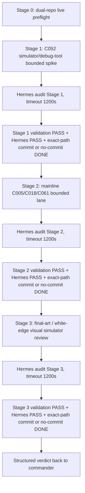

# Dispatch 9 - R5 Serial Bounded Lanes With Hermes Gates

## 0. Commander Decision

The commander recommends running the three post-D8 bounded lanes serially in this one mixed window, because this window already has both-repo context and can preserve ordering across UIUE simulator/debug work and mainline contract work.

This is allowed only as a serial train with a hard Hermes gate after each stage. Do not parallelize the stages. Do not treat this as one large implementation bucket.

## 1. Hard Ordering



Stop immediately if a stage cannot pass its own validation and Hermes gate. Do not enter the next stage with `PARTIAL`, `BLOCKED`, unresolved P0/P1, no Hermes evidence, or a Hermes timeout.

## 2. Live Truth Preflight

Record before edits:

```bash
cd /Users/wanglei/workspace/MAformac-uiue
pwd
git branch --show-current
git rev-parse HEAD
git status --short

cd /Users/wanglei/workspace/MAformac
pwd
git branch --show-current
git rev-parse HEAD
git status --short
```

Expected commander-observed truth at dispatch time:

| repo | expected head | expected dirty |
|---|---|---|
| UIUE | `f8e85384027bee13a9521bd1a0c605060590cfd8` | only this D9 dispatch may be untracked before your edits |
| main | `d332db736a0c47eb3b8dc09c80fb907a0f43e29e` | preserve-unowned only: `AGENTS.md`, `CLAUDE.md`, `docs/CURRENT.md`, `docs/README.md`, `.xcodebuildmcp/`, `Tools/agent-platform-plugin-refs/` |

If live truth differs, record it and proceed only if the difference is exact-path separable. Do not stage preserve-unowned files.

## 3. Hermes Audit Gate Template

After each stage, write a stage-specific Hermes prompt to a file under a stage run directory, then run Hermes with a hard 20-minute cap:

```bash
mkdir -p /Users/wanglei/workspace/MAformac-uiue/Reports/r5-d9-<stage>-$(date +%Y%m%dT%H%M%S)

/Users/wanglei/.codex/skills/hermes-cli-glm52-code/scripts/hermes_glm52_code.py run \
  --prompt-file /absolute/path/to/hermes-prompt.txt \
  --timeout 1200 \
  > /absolute/path/to/hermes-output.txt 2>&1
```

Hermes prompt requirements:

- Scope is current stage only.
- Ask for P0/P1 blockers first.
- Require file:line evidence for findings.
- Require proof-class and non-claim review.
- Require dirty split / exact pathspec review.
- Require validation adequacy review.
- Ask Hermes to return `PASS` only if no unresolved P0/P1 remains.

If Hermes times out, returns no usable evidence, or reports unresolved P0/P1, stop as `PARTIAL`; do not continue to the next stage.

Do not make Hermes the final authority for claims outside the current stage. Live repo state, validation stdout, and file diffs remain controller truth.

Reports under `Reports/` are audit artifacts; do not stage them unless the repo already tracks the exact path and you can justify it. Instead, record the Hermes output path and summary in the stage receipt.

## 4. Stage 1 - C052 Simulator/Debug-Tool Bounded Spike

### Goal

Determine whether the force-state/demo-tooling path can be proven as a debug-only, non-production lane with trace/provenance evidence and `simulator_mock` cap if a simulator is opened.

### Non-goals

- No production force-state behavior.
- No runtime-ready claim.
- No mobile or true-device proof.
- No UIUE merge.
- No broad UI refactor.

### Required Work

1. Work from `/Users/wanglei/workspace/MAformac-uiue`.
2. Re-read D8 decision receipt and D7 human-review packet lines for `C052`.
3. Discover current force-state/debug tooling surfaces before editing.
4. If a bounded spike can be done safely, create the minimal proof artifact and/or debug-only guard.
5. If it cannot be implemented safely without production behavior or shared-field invention, stop Stage 1 as `PARTIAL` with a bounded spike receipt.
6. If a simulator is opened, use UIUE's configured profile/simulator and record the exact state. Proof class remains `simulator_mock`.

### Expected Receipt

Create or update a Stage 1 receipt:

`/Users/wanglei/workspace/MAformac-uiue/docs/project/phase0/r5-c052-force-state-debug-spike-2026-06-29.md`

Receipt must state:

- `C052` disposition: `covered_by_bounded_spike`, `partial`, or `blocked`.
- touched paths
- whether simulator was opened
- validation commands
- Hermes output path
- proof cap
- non-claims

### Validation

Run at minimum:

```bash
cd /Users/wanglei/workspace/MAformac-uiue
git diff --check
openspec validate ui-presentation --strict
```

If Swift code changes, run focused Swift tests for touched areas plus `swift build` if build impact is plausible. If simulator is used, record build/run command and current screen/state.

### Stage 1 Commit

Commit only after validation and Hermes PASS. Use exact pathspecs only; no `git add .`; no push.

## 5. Stage 2 - Mainline C005/C018/C061 Bounded Lane

### Goal

Work in `/Users/wanglei/workspace/MAformac` to advance the mainline deferred gates without inventing UIUE shared fields:

- `C005`: runtime adapter write ownership through executor/runtime adapter.
- `C018`: SceneMacroRegistry/Core config authority.
- `C061`: retry/idempotency/no-double-write/no-swallowed-no-op runtime execution proof.

### Non-goals

- No UIUE implementation of mainline authority.
- No raw runtime-store consumption by UIUE.
- No production behavior claim beyond tests/receipts actually produced.
- No voice/model/golden/endpoint work.
- No UIUE merge.

### Required Work

1. Switch to `/Users/wanglei/workspace/MAformac` only after Stage 1 ends as `DONE` with validation PASS, Hermes PASS, and either an exact-path commit or an explicit no-commit DONE justification. If Stage 1 is `PARTIAL` or `BLOCKED`, return to commander and do not start Stage 2.
2. Preserve existing main dirty paths unless the user later explicitly authorizes them:
   - `AGENTS.md`
   - `CLAUDE.md`
   - `docs/CURRENT.md`
   - `docs/README.md`
   - `.xcodebuildmcp/`
   - `Tools/agent-platform-plugin-refs/`
3. For each row, decide from live code whether it is implementable now, spike-only, or still blocked:
   - Implement only if authority already exists in mainline OpenSpec/code.
   - For `C018`, do not invent `SceneMacroRegistry` if no current mainline owner/config authority exists; produce an owner-decision receipt instead.
   - For `C005` and `C061`, prove behavior with tests/fixtures before marking covered.
4. Update mainline receipts/OpenSpec/tasks only when they correspond to actual code/test evidence.

### Expected Receipt

Create or update:

`/Users/wanglei/workspace/MAformac/docs/project/phase0/r5-mainline-deferred-gates-c005-c018-c061-2026-06-29.md`

Receipt must include row-by-row disposition, touched paths, validation, Hermes output path, preserve-unowned split, proof cap, and non-claims.

### Validation

Run at minimum:

```bash
cd /Users/wanglei/workspace/MAformac
git diff --check
openspec validate define-runtime-presentation-bridge --strict
openspec validate --all --strict
```

If Swift code changes, run focused tests for touched behavior, usually:

```bash
swift test --filter RuntimePresentationBridgeTests
```

Broaden validation only if touched files require it.

### Stage 2 Commit

Commit only after validation and Hermes PASS. Use exact pathspecs only; no `git add .`; no push. Preserve unrelated main dirty.

## 6. Stage 3 - Final-Art / White-Edge Visual Simulator Review

### Goal

Create a scoped visual simulator review for final-art capsule and white-edge threshold questions, using exact screen/state evidence only if the simulator can be opened to a meaningful state.

### Non-goals

- No product final-art acceptance.
- No V-PASS/S-PASS/U-PASS.
- No mobile/true-device proof.
- No a11y proof promotion.
- No broad visual redesign unless the evidence shows a clear bounded fix and validation path.

### Required Work

1. Work from `/Users/wanglei/workspace/MAformac-uiue`.
2. Define the exact visual questions before opening simulator:
   - final-art capsule: what state/screen is being reviewed?
   - white-edge threshold: is this a warning, formal threshold proposal, or measurable screenshot issue?
3. Open UIUE simulator only if there is an exact screen/state question.
4. Capture or record evidence as simulator/mock only.
5. If no exact screen/state can be named, do not open simulator; produce a visual review prep receipt and stop Stage 3 as `PARTIAL`.

### Expected Receipt

Create or update:

`/Users/wanglei/workspace/MAformac-uiue/docs/project/phase0/r5-final-art-white-edge-visual-review-2026-06-29.md`

Receipt must include:

- exact visual questions
- simulator profile/scheme/device if opened
- screenshot/evidence paths if produced
- whether the result is warning, threshold proposal, or blocked
- Hermes output path
- proof cap and non-claims

### Validation

Run:

```bash
cd /Users/wanglei/workspace/MAformac-uiue
git diff --check
openspec validate ui-presentation --strict
```

If Swift or UI code changes, run focused tests/build/simulator validation required by touched files. If screenshots are produced, keep them in a deliberate evidence path and do not claim mobile/true-device proof.

### Stage 3 Commit

Commit only after validation and Hermes PASS. Use exact pathspecs only; no `git add .`; no push.

## 7. Global Git Rules

- No `git add .`.
- No push.
- Stage exact owned paths only.
- Do not stage main preserve-unowned files.
- Do not stage generated caches, `.DS_Store`, broad `Reports/`, `.gitnexus/`, or simulator runtime output unless explicitly justified as an evidence artifact path.
- Prefer one commit per stage after that stage's Hermes PASS.

## 8. Final Verdict Back To Commander

Return:

```yaml
status: DONE | PARTIAL | BLOCKED
label: UIUE_R5_D9_SERIAL_BOUNDED_LANES_WITH_HERMES_GATES
repo_truth:
  UIUE:
  main:
stage_1_C052:
  status:
  changed_paths:
  validation:
  hermes:
    status:
    output:
    elapsed_seconds:
    findings_P0_P1:
  commit:
stage_2_C005_C018_C061:
  status:
  row_dispositions:
  changed_paths:
  validation:
  hermes:
    status:
    output:
    elapsed_seconds:
    findings_P0_P1:
  commit:
stage_3_final_art_white_edge:
  status:
  simulator_opened:
  simulator_state:
  evidence_paths:
  changed_paths:
  validation:
  hermes:
    status:
    output:
    elapsed_seconds:
    findings_P0_P1:
  commit:
non_claims:
residual_risks:
next_step_for_commander:
```

`status: DONE` for the whole train requires all three stages to finish with validation PASS, Hermes PASS within 1200 seconds each, and exact-path commits or explicit no-commit docs-only justification. If any stage stops as `PARTIAL` or `BLOCKED`, return immediately and do not continue to later stages.

## 9. Stop Conditions

Stop as `PARTIAL` or `BLOCKED` if:

1. Hermes audit for the current stage times out, returns no evidence, or reports unresolved P0/P1.
2. Any stage needs claims above its proof cap.
3. Any stage requires R5 complete, runtime-ready, mobile, true_device, voice/model/golden/endpoint, UIUE merge, V-PASS, S-PASS, U-PASS, A-2, A-2 ready, or A-2 complete.
4. Stage 2 requires editing main preserve-unowned files.
5. A stage needs `git add .`.
6. A simulator review cannot name an exact screen/state question.
7. A row is not implementable without inventing shared fields or authority.
