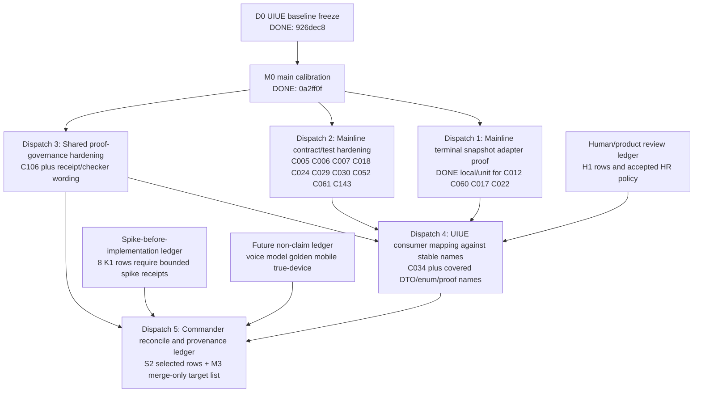

# UIUE R5 Dispatch-Ready Decomposition Map

This document combines the UIUE STEP0 baseline freeze verdict and the main-side STEP0 calibration verdict into a dispatch-ready dependency map. It does not dispatch windows by itself and does not authorize implementation. A later commander prompt may use this map to create bounded dispatches.

## Inputs Frozen

| Input | Current truth | Evidence |
|---|---|---|
| UIUE baseline | Frozen at `926dec8311c63a7b51cd1a1a5f633009e25cf7d2`; UIUE worktree clean at STEP0 verdict. | UIUE STEP0 verdict; commit `926dec8 docs(uiue): freeze r5 baseline for calibration`. |
| Mainline calibration base | Main HEAD `0a2ff0f7d30d6caf2d48f018f6b874828fb70c03`; dirty state preserved and not owned by this map. | Main STEP0 verdict; current main `git status` remains preserve_unowned. |
| Coordination spec boundary | UIUE coordination spec is canonical only for R5 coordination and cannot override mainline shared field authority. | `docs/roadmaps/2026-06-28-uiue-r5-dual-branch-coordination-spec.md:30-32`. |
| Needs-validation rule | `needs-validation` is an evidence gap, not an implementation gap. | `docs/roadmaps/2026-06-28-uiue-r5-dual-branch-coordination-spec.md:59-72`. |
| Dispatch gate | Calibration produces state labels only; implementation requires later commander/user dispatch. | `docs/roadmaps/2026-06-28-uiue-r5-dual-branch-coordination-spec.md:106-108`, `:188-190`. |

## Dispatch Intake Updates

| Dispatch | Controller disposition | Evidence | Remaining cap |
|---|---|---|---|
| Dispatch 1: mainline terminal snapshot adapter behavior proof | Accepted for dispatch-local coverage on 2026-06-28. `C012`, `C060`, `C017`, and `C022` may move from `remaining` to `covered_for_dispatch_1` for UIUE consumer mapping. | Main verdict reports local/unit tests and OpenSpec pass; controller re-ran `openspec validate define-runtime-presentation-bridge --strict`, `openspec validate --all --strict`, `git diff --check`, and `swift test --filter RuntimePresentationBridgeTests` with PASS. Code evidence: `/Users/wanglei/workspace/MAformac/Core/Presentation/RuntimePresentationBridge.swift:368-473`; tests: `/Users/wanglei/workspace/MAformac/Tests/MAformacCoreTests/RuntimePresentationBridgeTests.swift:88-184`; spec: `/Users/wanglei/workspace/MAformac/openspec/changes/define-runtime-presentation-bridge/specs/runtime-presentation-bridge/spec.md:95-123`. | This is local/unit adapter/factory proof only. It is not C3 runtime wiring, not runtime-ready, not UIUE merge, and not mobile/true-device/live proof. |
| Dispatch 2: mainline contract/test hardening | Accepted with Hermes-equivalent caveat on 2026-06-28. `C006`, `C007`, `C024`, `C029`, `C030`, and `C143` may be consumed by UIUE as stable mainline contract rows. `C005`, `C018`, `C052`, and `C061` remain deferred owner gates, not UIUE implementation authority. | Main verdict reports local/unit tests and OpenSpec pass; controller re-ran `openspec validate define-runtime-presentation-bridge --strict`, `openspec validate --all --strict`, `git diff --check`, and `swift test --filter RuntimePresentationBridgeTests` with PASS. Code evidence: `/Users/wanglei/workspace/MAformac/Core/Presentation/RuntimePresentationBridge.swift:12-37`, `:155-246`, `:248-356`; tests: `/Users/wanglei/workspace/MAformac/Tests/MAformacCoreTests/RuntimePresentationBridgeTests.swift:186-358`; receipt: `/Users/wanglei/workspace/MAformac/docs/project/phase0/r5-mainline-contract-test-hardening-dispatch-2-2026-06-28.md:71-121`. | Hermes first pass P1 was fixed, but final Hermes rerun was replaced by user-authorized Codex-equivalent audit. Treat as accepted for commander workflow, not as Hermes final PASS. Proof remains docs/local + OpenSpec + local/unit only. |
| Dispatch 4: UIUE consumer mapping against stable mainline names | Accepted as `DONE / PASS_WITH_NOTES` on 2026-06-28. UIUE may consume stable mainline names/semantics under local/unit proof cap; `C005`, `C018`, `C052`, `C061` remain deferred mainline owner gates; K1 remains spike ledger. | UIUE verdict reports `RuntimePresentationConsumerMapping.swift`, `RuntimePresentationConsumerMappingTests.swift`, `PresentationReducedMotionPolicy.swift`, `PresentationReducedMotionPolicyTests.swift`, and receipt. Controller re-ran `swift test --filter RuntimePresentationConsumerMappingTests`, `swift test --filter PresentationReducedMotionPolicyTests`, `openspec validate ui-presentation --strict`, `openspec validate define-runtime-presentation-bridge --strict` in main read-only, and `git diff --check` with PASS. | Proof remains docs/local + local/unit. This is not runtime payload parsing, not runtime adapter wiring, not mobile/true-device a11y proof, and not UIUE merge. |
| Dispatch 3: shared proof-governance hardening | Accepted as `DONE / PASS_WITH_NOTES` on 2026-06-28. `C106` and listed S2 proof-governance rows are covered by receipt schema/static checker evidence. S1 guards remain guarded; K1/M3/H1 remain non-implementation lanes. | UIUE verdict reports `R5ProofGovernanceStaticChecksTests.swift`, `r5-proof-governance-receipt-schema-2026-06-28.md`, and `r5-shared-proof-governance-dispatch-3-2026-06-28.md`. Controller re-ran `swift test --filter R5ProofGovernanceStaticChecksTests`, `openspec validate ui-presentation --strict`, `openspec validate define-runtime-presentation-bridge --strict` in main read-only, and `git diff --check` with PASS. | Proof remains docs/local + receipt_consistency + local_static. This is not runtime proof, mobile/true-device proof, UIUE merge, or R5 closeout acceptance. |

## Dispatch Log

| Dispatch | Status | Prompt path | Target thread | Required return |
|---|---|---|---|---|
| Dispatch 1: mainline terminal snapshot adapter behavior proof | sent and accepted | `/Users/wanglei/workspace/MAformac-uiue/docs/dispatches/2026-06-28-uiue-r5-mainline-terminal-snapshot-adapter-dispatch.md` | `019f0c69-972a-7f61-9515-3a101d5c0131` | received `DONE`; no unresolved P0/P1; local/unit only. |
| Dispatch 2: mainline contract/test hardening | accepted with Hermes-equivalent caveat | `/Users/wanglei/workspace/MAformac-uiue/docs/dispatches/2026-06-28-uiue-r5-mainline-contract-test-hardening-dispatch.md` | `019f0c69-972a-7f61-9515-3a101d5c0131` | received `DONE`; `can_UIUE_start_consumer_mapping=yes`; preserve caveat that final Hermes rerun was replaced by user-authorized Codex-equivalent audit. |
| Dispatch 4: UIUE consumer mapping against stable mainline names | accepted as DONE / PASS_WITH_NOTES | `/Users/wanglei/workspace/MAformac-uiue/docs/dispatches/2026-06-28-uiue-r5-uiue-consumer-mapping-dispatch.md` | `019f0c69-7c7d-7173-a67b-758e786164b1` | received `DONE`; `can_return_for_commander_reconcile=yes`; Codex subagent primary audit has no unresolved P0/P1; local/unit only. |
| Dispatch 3: shared proof-governance hardening | accepted as DONE / PASS_WITH_NOTES | `/Users/wanglei/workspace/MAformac-uiue/docs/dispatches/2026-06-28-uiue-r5-shared-proof-governance-dispatch.md` | `019f0c69-7c7d-7173-a67b-758e786164b1` | received `DONE`; `can_open_commander_reconcile=yes`; Codex subagent primary audit has no unresolved P0/P1; docs/local/static only. |
| Dispatch 5: commander reconcile and provenance ledger | completed as DONE / PASS_WITH_NOTES | `/Users/wanglei/workspace/MAformac-uiue/docs/dispatches/2026-06-28-uiue-r5-commander-reconcile-dispatch.md`; receipt `/Users/wanglei/workspace/MAformac-uiue/docs/project/phase0/r5-commander-reconcile-dispatch-5-2026-06-28.md` | current commander thread | accepted D1/D2/D3/D4 under proof caps, preserved deferred gates and non-implementation ledgers, and prepared exact-path staging plan without git integration. |
| Dispatch 6: dual-repo integration train | running in mixed window; Stage 1 UIUE audit PASS and Stage 2 main audit PASS; latest D6 requires docs cascade + GitNexus refresh before final overall Codex audit | `/Users/wanglei/workspace/MAformac-uiue/docs/dispatches/2026-06-28-uiue-r5-dual-repo-integration-train-dispatch.md`; receipt `/Users/wanglei/workspace/MAformac-uiue/docs/project/phase0/r5-dual-repo-integration-train-2026-06-28.md` | `019f0ebc-8e13-74a0-a2fb-7a8d402645bf` | serial UIUE integration, main integration, cross-repo reconcile, docs cascade, GitNexus refresh, final overall Codex audit as last pre-staging/pre-commit gate, exact-path commits, and verdict back to commander. |

## Calibration Result

Main-side calibration converted the high-risk `needs-validation` subset as follows:

| Package | Covered | Remaining | Merge-only | Non-claim | Blocked | Dispatch implication |
|---|---:|---:|---:|---:|---:|---|
| `M1-mainline-P0-bridge-contract` | 1 | 2 | 0 | 0 | 0 | Mainline must handle 2 terminal-snapshot behavior gaps before UIUE can claim those behaviors. |
| `S1-shared-P0-proof-governance` | 4 | 1 | 0 | 2 | 0 | One checker/receipt hardening item remains; two are guardrails, not implementation. |
| `M2-mainline-P1-contract-test` | 8 | 12 | 0 | 2 | 0 | Mainline contract/test hardening remains; several DTO vocabulary rows are already stable. |
| Total calibrated | 13 | 15 | 0 | 4 | 0 | Dispatch only the 15 remaining rows plus one proof-governance hardening item; preserve non-claims as gates. |

Rows already stable for UIUE consumption are the mainline DTO/enum/proof-cap rows marked `covered` in STEP0 main verdict. They do not authorize UIUE to invent fields or upgrade local/simulator proof.

## Row Calibration Delta From 13-Package Source

This table explains the intentional delta between the frozen 13-package source and the five dispatch groups below. It prevents row loss when a row is moved from its original package into a better execution grouping.

| Row | Original package | New disposition | Calibration evidence | Why |
|---|---|---|---|---|
| `C105` | `M1-mainline-P0-bridge-contract` | `covered`; referenced by proof-governance wording, not dispatched as remaining. | Source row: `burndown-dispatch-plan.md:137`; proof enum/display caps: `/Users/wanglei/workspace/MAformac/Core/Presentation/RuntimePresentationBridge.swift:110-127`; fail-closed test: `/Users/wanglei/workspace/MAformac/Tests/MAformacCoreTests/RuntimePresentationBridgeTests.swift:39-46`. | Mainline already locks finite proof classes and empty readiness display caps. This is covered only as proof-cap contract, not as true-device/live proof. |
| `C017` | `M2-mainline-P1-contract-test` | Dispatch 1. | Source row: `burndown-dispatch-plan.md:172`; mainline snapshot DTO fields: `/Users/wanglei/workspace/MAformac/Core/Presentation/RuntimePresentationBridge.swift:311-356`; terminal adapter behavior: `/Users/wanglei/workspace/MAformac/Core/Presentation/RuntimePresentationBridge.swift:416-473`. | Partial deny needs composite terminal snapshot/readback behavior. Dispatch 1 covers adapter/factory behavior under local/unit proof cap, but not full runtime execution. |
| `C022` | `M2-mainline-P1-contract-test` | Dispatch 1. | Source row: `burndown-dispatch-plan.md:174`; phase1 grill says thrown C3 errors still need future adapter classification at `/Users/wanglei/workspace/MAformac/docs/project/phase0/runtime-presentation-bridge-phase1-grill-2026-06-28.md:106`. | Cancel/interruption/timeout/backgrounding terminality is behavior proof, not just enum/DTO shape, so it must wait for terminal snapshot adapter tests/fixtures. |
| `K1` rows | `K1-spike-before-implementation` | Spike-before-implementation ledger, not implementation dispatch. | Package count and wave: `burndown-dispatch-plan.md:83`, `:107`; row detail: `burndown-dispatch-plan.md:390-406`. | These 8 rows require bounded falsification receipts before promotion. They should not disappear and should not be mixed into implementation dispatches. |

## Dependency Graph

## Recommended Dispatch Count

Recommended: **5 dispatches now**, plus **3 ledgers** that should not become implementation dispatches unless the user explicitly reopens them.

| # | Dispatch | Owner | Rows / scope | Serial or parallel | Proof cap | Exit gate |
|---:|---|---|---|---|---|---|
| 1 | Mainline terminal snapshot adapter behavior proof, not DTO-only proof | mainline | `C012`, `C060`, `C017`, `C022` | DONE for local/unit dispatch coverage; serial gate for UIUE behavior claims is now open only under proof cap. | local/unit/integration at most; no runtime-ready claim. | Covered by terminal snapshot adapter/factory tests and OpenSpec receipt. This does not prove real C3 runtime wiring. |
| 2 | Mainline contract/test hardening | mainline | `C005`, `C006`, `C007`, `C018`, `C024`, `C029`, `C030`, `C052`, `C061`, `C143` | After or coordinated with Dispatch 1; avoid two mainline windows editing the same bridge files concurrently. | docs/local/unit only. | Each remaining contract row has one falsifiable test/spec/receipt or is explicitly deferred. |
| 3 | Shared proof-governance hardening | commander + both branches | `C106` plus proof wording/checker for S1; later consumes S2 hygiene rows `C046`, `C047`, `C048`, `C049`, `C107`, `C108`, `C110`, `C111`, `C179`, `C193`, `C195`, `C196`. | Split into field-independent and field-dependent subwork. Field-independent work can start after STEP0; field-dependent checker/crosswalk work waits for mainline field/type verdicts from Dispatch 1/2. | docs/local/receipt consistency only. | Field-independent: forbidden-claim grep, non-claim wording, dirty split, proof-cap text. Field-dependent: receipt schema, crosswalk checker, field/enum consistency checks after mainline verdict. |
| 4 | UIUE consumer mapping against stable mainline names | UIUE | `C034` plus covered fields from main verdict: result enum, snapshot fields, proof class caps, no `ScopeOrigin.missing`. Include accepted product policy for `C155`, `C172`, `C194` only if no shared fields are invented. | Waits for Dispatch 1/2 for behavior rows. Early UIUE work is limited to docs/local matrix only: no shared adapter code, no parsing mainline runtime payload, no new shared field names. | UIUE local/unit/simulator only. | UIUE tests/checkers prove consumer mapping uses mainline stable names and does not promote simulator/local proof. |
| 5 | Commander reconcile and provenance ledger | commander | S2 final reconcile plus M3 merge-only target list. Do not implement 52 M3 rows independently. | Last before closeout. | coordination proof only. | Row IDs are preserved, remaining rows carry owners, non-claim ledgers remain non-claim. |

Ledgers not counted as implementation dispatches:

| Ledger | Scope | Rule |
|---|---|---|
| Human/product review ledger | H1 rows including `C134`, `C135`, `C155`, `C160-C164`, `C172`, `C173`, `C194`. | Product/a11y/final-art decisions may be recorded, but cannot be encoded as implementation truth before human choice. |
| Spike-before-implementation ledger | K1 rows `C082`, `C083`, `C096`, `C117`, `C182`, `C197`, `C207`, `C208`. | Each row needs a bounded spike receipt with pass/partial/blocked and proof class before promotion. K1 rows are not implementation dispatches from this map. |
| Future non-claim ledger | voice/model/golden/mobile/true-device/C5/C6 future lanes. | Preserve as future boundaries; never use this R5 map to claim readiness. |

## What Can Run In Parallel

Safe parallel work:

- Mainline Dispatch 1 and Dispatch 3 can overlap only for field-independent proof-governance work: forbidden-claim grep, non-claim wording, dirty split, and proof-cap text.
- Field-dependent proof governance waits for mainline field/type verdicts: receipt schema, crosswalk checker, and field/enum consistency checks.
- UIUE can work on docs/local matrix and customer-facing policy wording already accepted by the user: no `operatorReview` / `acceptance` in customer UI, summary expands only, gear/safety display-only, `仅展示，不可操作`, mock controls inside expanded controls with readback.
- Future non-claim ledger can be maintained in parallel as docs-only guardrail.

Unsafe parallel work:

- Two mainline implementation windows should not concurrently edit `RuntimePresentationBridge.swift`, OpenSpec bridge files, or `RuntimePresentationBridgeTests.swift`.
- UIUE must not implement adapter consumption for terminal snapshot behavior until mainline Dispatch 1 has a verdict.
- UIUE must not introduce shared bridge fields, proof enum values, result enum names, shared adapter code, or runtime payload parsing outside mainline authority.

## Mainline Wait Gates

Dispatch 1 moved these rows out of mainline-wait for UIUE consumer mapping, but only under local/unit proof cap:

| Row | Current disposition | Proof cap |
|---|---|---|
| `C012` | Covered for Dispatch 1: guard denial maps to presentation-safe terminal refusal snapshot. | local/unit adapter proof; no real runtime guard wiring claim. |
| `C060` | Covered for Dispatch 1: thrown adapter/runtime failure maps to terminal `runtime_error` snapshot. | local/unit adapter proof; no C3 do/catch integration claim. |
| `C017` | Covered for Dispatch 1: partial accept/refuse maps to mixed cards plus accepted readbacks. | local/unit adapter proof; no full multi-effect runtime execution claim. |
| `C022` | Covered for Dispatch 1: cancel/interruption/timeout/backgrounding map to terminal snapshots. | local/unit adapter proof; no lifecycle integration claim. |

These rows still cannot be consumed as behavior-complete by UIUE until future owners provide runtime/config/tooling proof:

| Row | Reason to wait |
|---|---|
| `C005` | Write ownership through executor/runtime adapter is stated, not behavior-proven. |
| `C018` | `SceneMacroRegistry` / Core config is still future mainline authority, not UIUE implementation truth. |
| `C052` | Force-state gating remains future demo tooling proof, not production behavior from R5 D6. |
| `C061` | Retry/idempotency/no-double-write remains future runtime adapter execution proof. |

Rows `C006`, `C007`, `C024`, `C029`, `C030`, and `C143` are covered for local/unit/OpenSpec consumption by Dispatch 2 only; they are still not runtime-ready, mobile, true-device, live, V-PASS, S-PASS, U-PASS, A-2, A-2 ready, or A-2 complete proof.

## Human Review Nodes

| Node | Trigger | Required decision |
|---|---|---|
| HR-A | Before UIUE changes customer-facing proof/acceptance wording. | Confirm internal proof labels remain hidden from customer UI. Current accepted policy can be used; changes need review. |
| HR-B | Before direct touch on summary/gear/safety controls. | Confirm disabled/display-only/readback/a11y policy. |
| HR-C | Before final-art capsule, white-edge threshold, or aesthetic closeout. | Decide whether warning remains warning or becomes a formal threshold. |
| HR-D | Before mobile/true-device/a11y/voice/model/golden claims. | Separate proof plan and human acceptance; this R5 map cannot sign those. |
| HR-E | Before UIUE merge, push/PR, or public release. | Confirm proof class, dirty split, and non-claim wording. |

## Proof Caps

| Surface | Maximum proof class in this dispatch map | Forbidden promotion |
|---|---|---|
| Mainline bridge DTO/tests | `docs/local + openspec_contract + local_unit` | Not runtime-ready, not mobile, not true-device, not live. |
| Mainline terminal adapter tests | `local/unit/integration` unless a later dispatch explicitly runs real runtime proof. | DTO/test success is not runtime acceptance. |
| UIUE consumer mapping | `docs/local + local_unit + simulator_mock` | Not mainline proof, not runtime proof, not mobile/true-device proof. |
| Commander reconcile | `docs/local + receipt_consistency` | Not implementation closeout. |
| Human/product policy | human decision record only | Not V-PASS/S-PASS/U-PASS unless user explicitly signs those gates in a separate acceptance context. |
| Future lanes | `non-claim-only` | No voice/model/golden/mobile/true-device readiness. |

## Stop Conditions

Stop and return to commander if any dispatch attempts one of these:

1. Turns `needs-validation` directly into implementation without the row being marked `remaining`.
2. Claims R5 complete, runtime-ready, mobile, true_device, voice-ready, model-ready, golden-ready, endpoint-ready, UIUE merge, V-PASS, S-PASS, U-PASS, A-2, A-2 ready, or A-2 complete.
3. Adds `ScopeOrigin.missing` or any equivalent Core shared enum without mainline authority.
4. Lets UIUE invent shared Runtime-Presentation fields, enum values, or proof classes.
5. Treats UIUE docs/local/simulator evidence as mainline/runtime proof.
6. Mixes main dirty residual with UIUE docs commits or uses `git add .`.
7. Edits raw customer/source material into repo artifacts.
8. Dispatches M3 merge-only rows as 52 standalone implementation tasks.
9. Runs voice/model/golden/mobile/true-device work under this R5 dispatch map.
10. Lets UIUE early work escape docs/local matrix into shared adapter code or runtime payload parsing.

## Dispatch Decision

Proceed with the remaining implementation dispatches only after commander approval:

1. Dispatch 1 is accepted for local/unit coverage and no longer needs to be resent unless new P0/P1 evidence appears.
2. Mainline contract/test hardening.
3. Shared proof-governance hardening.
4. UIUE consumer mapping against stable mainline names.
5. Commander reconcile and provenance ledger.

Do not dispatch the human/product ledger, spike-before-implementation ledger, or future-lane ledger as implementation work. They are governance surfaces, bounded falsification receipts, and proof caps.
