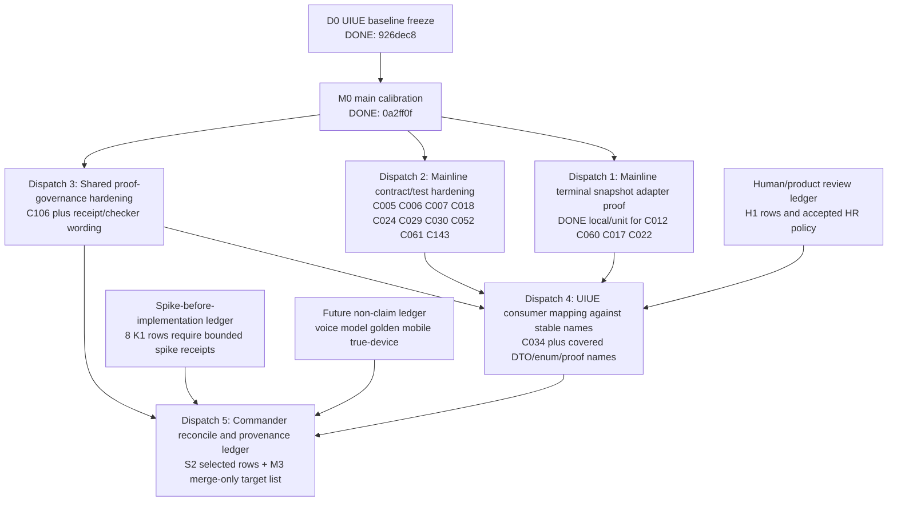

# UIUE R5 Dispatch-Ready Decomposition Map

This document combines the UIUE STEP0 baseline freeze verdict and the main-side STEP0 calibration verdict into a dispatch-ready dependency map. It does not dispatch windows by itself and does not authorize implementation. A later commander prompt may use this map to create bounded dispatches.

As of D15, this file is also the living R5 route-control document. Update it after every accepted dispatch, phase review, or commander route decision. Each update must record live repo truth, proof-class ceiling, grill burndown movement, changed row dispositions, next long-task order, stop conditions, and any stale wording corrected during intake.

## Current Route Snapshot After D15

Last live-verified commander checkpoint:

| repo | HEAD | status |
|---|---|---|
| main | `1d9b67412b7fa11fbce5f7b5f52be6f2586c475d` | preserve-unowned dirty only: `AGENTS.md`, `CLAUDE.md`, `docs/CURRENT.md`, `docs/README.md`, `.xcodebuildmcp/`, `Tools/agent-platform-plugin-refs/` |
| UIUE | `3bab4c80ee8d360cb7ebdfcfcb8869d6ababb2d7` | untracked source dispatches remain: D12, D13, D14, D15; `docs/research/2026-06-29-visual-acceptance-standard/` is unrelated pre-existing untracked evidence; Gate 4 writes only this map, burndown, and D15 reconcile receipt |

D15 route truth:

- D15 defines and locally proves a main-owned `RuntimePresentationPayload` / `PresentationReconciliation` contract surface in main. Stable categories are schema version, presentation-safe identity, terminal flag, outcome, proof class, cards, card semantics, readbacks, reconciliation status, presentation-safe trace, and timestamp.
- D15 forbids UIUE-facing exposure of `DemoRuntimeAdapter*`, `RuntimeAdapterBox`, request fingerprints, private ledgers, settled parent-plan internals, raw runtime store, raw model output, training receipt, and adapter-local names.
- D15 does not implement UIUE consumer integration. UIUE remains read-only/boundary/reconcile in D15, and D17 remains the future UIUE consumer lane.
- D15 strengthens payload-contract rows under main docs/local + local/unit proof and narrows stale D14 wording: UIUE payload contract definition is no longer future, but UIUE payload consumption, UIUE merge, production runtime, mobile/true-device/live proof, and durable execution remain future work.
- `C018` remains a future Core config / SceneMacroRegistry owner lane. `C052` remains debug-only bounded spike proof; production/runtime force-state authority remains future work.
- D15 Gate 3 and Gate 4 use operator-authorized CC substitute audit instead of Hermes. This is not a Hermes PASS and does not upgrade proof class.

Grill burndown accounting:

| lens | count | percent | meaning |
|---|---:|---:|---|
| Routed/classified rows | 215/215 | 100.0% | Every grill row has route/action/package. This is routing completion, not implementation completion. |
| Task-shape compression | 8 workstreams from 215 rows | 96.3% compressed | The row set is controlled as 5 implementation dispatches plus 3 ledgers, not 215 standalone tickets. |
| Strict proof-closed rows | about 36/215 | about 16.7% | D15 adds main local/unit payload-contract coverage for `C003`, `C024`, `C062`, `C097`, `C138`, and `C150`. Proof remains capped; no UIUE consumer/runtime/mobile/true-device claim. |
| Debug-only bounded spike counted separately | +1 row | about 14.4% if included | `C052` has D9 debug-only bounded spike proof only; production/runtime force-state remains future owner work. |
| Future/human/spike ledgers still open | 45/215 | 20.9% | Future lane 29 + spike 8 + remaining human 8 cannot be closed by runtime code alone. |

Post-D15 long-task order:

| order | candidate dispatch | primary repo | goal | hard stop |
|---:|---|---|---|---|
| D16 | Core config and force-state owner lanes | main | Handle `C018` SceneMacroRegistry/Core config authority and `C052` production/runtime force-state authority separately from UIUE. | Stop if UIUE invents Core config truth or if debug-only force-state is promoted to runtime proof. |
| D17 | UIUE consumer integration against stable payload | UIUE after D15 | Consume only main-owned stable payload names with UIUE local/unit/simulator proof and no proof promotion. | Stop if UIUE creates shared fields, claims merge/readiness, or treats simulator/local proof as mobile/true-device/runtime. |

Do not open C5/C6 model, golden, voice, mobile/true-device, endpoint, merge, or V/S/U/A-2 readiness lanes from this R5 route-control document. Those remain separate future lanes requiring their own authority and proof plans.

## Inputs Frozen

| Input | Current truth | Evidence |
|---|---|---|
| UIUE baseline | Frozen at `926dec8311c63a7b51cd1a1a5f633009e25cf7d2`; UIUE worktree clean at STEP0 verdict. | UIUE STEP0 verdict; commit `926dec8 docs(uiue): freeze r5 baseline for calibration`. |
| Mainline calibration base | Main HEAD `0a2ff0f7d30d6caf2d48f018f6b874828fb70c03`; dirty state preserved and not owned by this map. | Main STEP0 verdict; current main `git status` remains preserve_unowned. |
| Coordination spec boundary | UIUE coordination spec is canonical only for R5 coordination and cannot override mainline shared field authority. | `docs/roadmaps/2026-06-28-uiue-r5-dual-branch-coordination-spec.md:30-32`. |
| Needs-validation rule | `needs-validation` is an evidence gap, not an implementation gap. | `docs/roadmaps/2026-06-28-uiue-r5-dual-branch-coordination-spec.md:59-72`. |
| Dispatch gate | Calibration produces state labels only; implementation requires later commander/user dispatch. | `docs/roadmaps/2026-06-28-uiue-r5-dual-branch-coordination-spec.md:106-108`, `:188-190`. |

## Dispatch Intake Updates

| Dispatch | Controller disposition | Evidence | Remaining cap |
|---|---|---|---|
| Dispatch 1: mainline terminal snapshot adapter behavior proof | Accepted for dispatch-local coverage on 2026-06-28. `C012`, `C060`, `C017`, and `C022` may move from `remaining` to `covered_for_dispatch_1` for UIUE consumer mapping. | Main verdict reports local/unit tests and OpenSpec pass; controller re-ran `openspec validate define-runtime-presentation-bridge --strict`, `openspec validate --all --strict`, `git diff --check`, and `swift test --filter RuntimePresentationBridgeTests` with PASS. Code evidence: `/Users/wanglei/workspace/MAformac/Core/Presentation/RuntimePresentationBridge.swift:368-473`; tests: `/Users/wanglei/workspace/MAformac/Tests/MAformacCoreTests/RuntimePresentationBridgeTests.swift:88-184`; spec: `/Users/wanglei/workspace/MAformac/openspec/changes/define-runtime-presentation-bridge/specs/runtime-presentation-bridge/spec.md:95-123`. | This is local/unit adapter/factory proof only. It is not C3 runtime wiring, not runtime-ready, not UIUE merge, and not mobile/true-device/live proof. |
| Dispatch 2: mainline contract/test hardening | Accepted with Hermes-equivalent caveat on 2026-06-28. `C006`, `C007`, `C024`, `C029`, `C030`, and `C143` may be consumed by UIUE as stable mainline contract rows. `C005`, `C018`, `C052`, and `C061` remain deferred owner gates, not UIUE implementation authority. | Main verdict reports local/unit tests and OpenSpec pass; controller re-ran `openspec validate define-runtime-presentation-bridge --strict`, `openspec validate --all --strict`, `git diff --check`, and `swift test --filter RuntimePresentationBridgeTests` with PASS. Code evidence: `/Users/wanglei/workspace/MAformac/Core/Presentation/RuntimePresentationBridge.swift:12-37`, `:155-246`, `:248-356`; tests: `/Users/wanglei/workspace/MAformac/Tests/MAformacCoreTests/RuntimePresentationBridgeTests.swift:186-358`; receipt: `/Users/wanglei/workspace/MAformac/docs/project/phase0/r5-mainline-contract-test-hardening-dispatch-2-2026-06-28.md:71-121`. | Hermes first pass P1 was fixed, but final Hermes rerun was replaced by user-authorized Codex-equivalent audit. Treat as accepted for commander workflow, not as Hermes final PASS. Proof remains docs/local + OpenSpec + local/unit only. |
| Dispatch 4: UIUE consumer mapping against stable mainline names | Accepted as `DONE / PASS_WITH_NOTES` on 2026-06-28. UIUE may consume stable mainline names/semantics under local/unit proof cap; `C005`, `C018`, `C052`, `C061` remain deferred mainline owner gates; K1 remains spike ledger. | UIUE verdict reports `RuntimePresentationConsumerMapping.swift`, `RuntimePresentationConsumerMappingTests.swift`, `PresentationReducedMotionPolicy.swift`, `PresentationReducedMotionPolicyTests.swift`, and receipt. Controller re-ran `swift test --filter RuntimePresentationConsumerMappingTests`, `swift test --filter PresentationReducedMotionPolicyTests`, `openspec validate ui-presentation --strict`, `openspec validate define-runtime-presentation-bridge --strict` in main read-only, and `git diff --check` with PASS. | Proof remains docs/local + local/unit. This is not runtime payload parsing, not runtime adapter wiring, not mobile/true-device a11y proof, and not UIUE merge. |
| Dispatch 3: shared proof-governance hardening | Accepted as `DONE / PASS_WITH_NOTES` on 2026-06-28. `C106` and listed S2 proof-governance rows are covered by receipt schema/static checker evidence. S1 guards remain guarded; K1/M3/H1 remain non-implementation lanes. | UIUE verdict reports `R5ProofGovernanceStaticChecksTests.swift`, `r5-proof-governance-receipt-schema-2026-06-28.md`, and `r5-shared-proof-governance-dispatch-3-2026-06-28.md`. Controller re-ran `swift test --filter R5ProofGovernanceStaticChecksTests`, `openspec validate ui-presentation --strict`, `openspec validate define-runtime-presentation-bridge --strict` in main read-only, and `git diff --check` with PASS. | Proof remains docs/local + receipt_consistency + local_static. This is not runtime proof, mobile/true-device proof, UIUE merge, or R5 closeout acceptance. |
| Dispatch 9: serial bounded lanes with Hermes gates | DONE under proof cap on 2026-06-29. `C052` is covered only as a debug-only bounded spike; `C005` is covered only for the current local mock executor/store write path; `C061` is partial for already-state no-double-write while retry/full adapter idempotency remains deferred; `C018` stays deferred owner decision; final-art capsule is simulator review prep only; white-edge stays blocked for threshold. | UIUE commits `cfcf2fd` and `4baab55`; main commit `8c81d13`; receipts `r5-c052-force-state-debug-spike-2026-06-29.md`, `r5-mainline-deferred-gates-c005-c018-c061-2026-06-29.md`, and `r5-final-art-white-edge-visual-review-2026-06-29.md`; Hermes anchors `HERMES_R5_D9_STAGE_1_VERDICT: PASS`, `HERMES_R5_D9_STAGE_2_VERDICT: PASS`, `HERMES_R5_D9_STAGE_3_VERDICT: PASS`; Stage 3 screenshot sha256 `c282b354294956bc450360293f7c6e6cdaf9f0f9038262c897f72f0b526e512f`. | Proof remains docs/local + local_static + local_unit + OpenSpec + simulator_mock. This is not R5 complete, runtime-ready, mobile/true-device proof, UIUE merge, V/S/U-PASS, or A-2 readiness/completion. |
| Dispatch 10: commander reconcile, receipt, map/burndown, validation | DONE after local validation and Hermes hard gate. D10 reconciles D9 without proof promotion and updates this map plus burndown provenance. | Receipt: `/Users/wanglei/workspace/MAformac-uiue/docs/project/phase0/r5-d10-commander-reconcile-2026-06-29.md`; source dispatch: `/Users/wanglei/workspace/MAformac-uiue/docs/dispatches/2026-06-29-uiue-r5-d10-commander-reconcile-dispatch.md`; Hermes anchor: `HERMES_R5_D10_COMMANDER_RECONCILE_VERDICT: PASS`. | D10 is docs/local reconcile only. Main remained read-only; no simulator rerun; no code edits; no push; no proof promotion. |
| Dispatch 12: Runtime Adapter V0 code train | DONE through Gate 4 under proof cap. `C005` and `C061` move to Runtime Adapter V0 local/unit code-backed coverage in main; UIUE remains a guarded consumer and does not invent shared runtime fields. `C018`, `C052`, final-art, and white-edge remain outside D12 implementation scope. | Main commits `b4afc82` and `451c699`; UIUE commit `004ae82`; Gate 1 receipt `r5-d12-gate1-runtime-adapter-v0-openspec-authority-2026-06-29.md`; Gate 2 receipt `r5-d12-gate2-runtime-adapter-v0-code-2026-06-29.md`; Gate 3 receipt `r5-d12-gate3-uiue-consumer-guard-2026-06-29.md`; Hermes anchors `HERMES_R5_D12_GATE_1_OPENSPEC_AUTHORITY_VERDICT: PASS`, `HERMES_R5_D12_GATE_2_RUNTIME_ADAPTER_V0_VERDICT: PASS`, and `HERMES_R5_D12_GATE_3_UIUE_CONSUMER_GUARD_VERDICT: PASS`. | Proof remains docs/local + local_static + local_unit + OpenSpec contract only. The adapter is not wired into production runtime, has no durable ledger, and gives no runtime-ready, mobile/true-device/live, UIUE merge, V/S/U-PASS, or A-2 readiness/completion proof. |
| Dispatch 13: C3 Runtime Adapter Integration Train | DONE through Gate 4 under proof cap. `C005` and `C061` move from D12 standalone adapter local/unit proof to D13 C3-path local/unit code-backed proof in main. UIUE remains a guarded consumer and does not consume Runtime Adapter V0 private fields or define a payload contract. | Main commits `199a12c` and `612e0df`; UIUE commits `4859105` and `98e48da`; Gate 1 receipt `r5-d13-gate1-c3-runtime-adapter-integration-authority-2026-06-29.md`; Gate 2 receipt `r5-d13-gate2-c3-runtime-adapter-integration-code-2026-06-29.md`; Gate 3 receipt `r5-d13-gate3-uiue-c3-adapter-boundary-guard-2026-06-29.md`; Gate 4 receipt `r5-d13-c3-runtime-adapter-integration-commander-reconcile-2026-06-29.md`; Hermes anchors `HERMES_R5_D13_GATE_1_C3_AUTHORITY_VERDICT: PASS`, `HERMES_R5_D13_GATE_2_C3_INTEGRATION_VERDICT: PASS`, `HERMES_R5_D13_GATE_3_UIUE_BOUNDARY_VERDICT: PASS`, and `HERMES_R5_D13_GATE_4_RECONCILE_VERDICT: PASS`. | Proof remains docs/local + local_static + local_unit + OpenSpec/GitNexus only. Ledger is still in-memory; exact stale retry, persistent ledger, production runtime, mobile/true-device/live, UIUE merge, final-art, white-edge, voice/model/golden/endpoint readiness, V/S/U-PASS, and A-2 claims remain unproven. |
| Dispatch 14: Runtime Adapter Residual Train | DONE through Gate 4 under proof cap. `C005` and `C061` keep the same row identity but move from D13 residual state to D14 session-scoped local/unit residual proof: failure ledger, readback reconciliation, exact settled stale retry ordering, parent request fingerprint, and private `RuntimeAdapterBox` boundary. | Main commits `1fd8a7b`, `5d0cd27`, and `66dda25`; UIUE Gate 4 receipt `r5-d14-runtime-adapter-residual-commander-reconcile-2026-06-29.md`; Gate 1 receipt `r5-d14-gate1-runtime-adapter-residual-openspec-authority-2026-06-29.md`; Gate 2 receipt `r5-d14-gate2-runtime-adapter-residual-code-2026-06-29.md`; Gate 3 receipt `r5-d14-gate3-runtime-adapter-residual-verifier-2026-06-29.md`; Codex substitute verifier PASS for Gate 3 because Hermes quota was unavailable. | Proof remains docs/local + local_static + local_unit + OpenSpec/GitNexus + substitute verifier only. Ledger is session-scoped and non-durable; no production runtime, mobile/true-device/live, UIUE payload contract/consumption, UIUE merge, final-art, white-edge, voice/model/golden/endpoint readiness, V/S/U-PASS, or A-2 claim. |
| Dispatch 15: Runtime Presentation Payload Contract Train | DONE through Gate 4 under proof cap and operator Hermes override. Main defines stable presentation-safe payload/readback/reconciliation fields. UIUE only reconciles route map/burndown/receipt and does not implement consumer integration. | Main commits `c212863`, `ab9a682`, and `1d9b674`; UIUE Gate 4 receipt `r5-d15-runtime-presentation-payload-contract-commander-reconcile-2026-06-29.md`; Gate 1 receipt `r5-d15-gate1-runtime-presentation-payload-contract-authority-2026-06-29.md`; Gate 2 receipt `r5-d15-gate2-runtime-presentation-payload-contract-code-2026-06-29.md`; Gate 3 receipt `r5-d15-gate3-runtime-presentation-payload-contract-verifier-2026-06-29.md`; CC substitute audit PASS for Gate 3 and Gate 4 after operator override. | Proof remains docs/local + local_static + local_unit + OpenSpec/GitNexus + CC substitute verifier only. No Hermes Gate 3/4 PASS claimed, no UIUE consumer, no production runtime, mobile/true-device/live, UIUE merge, final-art, white-edge, voice/model/golden/endpoint readiness, V/S/U-PASS, or A-2 claim. |

## Dispatch Log

| Dispatch | Status | Prompt path | Target thread | Required return |
|---|---|---|---|---|
| Dispatch 1: mainline terminal snapshot adapter behavior proof | sent and accepted | `/Users/wanglei/workspace/MAformac-uiue/docs/dispatches/2026-06-28-uiue-r5-mainline-terminal-snapshot-adapter-dispatch.md` | `019f0c69-972a-7f61-9515-3a101d5c0131` | received `DONE`; no unresolved P0/P1; local/unit only. |
| Dispatch 2: mainline contract/test hardening | accepted with Hermes-equivalent caveat | `/Users/wanglei/workspace/MAformac-uiue/docs/dispatches/2026-06-28-uiue-r5-mainline-contract-test-hardening-dispatch.md` | `019f0c69-972a-7f61-9515-3a101d5c0131` | received `DONE`; `can_UIUE_start_consumer_mapping=yes`; preserve caveat that final Hermes rerun was replaced by user-authorized Codex-equivalent audit. |
| Dispatch 4: UIUE consumer mapping against stable mainline names | accepted as DONE / PASS_WITH_NOTES | `/Users/wanglei/workspace/MAformac-uiue/docs/dispatches/2026-06-28-uiue-r5-uiue-consumer-mapping-dispatch.md` | `019f0c69-7c7d-7173-a67b-758e786164b1` | received `DONE`; `can_return_for_commander_reconcile=yes`; Codex subagent primary audit has no unresolved P0/P1; local/unit only. |
| Dispatch 3: shared proof-governance hardening | accepted as DONE / PASS_WITH_NOTES | `/Users/wanglei/workspace/MAformac-uiue/docs/dispatches/2026-06-28-uiue-r5-shared-proof-governance-dispatch.md` | `019f0c69-7c7d-7173-a67b-758e786164b1` | received `DONE`; `can_open_commander_reconcile=yes`; Codex subagent primary audit has no unresolved P0/P1; docs/local/static only. |
| Dispatch 5: commander reconcile and provenance ledger | completed as DONE / PASS_WITH_NOTES | `/Users/wanglei/workspace/MAformac-uiue/docs/dispatches/2026-06-28-uiue-r5-commander-reconcile-dispatch.md`; receipt `/Users/wanglei/workspace/MAformac-uiue/docs/project/phase0/r5-commander-reconcile-dispatch-5-2026-06-28.md` | current commander thread | accepted D1/D2/D3/D4 under proof caps, preserved deferred gates and non-implementation ledgers, and prepared exact-path staging plan without git integration. |
| Dispatch 6: dual-repo integration train | DONE; UIUE commit `9d50aa0`, main commit `d332db7`; stale D6 receipt status reconciled by D7 docs pass | `/Users/wanglei/workspace/MAformac-uiue/docs/dispatches/2026-06-28-uiue-r5-dual-repo-integration-train-dispatch.md`; receipt `/Users/wanglei/workspace/MAformac-uiue/docs/project/phase0/r5-dual-repo-integration-train-2026-06-28.md` | `019f0ebc-8e13-74a0-a2fb-7a8d402645bf` | D6 integrated D1-D5 under docs/local + local/unit/static/OpenSpec proof caps; no runtime/mobile/true-device/UIUE merge/V/S/U/A-2 claim. |
| Dispatch 7: human review gate prep | DONE; human review packet produced; simulator not opened because no item requires current simulator inspection | `/Users/wanglei/workspace/MAformac-uiue/docs/dispatches/2026-06-28-uiue-r5-human-review-gate-dispatch.md`; packet `/Users/wanglei/workspace/MAformac-uiue/docs/project/phase0/r5-human-review-gate-2026-06-28.md` | `019f0ebc-8e13-74a0-a2fb-7a8d402645bf` | no new subagent by commander order; checklist routes human/product, deferred owner gates, K1 spike ledger, and M3/future lanes without implementation or proof promotion. |
| Dispatch 9: serial bounded lanes with Hermes gates | DONE; UIUE commits `cfcf2fd`, `4baab55`; main commit `8c81d13` | `/Users/wanglei/workspace/MAformac-uiue/docs/dispatches/2026-06-29-uiue-r5-serial-bounded-lanes-dispatch.md`; receipts listed in Dispatch Intake Updates | `019f10df-8ebc-7c71-b026-f3dbc0262153` | three serial stages passed local validation and Hermes anchored gates; dispositions are bounded under proof cap and preserve residual future work. |
| Dispatch 10: commander reconcile, receipt, map/burndown, validation | DONE after Hermes hard gate | `/Users/wanglei/workspace/MAformac-uiue/docs/dispatches/2026-06-29-uiue-r5-d10-commander-reconcile-dispatch.md`; receipt `/Users/wanglei/workspace/MAformac-uiue/docs/project/phase0/r5-d10-commander-reconcile-2026-06-29.md` | `019f10df-8ebc-7c71-b026-f3dbc0262153` | reconciled D9 into map/burndown without proof promotion; local validation passed and `HERMES_R5_D10_COMMANDER_RECONCILE_VERDICT: PASS` was required before commit. |
| Dispatch 12: Runtime Adapter V0 code train | DONE after four serial Hermes gates | `/Users/wanglei/workspace/MAformac-uiue/docs/dispatches/2026-06-29-uiue-r5-d12-runtime-adapter-v0-code-train-dispatch.md`; receipts listed in Dispatch Intake Updates | `019f10df-8ebc-7c71-b026-f3dbc0262153` | Gate 1 OpenSpec authority, Gate 2 main Runtime Adapter V0 code, Gate 3 UIUE consumer guard, and Gate 4 reconcile passed local validation and Hermes; no merge, push, runtime-ready, mobile/true-device, V/S/U, or A-2 claim. |
| Dispatch 13: C3 Runtime Adapter Integration Train | DONE after four serial Hermes gates | `/Users/wanglei/workspace/MAformac-uiue/docs/dispatches/2026-06-29-uiue-r5-d13-c3-runtime-adapter-integration-dispatch.md`; receipt `/Users/wanglei/workspace/MAformac-uiue/docs/project/phase0/r5-d13-c3-runtime-adapter-integration-commander-reconcile-2026-06-29.md` | `019f10df-8ebc-7c71-b026-f3dbc0262153` | Gate 1 C3 authority, Gate 2 main C3 adapter integration, Gate 3 UIUE boundary guard, and Gate 4 reconcile passed local validation and Hermes; no push, merge, runtime-ready, mobile/true-device, UIUE payload contract, V/S/U, or A-2 claim. |
| Dispatch 14: Runtime Adapter Residual Train | DONE under Hermes-quota override with Codex substitute verifier | `/Users/wanglei/workspace/MAformac-uiue/docs/dispatches/2026-06-29-uiue-r5-d14-runtime-adapter-residual-train-dispatch.md`; receipt `/Users/wanglei/workspace/MAformac-uiue/docs/project/phase0/r5-d14-runtime-adapter-residual-commander-reconcile-2026-06-29.md` | `019f1215-ca98-7083-a6dd-9a62d46444ad` | Gate 1 OpenSpec authority, Gate 2 main residual code, Gate 3 GitNexus/substitute verifier, and Gate 4 reconcile passed local validation / Codex audits; no Hermes Gate 3 anchor claimed, no push, merge, runtime-ready, mobile/true-device, UIUE payload contract, V/S/U, or A-2 claim. |
| Dispatch 15: Runtime Presentation Payload Contract Train | DONE under operator Hermes override with CC substitute verifier | `/Users/wanglei/workspace/MAformac-uiue/docs/dispatches/2026-06-29-uiue-r5-d15-runtime-presentation-payload-contract-dispatch.md`; receipt `/Users/wanglei/workspace/MAformac-uiue/docs/project/phase0/r5-d15-runtime-presentation-payload-contract-commander-reconcile-2026-06-29.md` | `019f1215-ca98-7083-a6dd-9a62d46444ad` | Gate 1 OpenSpec authority, Gate 2 main payload code/tests, Gate 3 clean-worktree/GitNexus/UIUE-boundary verifier, and Gate 4 UIUE reconcile passed local validation / CC substitute audits; no Hermes Gate 3/4 PASS claimed, no push, merge, runtime-ready, mobile/true-device, UIUE consumer integration, V/S/U, or A-2 claim. |

## Calibration Result

Main-side calibration converted the high-risk `needs-validation` subset as follows:

| Package | Covered | Remaining | Merge-only | Non-claim | Blocked | Dispatch implication |
|---|---:|---:|---:|---:|---:|---|
| `M1-mainline-P0-bridge-contract` | 1 | 2 | 0 | 0 | 0 | Mainline must handle 2 terminal-snapshot behavior gaps before UIUE can claim those behaviors. |
| `S1-shared-P0-proof-governance` | 4 | 1 | 0 | 2 | 0 | One checker/receipt hardening item remains; two are guardrails, not implementation. |
| `M2-mainline-P1-contract-test` | 8 | 12 | 0 | 2 | 0 | Mainline contract/test hardening remains; several DTO vocabulary rows are already stable. |
| Total calibrated | 13 | 15 | 0 | 4 | 0 | Dispatch only the 15 remaining rows plus one proof-governance hardening item; preserve non-claims as gates. |

Rows already stable for UIUE consumption are the mainline DTO/enum/proof-cap rows marked `covered` in STEP0 main verdict. They do not authorize UIUE to invent fields or upgrade local/simulator proof.

## Row Calibration Delta From 13-Package Source

This table explains the intentional delta between the frozen 13-package source and the five dispatch groups below. It prevents row loss when a row is moved from its original package into a better execution grouping.

| Row | Original package | New disposition | Calibration evidence | Why |
|---|---|---|---|---|
| `C105` | `M1-mainline-P0-bridge-contract` | `covered`; referenced by proof-governance wording, not dispatched as remaining. | Source row: `burndown-dispatch-plan.md:137`; proof enum/display caps: `/Users/wanglei/workspace/MAformac/Core/Presentation/RuntimePresentationBridge.swift:110-127`; fail-closed test: `/Users/wanglei/workspace/MAformac/Tests/MAformacCoreTests/RuntimePresentationBridgeTests.swift:39-46`. | Mainline already locks finite proof classes and empty readiness display caps. This is covered only as proof-cap contract, not as true-device/live proof. |
| `C017` | `M2-mainline-P1-contract-test` | Dispatch 1. | Source row: `burndown-dispatch-plan.md:172`; mainline snapshot DTO fields: `/Users/wanglei/workspace/MAformac/Core/Presentation/RuntimePresentationBridge.swift:311-356`; terminal adapter behavior: `/Users/wanglei/workspace/MAformac/Core/Presentation/RuntimePresentationBridge.swift:416-473`. | Partial deny needs composite terminal snapshot/readback behavior. Dispatch 1 covers adapter/factory behavior under local/unit proof cap, but not full runtime execution. |
| `C022` | `M2-mainline-P1-contract-test` | Dispatch 1. | Source row: `burndown-dispatch-plan.md:174`; phase1 grill says thrown C3 errors still need future adapter classification at `/Users/wanglei/workspace/MAformac/docs/project/phase0/runtime-presentation-bridge-phase1-grill-2026-06-28.md:106`. | Cancel/interruption/timeout/backgrounding terminality is behavior proof, not just enum/DTO shape, so it must wait for terminal snapshot adapter tests/fixtures. |
| `K1` rows | `K1-spike-before-implementation` | Spike-before-implementation ledger, not implementation dispatch. | Package count and wave: `burndown-dispatch-plan.md:83`, `:107`; row detail: `burndown-dispatch-plan.md:390-406`. | These 8 rows require bounded falsification receipts before promotion. They should not disappear and should not be mixed into implementation dispatches. |

## Dependency Graph

## Recommended Dispatch Count

Original D1-pre recommendation: **5 implementation dispatches**, plus **3 ledgers**
that should not become implementation dispatches unless the user explicitly
reopens them. This plan is now historical route provenance consumed through
D13; use "Current Route Snapshot After D13" for active next-task ordering.

| # | Dispatch | Owner | Rows / scope | Serial or parallel | Proof cap | Exit gate |
|---:|---|---|---|---|---|---|
| 1 | Mainline terminal snapshot adapter behavior proof, not DTO-only proof | mainline | `C012`, `C060`, `C017`, `C022` | DONE for local/unit dispatch coverage; serial gate for UIUE behavior claims is now open only under proof cap. | local/unit/integration at most; no runtime-ready claim. | Covered by terminal snapshot adapter/factory tests and OpenSpec receipt. This does not prove real C3 runtime wiring. |
| 2 | Mainline contract/test hardening | mainline | `C005`, `C006`, `C007`, `C018`, `C024`, `C029`, `C030`, `C052`, `C061`, `C143` | After or coordinated with Dispatch 1; avoid two mainline windows editing the same bridge files concurrently. | docs/local/unit only. | Each remaining contract row has one falsifiable test/spec/receipt or is explicitly deferred. |
| 3 | Shared proof-governance hardening | commander + both branches | `C106` plus proof wording/checker for S1; later consumes S2 hygiene rows `C046`, `C047`, `C048`, `C049`, `C107`, `C108`, `C110`, `C111`, `C179`, `C193`, `C195`, `C196`. | Split into field-independent and field-dependent subwork. Field-independent work can start after STEP0; field-dependent checker/crosswalk work waits for mainline field/type verdicts from Dispatch 1/2. | docs/local/receipt consistency only. | Field-independent: forbidden-claim grep, non-claim wording, dirty split, proof-cap text. Field-dependent: receipt schema, crosswalk checker, field/enum consistency checks after mainline verdict. |
| 4 | UIUE consumer mapping against stable mainline names | UIUE | `C034` plus covered fields from main verdict: result enum, snapshot fields, proof class caps, no `ScopeOrigin.missing`. Include accepted product policy for `C155`, `C172`, `C194` only if no shared fields are invented. | Waits for Dispatch 1/2 for behavior rows. Early UIUE work is limited to docs/local matrix only: no shared adapter code, no parsing mainline runtime payload, no new shared field names. | UIUE local/unit/simulator only. | UIUE tests/checkers prove consumer mapping uses mainline stable names and does not promote simulator/local proof. |
| 5 | Commander reconcile and provenance ledger | commander | S2 final reconcile plus M3 merge-only target list. Do not implement 52 M3 rows independently. | Last before closeout. | coordination proof only. | Row IDs are preserved, remaining rows carry owners, non-claim ledgers remain non-claim. |

Ledgers not counted as implementation dispatches:

| Ledger | Scope | Rule |
|---|---|---|
| Human/product review ledger | H1 rows including `C134`, `C135`, `C155`, `C160-C164`, `C172`, `C173`, `C194`. | Product/a11y/final-art decisions may be recorded, but cannot be encoded as implementation truth before human choice. |
| Spike-before-implementation ledger | K1 rows `C082`, `C083`, `C096`, `C117`, `C182`, `C197`, `C207`, `C208`. | Each row needs a bounded spike receipt with pass/partial/blocked and proof class before promotion. K1 rows are not implementation dispatches from this map. |
| Future non-claim ledger | voice/model/golden/mobile/true-device/C5/C6 future lanes. | Preserve as future boundaries; never use this R5 map to claim readiness. |

## What Can Run In Parallel

Safe parallel work:

- Mainline Dispatch 1 and Dispatch 3 can overlap only for field-independent proof-governance work: forbidden-claim grep, non-claim wording, dirty split, and proof-cap text.
- Field-dependent proof governance waits for mainline field/type verdicts: receipt schema, crosswalk checker, and field/enum consistency checks.
- UIUE can work on docs/local matrix and customer-facing policy wording already accepted by the user: no `operatorReview` / `acceptance` in customer UI, summary expands only, gear/safety display-only, `仅展示，不可操作`, mock controls inside expanded controls with readback.
- Future non-claim ledger can be maintained in parallel as docs-only guardrail.

Unsafe parallel work:

- Two mainline implementation windows should not concurrently edit `RuntimePresentationBridge.swift`, OpenSpec bridge files, or `RuntimePresentationBridgeTests.swift`.
- UIUE must not implement adapter consumption for terminal snapshot behavior until mainline Dispatch 1 has a verdict.
- UIUE must not introduce shared bridge fields, proof enum values, result enum names, shared adapter code, or runtime payload parsing outside mainline authority.

## Mainline Wait Gates

Dispatch 1 moved these rows out of mainline-wait for UIUE consumer mapping, but only under local/unit proof cap:

| Row | Current disposition | Proof cap |
|---|---|---|
| `C012` | Covered for Dispatch 1: guard denial maps to presentation-safe terminal refusal snapshot. | local/unit adapter proof; no real runtime guard wiring claim. |
| `C060` | Covered for Dispatch 1: thrown adapter/runtime failure maps to terminal `runtime_error` snapshot. | local/unit adapter proof; no C3 do/catch integration claim. |
| `C017` | Covered for Dispatch 1: partial accept/refuse maps to mixed cards plus accepted readbacks. | local/unit adapter proof; no full multi-effect runtime execution claim. |
| `C022` | Covered for Dispatch 1: cancel/interruption/timeout/backgrounding map to terminal snapshots. | local/unit adapter proof; no lifecycle integration claim. |

These rows still cannot be consumed as behavior-complete by UIUE until future owners provide runtime/config/tooling proof. D9 narrowed three of them under bounded proof caps but did not close the future work:

| Row | Reason to wait |
|---|---|
| `C005` | D14/D15 preserve main ownership: D14 proves C3-path adapter-owned mock write and session ledger residuals under local/unit proof; D15 defines a presentation-safe payload contract but does not make UIUE a runtime consumer. Durable execution ownership, persistent ledger, production runtime, mobile/true-device/live proof, UIUE merge, and UIUE payload consumption remain future work. |
| `C018` | `SceneMacroRegistry` / Core config is still future mainline authority, not UIUE implementation truth. |
| `C052` | D9 covers only a debug-only bounded force-state spike. Production/runtime force-state remains future owner work. |
| `C061` | D14 proves session-scoped retry/reconciliation residuals under main local/unit proof; D15 exposes only presentation-safe reconciliation status, not private retry identity or ledger internals. Persistent retry ledger, production runtime, mobile/true-device/live proof, UIUE merge, and UIUE payload consumption remain future work. |

Rows `C006`, `C007`, `C024`, `C029`, `C030`, and `C143` are covered for local/unit/OpenSpec consumption by Dispatch 2 only; they are still not runtime-ready, mobile, true-device, live, V-PASS, S-PASS, U-PASS, A-2, A-2 ready, or A-2 complete proof.

## Human Review Nodes

| Node | Trigger | Required decision |
|---|---|---|
| HR-A | Before UIUE changes customer-facing proof/acceptance wording. | Confirm internal proof labels remain hidden from customer UI. Current accepted policy can be used; changes need review. |
| HR-B | Before direct touch on summary/gear/safety controls. | Confirm disabled/display-only/readback/a11y policy. |
| HR-C | Before final-art capsule, white-edge threshold, or aesthetic closeout. | Decide whether warning remains warning or becomes a formal threshold. |
| HR-D | Before mobile/true-device/a11y/voice/model/golden claims. | Separate proof plan and human acceptance; this R5 map cannot sign those. |
| HR-E | Before UIUE merge, push/PR, or public release. | Confirm proof class, dirty split, and non-claim wording. |

## Proof Caps

| Surface | Maximum proof class in this dispatch map | Forbidden promotion |
|---|---|---|
| Mainline bridge DTO/tests | `docs/local + openspec_contract + local_unit` | Not runtime-ready, not mobile, not true-device, not live. |
| Mainline terminal adapter tests | `local/unit/integration` unless a later dispatch explicitly runs real runtime proof. | DTO/test success is not runtime acceptance. |
| UIUE consumer mapping | `docs/local + local_unit + simulator_mock` | Not mainline proof, not runtime proof, not mobile/true-device proof. |
| Commander reconcile | `docs/local + receipt_consistency` | Not implementation closeout. |
| Human/product policy | human decision record only | Not V-PASS/S-PASS/U-PASS unless user explicitly signs those gates in a separate acceptance context. |
| Future lanes | `non-claim-only` | No voice/model/golden/mobile/true-device readiness. |

## Stop Conditions

Stop and return to commander if any dispatch attempts one of these:

1. Turns `needs-validation` directly into implementation without the row being marked `remaining`.
2. Claims R5 complete, runtime-ready, mobile, true_device, voice-ready, model-ready, golden-ready, endpoint-ready, UIUE merge, V-PASS, S-PASS, U-PASS, A-2, A-2 ready, or A-2 complete.
3. Adds `ScopeOrigin.missing` or any equivalent Core shared enum without mainline authority.
4. Lets UIUE invent shared Runtime-Presentation fields, enum values, or proof classes.
5. Treats UIUE docs/local/simulator evidence as mainline/runtime proof.
6. Mixes main dirty residual with UIUE docs commits or uses `git add .`.
7. Edits raw customer/source material into repo artifacts.
8. Dispatches M3 merge-only rows as 52 standalone implementation tasks.
9. Runs voice/model/golden/mobile/true-device work under this R5 dispatch map.
10. Lets UIUE early work escape docs/local matrix into shared adapter code or runtime payload parsing.

## Dispatch Decision

The original D1-pre five-dispatch plan has been consumed through D13. Do not
restart Dispatch 1-5 unless a new P0/P1 finding invalidates their receipts.

Current commander route:

1. Keep D13 as `DONE under proof cap`, not as runtime-ready or merge-ready.
2. Open D14 as a new long-running main runtime residual train if development
   continues immediately.
3. Keep D15 payload contract, D16 Core config/force-state, and D17 UIUE
   consumer integration behind their upstream gates.
4. Keep human/product, spike-required, and future-lane rows as ledgers until
   explicitly reopened.
5. Update this file after each accepted verdict before dispatching the next
   long task.

Do not dispatch the human/product ledger, spike-before-implementation ledger, or future-lane ledger as implementation work. They are governance surfaces, bounded falsification receipts, and proof caps.
