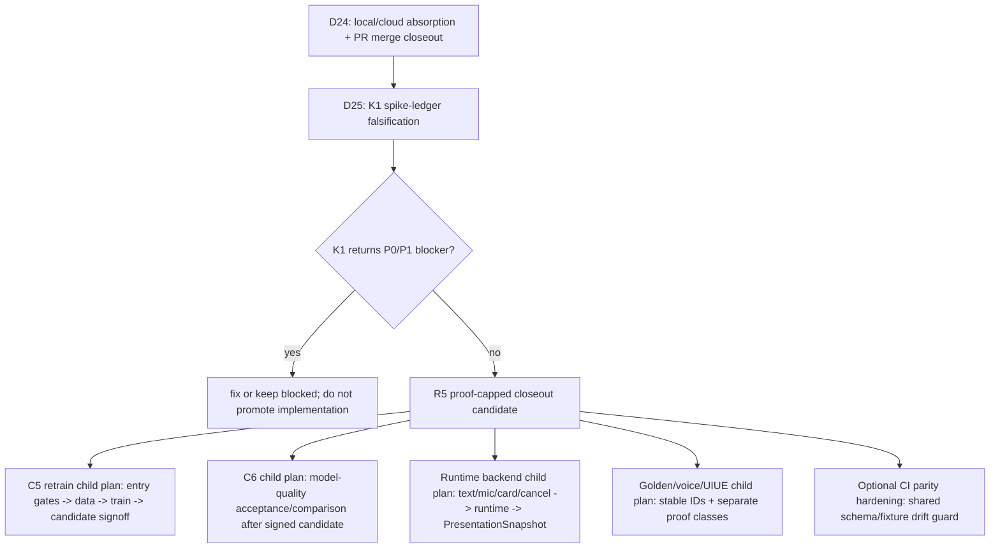

# Post-C6 Backend Training UIUE Roadmap Implementation Plan

> **For agentic workers:** REQUIRED SUB-SKILL: Use superpowers:subagent-driven-development (recommended) or superpowers:executing-plans to implement this plan task-by-task. Steps use checkbox (`- [ ]`) syntax for tracking.

**Goal:** Establish the post Long-run 2 roadmap for this branch, keeping a thin Runtime -> Presentation contract ahead of implementation while placing full backend, training, C6 acceptance, voice, and UIUE merge behind their proper gates.

**Architecture:** This is a parent roadmap plan, not a monolithic code implementation plan. It creates one route baseline and one thin contract carrier first, then requires separate child plans for C5 retrain, C6 acceptance/comparison, runtime backend wiring, voice/golden-run, and UIUE merge. The thin bridge prevents UIUE and backend work from inventing divergent event/result/snapshot fields while UIUE Phase 4 remains in brainstorming/remediation.

**Tech Stack:** OpenSpec, Swift Package Manager, SwiftUI, MAformac Core Swift modules, Python stdlib validation scripts, Makefile gates, local Git evidence.

## Global Constraints

- authority: `implementation_plan_not_ssot`; the source of truth remains `CLAUDE.md`, archived OpenSpec specs, accepted grill decision packs, active OpenSpec changes, signed evidence, and live repo state.
- branch at plan creation: `codex/rebuild-c6-doc-absorption-20260624`.
- plan_creation_head: `f3a3299fe55fcb67b72f8b1a085f8939b01b1b76`.
- architecture_audit_head: `69432512a2c8ddcdc584bfac47f3218262544118`.
- route_fix_input_head: `69432512a2c8ddcdc584bfac47f3218262544118`.
- Head truth rule: run `git rev-parse HEAD` and `git rev-parse @{u}` for live state; this plan records verification inputs, not a self-updating commit hash.
- Long-run 2 strongest claim: `external-pass-with-absorbed-fixes` only for rebuild-C6 identity + behavior-shape construction closeout.
- Long-run 2 does not authorize retrain-C5, C6 acceptance, D-domain base recalibration, candidate comparison, model-quality evaluation, golden-run, voice, endpoint readiness, UIUE merge, R-L17 candidate signoff, V-PASS, S-PASS, or U-PASS.
- The project remains pure端侧, offline, no cloud backend, mock vehicle control, SwiftUI macOS+iOS, Qwen3-1.7B + LoRA mainline, Python only for development tooling.
- No raw cockpit/customer text, PII, secrets, pricing, or internal-only source material may enter training data, bench cases, or docs beyond allowed abstracted private-repo evidence policy.
- Do not touch `/Users/wanglei/workspace/MAformac-uiue` except read-only intersection checks unless a later user instruction explicitly allows writes.
- Do not use `git add .`.
- Retire trigger: retire or supersede this plan after the thin runtime-presentation OpenSpec carrier is accepted and child plans exist for C5, C6, runtime backend, voice/golden-run, and UIUE connection.

---

## Step 0 Accepted Baseline

Step 0 is the discussion baseline accepted by the user before this plan:

- Long-run 2 completed identity + shape construction and absorbed two GPT Pro audit rounds.
- The previous model/training-only sequence was incomplete because it missed the iOS/macOS runtime backend and UIUE connection lane.
- Full runtime/backend implementation can wait behind model/C6 gates, but a thin Runtime -> Presentation contract should not wait.
- Current repo has pieces of the contract (`ScopeOrigin`, C3 result/readback, mock state cells, trace logger, `LLMBackend`, `SpeechSynthesisEngine`) but lacks a named UIUE-facing bridge artifact.
- UIUE is still in Phase 4 brainstorming/remediation; pure visual work remains isolated, but bridge fields that affect state/readback/scope/golden IDs must be defined in mainline.

## Scope Check

This roadmap covers several independent subsystems. Do not implement them in one code branch. Use this plan to create the shared route and contract, then split into child implementation plans:

- `docs/superpowers/plans/2026-06-25-runtime-presentation-bridge-apply.md`
- `docs/superpowers/plans/2026-06-25-retrain-c5-lora-d-domain-entry.md`
- `docs/superpowers/plans/2026-06-25-c6-acceptance-and-candidate-comparison.md`
- `docs/superpowers/plans/2026-06-25-ios-macos-runtime-backend-apply.md`
- `docs/superpowers/plans/2026-06-25-demo-golden-voice-uiue-connection.md`

Each child plan must carry its own writable paths, validation gates, proof class, and stop conditions.

## File Structure

- `CLAUDE.md`: project constitution. Add only the latest post Long-run 2 route override so new sessions do not follow stale pre-C6 instructions.
- `docs/CURRENT.md`: current route board. Replace stale construction-prep state with `plan_creation_head=f3a3299...`, `architecture_audit_head=69432512...`, and the live-head truth rule.
- `docs/README.md`: document map. Add the new plan and Long-run 2 closeout as current entry points.
- `docs/project/phase0/non-uiue-pre-code-action-list-2026-06-24.md`: historical pre-code checklist. Add a supersession note that its rebuild-C6-first ordering has been consumed by Long-run 2 construction work.
- `docs/superpowers/plans/2026-06-25-post-c6-backend-training-uiue-roadmap.md`: this parent roadmap.
- `openspec/changes/define-runtime-presentation-bridge/`: planned thin contract carrier. This plan authorizes proposing it after grill, not implementing it immediately.
- `docs/project/phase0/post-c6-roadmap-gptpro-architecture-audit-request-2026-06-25.md`: GPT Pro external architecture audit request for this roadmap.

## GPT Pro Audit Absorption Scope

Two GPT Pro audit reports were read for this patch:

- Long-run 2 identity + behavior-shape audit: no P0; the P1/P2 checker, fingerprint, version, and diagnostic naming findings are already absorbed in the current repo and ledger.
- Post-C6 architecture audit: no P0; the route/plan patch absorbed P1/P2 findings for head freshness, runtime-result vocabulary, `proof_class` display discipline, stale downstream task guards, and minimal iOS/macOS runtime boundaries.

Code-level findings from the architecture audit were later approved by the user and absorbed by a focused C6 bench/source-free guardrail patch. See `docs/project/phase0/post-c6-roadmap-gptpro-architecture-absorption-ledger-2026-06-25.md`.

- Absorbed now: `Tools/C6BenchCLI/main.swift` unknown result-id fail-closed behavior, expected case run coverage, `C6CanonicalJSON.encode` fail-closed behavior, `contract_bundle_fingerprint.bundle_hash` component-version identity, and regression coverage for already-state mismatch, missing risk IDs, clarify-tag checks, coverage/golden split, and unknown alternative tools.
- Still downstream: `docs/superpowers/plans/2026-06-25-c6-acceptance-and-candidate-comparison.md` must define and authorize actual C6 model-quality acceptance/comparison only after a signed candidate exists.
- Closeout rule remains: use `make verify-all` for full local Swift-inclusive proof and `make verify-ci` or GitHub Actions Verify for source-free CI proof; do not describe `make verify` as the full Swift gate.

### Task 1: Route Baseline Synchronization

**Files:**
- Modify: `CLAUDE.md`
- Modify: `docs/CURRENT.md`
- Modify: `docs/README.md`
- Modify: `docs/project/phase0/non-uiue-pre-code-action-list-2026-06-24.md`
- Create: `docs/superpowers/plans/2026-06-25-post-c6-backend-training-uiue-roadmap.md`

**Interfaces:**
- Consumes: Long-run 2 closeout `docs/project/phase0/rebuild-c6-identity-shape-closeout-2026-06-25.md`.
- Consumes: GPT Pro ledger `docs/project/phase0/rebuild-c6-identity-shape-gptpro-absorption-ledger-2026-06-25.md`.
- Produces: one current route statement that downstream plans can cite without reinterpreting stale roadmaps.

- [ ] **Step 1: Verify live repo state**

Run:

```bash
cd /Users/wanglei/workspace/MAformac
git status --short --branch
git rev-parse HEAD
git rev-parse @{u}
git rev-parse origin/main
```

Expected at the start of this architecture-audit absorption patch:

```text
## codex/rebuild-c6-doc-absorption-20260624...origin/codex/rebuild-c6-doc-absorption-20260624
69432512a2c8ddcdc584bfac47f3218262544118
69432512a2c8ddcdc584bfac47f3218262544118
c1e7d58d281d0256d29034c1d120cefe0bf5a033
```

If this plan itself is later committed, rerun the commands and let live git output supersede the recorded input head.

- [ ] **Step 2: Update route board wording**

Edit `docs/CURRENT.md` so its header uses:

```yaml
status: active_router_only_not_ssot
artifact_kind: current_route_board
authority: router_only_not_contract
updated: 2026-06-25
plan_creation_head: f3a3299fe55fcb67b72f8b1a085f8939b01b1b76
architecture_audit_head: 69432512a2c8ddcdc584bfac47f3218262544118
route_fix_input_worktree_head: 69432512a2c8ddcdc584bfac47f3218262544118
route_fix_input_upstream_head: 69432512a2c8ddcdc584bfac47f3218262544118
last_verified_origin_main: c1e7d58
branch: codex/rebuild-c6-doc-absorption-20260624
head_truth_rule: "Run git rev-parse HEAD and git rev-parse @{u}; this route board records verification inputs and loses to live repo state."
```

Expected content rule: the Current Phase section must say post Long-run 2 `external-pass-with-absorbed-fixes`, and it must explicitly keep retrain-C5, C6 acceptance, model-quality evaluation, candidate comparison, golden-run, voice, endpoint readiness, UIUE merge, and V/S/U-PASS locked.

- [ ] **Step 3: Add the new plan to the document map**

Edit `docs/README.md` and add this current authority row:

```markdown
| `docs/superpowers/plans/2026-06-25-post-c6-backend-training-uiue-roadmap.md` | **Post Long-run 2 parent roadmap**: bridge contract first, model/C6 next, full backend/UIUE connection later under child plans; implementation_plan_not_ssot |
```

Expected content rule: `docs/README.md` must keep `docs/roadmap-2026-06-20-from-c6-done.md` historical, not current.

- [ ] **Step 4: Add the latest route override to the project constitution**

Edit `CLAUDE.md` near section 9 and add a short dated override:

```markdown
> 🔴 **Post Long-run 2 route override (2026-06-25)**: Long-run 2 rebuild-C6 identity + behavior-shape closeout is `external-pass-with-absorbed-fixes` only for construction evidence. Next route is docs/grill first: define a thin Runtime -> Presentation bridge contract, then split child plans for C5 retrain, C6 acceptance/comparison, runtime backend, voice/golden-run, and UIUE connection. Full backend/UIUE implementation is downstream of model/C6 gates; the thin bridge contract is allowed earlier because it prevents field drift.
```

Expected content rule: do not delete historical sections in `CLAUDE.md`; add a superseding note instead.

- [ ] **Step 5: Mark the old pre-code checklist as consumed**

Edit `docs/project/phase0/non-uiue-pre-code-action-list-2026-06-24.md` and add a top note:

```markdown
> 2026-06-25 update: this checklist's "rebuild-C6 first" ordering has been consumed by Long-run 2 identity + behavior-shape construction closeout. It remains historical route-control evidence. Use `docs/superpowers/plans/2026-06-25-post-c6-backend-training-uiue-roadmap.md` for the next parent route.
```

Expected content rule: do not claim C6 acceptance or model-quality evidence.

- [ ] **Step 6: Validate docs baseline sync**

Run:

```bash
openspec validate --all --strict
git diff --check
```

Expected:

```text
Totals: 15 passed, 0 failed (15 items)
```

`git diff --check` prints no output and exits 0.

### Task 2: Runtime-Presentation Bridge Proposal

**Files:**
- Create: `openspec/changes/define-runtime-presentation-bridge/proposal.md`
- Create: `openspec/changes/define-runtime-presentation-bridge/design.md`
- Create: `openspec/changes/define-runtime-presentation-bridge/tasks.md`
- Create: `openspec/changes/define-runtime-presentation-bridge/specs/runtime-presentation-bridge/spec.md`
- Modify: `docs/CURRENT.md`
- Modify: `docs/README.md`

**Interfaces:**
- Consumes: `ScopeOrigin`, `DemoActionReadback`, `DemoVehicleStateCell`, `C3ExecutionResult`, `TraceEntry`, `DemoVisualState`.
- Produces: proposed names and observable fields for `DemoInteractionEvent`, `DemoRuntimeResult`, `PresentationSnapshot`, and `TraceEnvelope`.

- [ ] **Step 1: Create the proposal directory**

Run:

```bash
mkdir -p openspec/changes/define-runtime-presentation-bridge/specs/runtime-presentation-bridge
```

Expected: directory exists and `git status --short` shows no file changes yet if no files were written.

- [ ] **Step 2: Write `proposal.md`**

Add this content:

```markdown
# define-runtime-presentation-bridge

## Summary

Define a thin Runtime -> Presentation bridge contract so UIUE, iOS/macOS runtime backend, golden-run, and voice work consume the same event/result/snapshot vocabulary.

## Motivation

Long-run 2 closed C6 identity + behavior shape, but the app still lacks a named UI-facing runtime bridge. Existing pieces live in Core state, C3 execution, trace, LLM, voice, and ContentView. Without a contract, backend and UIUE can grow divergent fields for scope, readback, trace, voice, and orb state.

## Scope

- Define observable event/result/snapshot fields.
- Reuse existing Core concepts: `ScopeOrigin`, `DemoActionReadback`, `DemoVehicleStateCell`, `C3ExecutionResult`, `TraceEntry`, and `DemoVisualState`.
- Define ownership boundaries between Core runtime and UIUE presentation.

## Non-goals

- No Swift implementation in this proposal.
- No C5 data generation or training.
- No C6 acceptance, model-quality evaluation, D-domain base recalibration, or candidate comparison.
- No demo-golden-run execution.
- No ASR/TTS readiness claim.
- No endpoint readiness claim.
- No UIUE merge.
- No V-PASS, S-PASS, or U-PASS.
```

Expected: proposal explicitly separates bridge contract from backend implementation.

- [ ] **Step 3: Write `design.md`**

Add this content:

```markdown
# Runtime-Presentation Bridge Design

## AD-RPB-001: Contract-first, implementation-later

The bridge defines event/result/snapshot vocabulary before runtime backend or UIUE merge work. This is allowed before model/C6 gates because it does not execute a model, train data, or claim readiness.

## AD-RPB-002: UIUE consumes snapshots, not stores

UIUE SHALL consume a presentation snapshot. It SHALL NOT depend directly on `DemoVehicleStateStore`, raw trace arrays, model output, or training receipts.

## AD-RPB-003: Scope origin is single-source

Every readback and presentation scope label SHALL carry `scope_origin` from Core scope resolution. UIUE may choose visual emphasis, but it must not infer defaulted/explicit/fanout from display strings.

## AD-RPB-004: Voice and orb are presentation state, not proof of voice readiness

The bridge may expose `voice_state` and `orb_state` for UI choreography. Those fields do not imply ASR/TTS functional readiness, demo-golden-run pass, endpoint readiness, or V-PASS.

## AD-RPB-005: Runtime result vocabulary preserves refusal class

The bridge SHALL NOT expose a bare `rejected` result as the only runtime outcome. It must preserve at least unsupported/no-tool refusal and safety/policy refusal as distinct machine-readable values.

## AD-RPB-006: Presentation proof classes are finite and display-capped

`PresentationSnapshot.proof_class` SHALL use a finite project vocabulary. Unknown values fail closed, and local/static/external-review proof must never be displayed as endpoint-ready, voice-ready, C6-ready, or V-PASS.

## AD-RPB-007: Minimal endpoint runtime boundaries

Runtime work that feeds the bridge SHALL avoid blocking the main thread, SHALL emit a terminal snapshot on cancel/interruption/timeout, and SHALL NOT introduce persistence, cloud sync, or long-lived user memory.
```

Expected: the design keeps UIUE as consumer and avoids redefining C2/C3 semantics.

- [ ] **Step 4: Write `tasks.md`**

Add this content:

```markdown
## 1. Proposal validation

- [ ] 1.1 Validate this change with `openspec validate define-runtime-presentation-bridge --strict`.
- [ ] 1.2 Validate all OpenSpec with `openspec validate --all --strict`.
- [ ] 1.3 Run `git diff --check`.

## 2. Contract fields

- [ ] 2.1 Define `DemoInteractionEvent` field requirements for text input, mic start, mic end, card tap, cancel, and interruption.
- [ ] 2.2 Define `DemoRuntimeResult` outcomes: `accepted_tool_call`, `clarify_missing_slot`, `refusal_no_available_tool`, `refusal_safety_or_policy`, `already_state_noop`, `runtime_error`, and `cancelled`. A display-layer `rejected` aggregate is allowed only if it also carries a machine-readable `rejection_class` or `behavior_class_source`.
- [ ] 2.3 Define `PresentationSnapshot` fields: `trace_id`, `cards`, `dialog_text`, `readbacks`, `scope_origin`, `voice_state`, `orb_state`, and finite-enum `proof_class` with display caps and unknown-value fail-closed behavior.
- [ ] 2.4 Define `TraceEnvelope` as a presentation-safe view over C3 decode, plan, guard, execute, and readback stages.
- [ ] 2.5 Define minimal runtime boundary behavior: off-main execution for runtime work, terminal snapshots for cancel/interruption/timeout, and no persistence, cloud sync, or long-lived user memory.

## 3. Red lines

- [ ] 3.1 Do not implement Swift in this contract-only change.
- [ ] 3.2 Do not edit UIUE worktree.
- [ ] 3.3 Do not claim runtime/backend readiness from contract validation.
```

Expected: unchecked tasks are contract tasks only.

- [ ] **Step 5: Write the spec delta**

Add this content to `openspec/changes/define-runtime-presentation-bridge/specs/runtime-presentation-bridge/spec.md`:

```markdown
## ADDED Requirements

### Requirement: Presentation Snapshot Contract

The system SHALL expose a presentation snapshot that contains card state, dialog text, readbacks, scope origin, trace identity, voice state, orb state, and finite-enum proof class without requiring UI presentation code to read raw runtime stores.

#### Scenario: Default scope is visible but not re-inferred

GIVEN Core resolves an omitted user scope as `defaulted`
WHEN the presentation layer renders the resulting card and readback
THEN the snapshot SHALL carry `scope_origin=defaulted`
AND the presentation layer SHALL NOT infer the scope origin from display strings.

### Requirement: Runtime Result Vocabulary

The system SHALL classify runtime results as `accepted_tool_call`, `clarify_missing_slot`, `refusal_no_available_tool`, `refusal_safety_or_policy`, `already_state_noop`, `runtime_error`, or `cancelled` before UI presentation renders the result.

#### Scenario: Already-state result is not unsupported

GIVEN a user asks for a state that is already satisfied
WHEN runtime produces no state mutation
THEN the bridge result SHALL be `already_state_noop`
AND it SHALL NOT be reported as unsupported or safety refusal.

#### Scenario: Unsupported and safety refusals remain distinct

GIVEN runtime cannot map a request to an available demo tool
WHEN the presentation layer renders the refusal
THEN the bridge result SHALL be `refusal_no_available_tool`
AND it SHALL NOT be collapsed into `refusal_safety_or_policy` or a bare `rejected` value.

#### Scenario: Proof class cannot be upgraded by display copy

GIVEN a snapshot proof class is `local_static_contract`
WHEN the presentation layer renders status copy
THEN it SHALL NOT display endpoint-ready, voice-ready, C6-ready, V-PASS, S-PASS, or U-PASS claims.

#### Scenario: Timeout terminates as runtime error

GIVEN runtime exceeds its configured interaction timeout
WHEN the bridge emits the final snapshot for that turn
THEN the bridge result SHALL be `runtime_error`
AND the snapshot SHALL be terminal for the turn.
```

Expected: `openspec validate define-runtime-presentation-bridge --strict` can parse the change.

- [ ] **Step 6: Validate the proposal**

Run:

```bash
openspec validate define-runtime-presentation-bridge --strict
openspec validate --all --strict
git diff --check
```

Expected:

```text
Change 'define-runtime-presentation-bridge' is valid
Totals: 16 passed, 0 failed (16 items)
```

`git diff --check` prints no output and exits 0.

### Task 3: GPT Pro Architecture Audit Request

**Files:**
- Create: `docs/project/phase0/post-c6-roadmap-gptpro-architecture-audit-request-2026-06-25.md`
- Modify: `docs/README.md`

**Interfaces:**
- Consumes: this parent roadmap, current route board, Long-run 2 closeout, UIUE contract context, and active C5/C6/voice/UIUE OpenSpec drafts.
- Produces: one paste-ready external audit request that asks GPT Pro to review the route from a system architecture perspective.

- [ ] **Step 1: Write the GPT Pro audit request**

Create `docs/project/phase0/post-c6-roadmap-gptpro-architecture-audit-request-2026-06-25.md` with this content:

```markdown
# GPT Pro Architecture Audit Request - Post-C6 Roadmap - 2026-06-25

## Requested Verdict

Return exactly one:
- `ARCH_PASS`
- `ARCH_PASS_WITH_FIXES`
- `ARCH_FAIL`

Classify findings as P0/P1/P2.

## Mission

Audit PR #7 from a system architecture angle after Long-run 2. The question is not "did implementation pass C6"; the question is whether the new roadmap avoids both failure modes:

1. downgrade: rushing into backend/UIUE/model work without proof-class gates;
2. over-engineering: turning a pure端侧 5-minute demo into a production backend or governance maze.

## Primary Files To Read

- `CLAUDE.md`
- `docs/CURRENT.md`
- `docs/README.md`
- `docs/superpowers/plans/2026-06-25-post-c6-backend-training-uiue-roadmap.md`
- `docs/project/phase0/rebuild-c6-identity-shape-closeout-2026-06-25.md`
- `docs/project/phase0/rebuild-c6-identity-shape-gptpro-absorption-ledger-2026-06-25.md`
- `docs/project/phase0/non-uiue-pre-code-action-list-2026-06-24.md`
- `openspec/changes/rebuild-c6-four-layer-bench/tasks.md`
- `openspec/changes/retrain-c5-lora-d-domain/tasks.md`
- `openspec/changes/define-demo-golden-run-and-voice/tasks.md`
- `openspec/changes/ui-presentation/design.md`

## Architecture Questions

1. Is the bridge-first route justified, or should Runtime -> Presentation wait until after C5/C6?
2. Does the plan correctly separate thin contract work from full backend implementation?
3. Does the route preserve proof-class discipline for C5 train-health, C6 model-quality, endpoint/runtime proof, voice proof, UIUE proof, and V/S/U-PASS?
4. Does the plan avoid over-engineering by keeping MAformac pure端侧, mock vehicle control, no cloud backend, and demo-first?
5. Does the route create any new dual-SSOT risk with default_scope, state cells, readback, trace, golden IDs, or UIUE presentation fields?
6. Are the child-plan split and stop conditions sufficient before implementation begins?
7. Are any necessary iOS/macOS backend concerns missing from the route?

## Hard Boundaries

- Do not recommend training now.
- Do not recommend C6 acceptance or candidate comparison now.
- Do not recommend UIUE merge now.
- Do not recommend voice/golden-run execution now.
- Do not downgrade proof gates for demo speed.
- Do not add production backend, SaaS, cloud sync, real vehicle control, or long-lived user memory.
- If proposing extra contract work, explain why it prevents drift and why it is not over-engineering.

## Required Output

- Overall verdict.
- P0/P1/P2 findings with file:line anchors.
- A "downgrade risk" section.
- An "over-engineering risk" section.
- A proposed minimal next-step sequence.
- Explicit residual risks and proof-class boundaries.
```

Expected: the request names the precise audit lens and prevents GPT Pro from treating this as C6 acceptance or backend implementation authorization.

- [ ] **Step 2: Add the audit request to the document map**

Edit `docs/README.md` and add this current authority row:

```markdown
| `docs/project/phase0/post-c6-roadmap-gptpro-architecture-audit-request-2026-06-25.md` | **GPT Pro architecture audit request**: asks external review to challenge the post-C6 roadmap for downgrade risk and over-engineering risk |
```

Expected: the audit request is discoverable from the document map.

- [ ] **Step 3: Validate before external dispatch**

Run:

```bash
openspec validate --all --strict
git diff --check
```

Expected:

```text
Totals: 15 passed, 0 failed (15 items)
```

`git diff --check` prints no output and exits 0.

- [ ] **Step 4: Commit and push the tracked docs**

Run:

```bash
git status --short
git add CLAUDE.md \
  docs/CURRENT.md \
  docs/README.md \
  docs/project/phase0/non-uiue-pre-code-action-list-2026-06-24.md \
  docs/project/phase0/post-c6-roadmap-gptpro-architecture-audit-request-2026-06-25.md \
  docs/superpowers/plans/2026-06-25-post-c6-backend-training-uiue-roadmap.md
git commit -m "docs(route): align post-C6 roadmap baseline"
git push origin codex/rebuild-c6-doc-absorption-20260624
```

Expected: exact files are staged; no `git add .`; branch push succeeds.

- [ ] **Step 5: Dispatch GPT Pro audit**

Run the GPT Pro PR audit with the architecture request as the primary instruction:

```bash
cd /Users/wanglei/workspace/tools/chatgpt-automation-mcp
bash start-chrome-automation.sh
uv run python audit_pr.py "https://github.com/rayw-lab/MAformac/pull/7" --async --extra-instruction "Primary task: read docs/project/phase0/post-c6-roadmap-gptpro-architecture-audit-request-2026-06-25.md first. Audit the post-C6 roadmap from a system architecture perspective. Do not treat this as C6 acceptance. Focus on not downgrading proof gates and not over-engineering beyond a pure端侧 5-minute demo."
nohup uv run python watch_and_download.py --max-wait 1800 --min-text-len 2000 --stable-cycles 4 > /tmp/post-c6-roadmap-gptpro-watch-$(date +%Y%m%d-%H%M%S).log 2>&1 &
```

Expected: `audit_pr.py` sends the prompt and a `/tmp/post-c6-roadmap-gptpro-watch-*.log` watcher starts.

### Task 4: Grill And Child Plan Split After External Verdict

**Files:**
- Create: `docs/project/phase0/post-c6-roadmap-grill-ledger-2026-06-25.md`
- Modify: `docs/CURRENT.md`
- Modify: `docs/README.md`
- Modify: `openspec/changes/retrain-c5-lora-d-domain/tasks.md`
- Modify: `openspec/changes/rebuild-c6-four-layer-bench/tasks.md`
- Modify: `openspec/changes/define-demo-golden-run-and-voice/tasks.md`
- Modify: `openspec/changes/ui-presentation/design.md`

**Interfaces:**
- Consumes: GPT Pro external architecture verdict and user grill decisions.
- Produces: a single downstream order and a list of child plans to write next.

- [ ] **Step 1: Record the grill ledger after GPT Pro returns**

Create `docs/project/phase0/post-c6-roadmap-grill-ledger-2026-06-25.md` with these headings:

```markdown
# Post-C6 Roadmap Grill Ledger - 2026-06-25

## Inputs

- Parent plan: `docs/superpowers/plans/2026-06-25-post-c6-backend-training-uiue-roadmap.md`
- GPT Pro architecture audit: tracked in `docs/project/phase0/post-c6-roadmap-gptpro-architecture-absorption-ledger-2026-06-25.md`; use it as architecture-audit input, not as execution authorization for training/C6 acceptance/UIUE merge.

## Questions

1. Is the Runtime -> Presentation bridge proposal allowed before C5 retrain?
2. Which C5 gates must be physical before data generation starts?
3. Which C6 proof class is the first acceptable model-quality proof?
4. Which runtime backend fields must wait until a signed candidate exists?
5. Which UIUE Phase 4 outputs are visual-only, and which intersect state/readback/golden contracts?
6. What exact claim language is allowed for each phase?

## Non-goals

- No training execution.
- No C6 acceptance execution.
- No UIUE merge.
- No voice readiness claim.
```

Expected: the ledger has direct questions for grill and repeats the non-goals.

- [ ] **Step 2: Publish the allowed order**

Use this order in `docs/CURRENT.md` after grill acceptance:

```markdown
1. Contract-only: propose `define-runtime-presentation-bridge`.
2. Model-quality lane: harden `retrain-c5-lora-d-domain`, generate data only after C5 entry gates, train, and sign candidate.
3. C6 lane: run authorized C6 model-quality acceptance/comparison only after candidate signoff.
4. Runtime backend lane: implement text/mic/card/cancel -> runtime -> `PresentationSnapshot` wiring after the bridge contract is accepted; full model-backed execution waits for candidate proof.
5. Golden/voice/UIUE lane: freeze golden IDs, voice proof, and UIUE merge only after stable state/case/card/readback IDs and separate proof classes exist.
```

Expected content rule: contract-only bridge is first, but implementation-heavy backend is after model/C6 gates.

2026-06-30 D20/D21 execution note: `UIUE_R5_D20_D21_RUNTIME_UIUE_INTEGRATION_PR_SUPERTRAIN`
is a narrower child authorization that supersedes the sentence above only for
the demo app command-entry slice. It permits the existing app text command path
to move from `DemoWalkingSkeleton` to a main-owned
`C3ExecutionPipeline` / runtime-adapter / `RuntimePresentationPayload` path and
permits UIUE to consume presentation-safe public JSON fixtures into
`PresentationSnapshot`. It does not authorize model-backed backend readiness,
voice/golden/mobile/live proof, UIUE merge, V/S/U-PASS, A-2 completion, or R5
completion.

- [ ] **Step 3: Guard stale task files**

For each active OpenSpec task file touched in this task, add a short note near the top:

```markdown
Unchecked downstream tasks are not execution authorization. Follow `docs/superpowers/plans/2026-06-25-post-c6-backend-training-uiue-roadmap.md`, the GPT Pro architecture verdict, and the relevant accepted child plan before implementation. This note does not authorize training, C6 acceptance, candidate comparison, model-quality evaluation, backend readiness, golden-run execution, voice readiness, UIUE merge, or V/S/U-PASS.
```

Expected content rule: the note prevents stale task checkboxes from being read as permission to run training or acceptance.

- [ ] **Step 4: Validate route cascade**

Run:

```bash
openspec validate --all --strict
git diff --check
```

Expected: all OpenSpec items pass and whitespace check exits 0.

## Post-D24 Bird's-Eye Route

2026-06-30 update: D24 closed the PR absorption/merge lane under proof cap. It did not close runtime readiness or R5 completion.



### D24 Closed Lane

| Item | Status | Proof / note |
|---|---|---|
| PR #7 main route/doc/runtime absorption | `MERGED` | merge commit `b7b901b32b22f2895464faa497234d3ae46dc7dd` |
| PR #6 UIUE absorption | `MERGED` | merge commit `08032412b2ba8edb350259ccec8c70717ccb561d` |
| PR #8 post-audit CI whitespace proof fix | `MERGED` | merge commit `771f48ad1bbaf02740f71da2cf90ada02fc6f6c6` |
| Final cloud Verify | `SUCCESS` | run `28431421039` on `771f48ad1bbaf02740f71da2cf90ada02fc6f6c6` |
| GitHub-hosted macOS billing | `not_fixed` | D24 used temporary self-hosted Actions proof, then cleaned it up |

D24 proof class: `local`, `unit`, `docs_local`, `github_actions_self_hosted`, and `github_cloud_merge_truth`. This is not `runtime`, `mobile`, `true_device`, `live_api`, `V-PASS`, `S-PASS`, `U-PASS`, `A-2 complete`, or `R5 complete`.

### Runtime-Grill Accounting

| Class | Count | Route disposition |
|---|---:|---|
| Proof-bearing rows | 55 | Keep as proof-capped receipts; do not upgrade proof class without new evidence |
| Merge-only rows | 111 | Absorbed by D24 merge; merge is not new runtime proof |
| Human decision rows | 11 | 3 accepted, 8 backlog |
| K1 spike rows | 8 | D25 bounded falsification lane: `C082`, `C083`, `C096`, `C117`, `C182`, `C197`, `C207`, `C208` |
| F1 future guard rows | 29 | Preserve as future boundary; not R5 closeout evidence |
| Drop | 1 | Retain dropped disposition |
| Total runtime-related rows | 215 | R5 remains proof-capped until K1 receipts and final closeout reconcile land |

### D25 Scope

D25 is not a general runtime implementation dispatch. It is a K1 spike-ledger lane:

1. For each K1 row, state the hypothesis being falsified.
2. Run the smallest local/static/unit proof needed to classify it.
3. Exit each row as `PASS`, `PARTIAL`, or `BLOCKED` with proof class.
4. Record whether the row is promoted, stays spike-only, or remains blocked.
5. Stop if any P0/P1 finding invalidates the R5 closeout thesis.

D25 does not need a new 215-row grill. The existing grill matrix is detailed enough to explain why these eight rows are not direct implementation tasks. What D25 must add is an executable spike card per row: user story, minimal falsification action, proof class, and exit state.

#### D25 Execution Clusters

| Cluster | Rows | Purpose |
|---|---|---|
| Event gate matrix | `C082`, `C083`, `C182` | Decide whether card-changing, readback-ready, and TTS lifecycle states belong in the shared event vocabulary or remain derivable from snapshots. |
| GPU/runtime contention | `C096` | Bound whether presentation shader/GPU work can interfere with MLX runtime enough to become a gate. |
| Voice proof boundary | `C117` | Decide what premium Mandarin voice preflight/fallback can prove, without claiming voice readiness. |
| Model/parser/proof governance | `C197`, `C207`, `C208` | Keep parser repair, endpoint decode parity, and Mac-dev grammar fixtures in the correct proof lane. |

#### D25 User Stories

| Row | User story | Minimal falsification target | Exit rule |
|---|---|---|---|
| `C082` | As a UI presentation consumer, I need to know whether `cardsDidStartChanging` is an independent event gate so UIUE does not infer animation start from card diffs. | If current snapshots/state transitions already expose a stable "start changing" signal, do not add an event; otherwise keep a shared event candidate. | `PASS` = no event needed or event need proven; `PARTIAL/BLOCKED` = keep spike-only with missing evidence named. |
| `C083` | As a readback/TTS consumer, I need to know whether `readbackReady` is an independent gate so UI/TTS never reads stale or incomplete readbacks. | If readback arrays plus terminal snapshots are enough, do not add a gate; otherwise promote a typed ready signal candidate. | Same receipt shape as `C082`; no implementation without proof. |
| `C096` | As a现场 demo operator, I need to know whether shader/GPU effects contend with MLX runtime enough to damage perceived responsiveness. | Run or design the smallest perf proof that can classify this as R5 blocker, future perf lane, or fallback-only risk. | `PASS` = bounded as non-blocking or guarded by fallback; `PARTIAL/BLOCKED` = future perf lane with exact missing runtime data. |
| `C117` | As a现场 demo operator, I need premium Mandarin voice preflight and fallback boundaries so an unavailable high-quality voice is not reported as voice-ready. | Verify whether this belongs to D25 closeout or future voice lane; record that UI `voiceState` is not true TTS proof. | Usually `future_lane` unless a current receipt proves a minimal preflight boundary. |
| `C182` | As a bridge contract owner, I need one event-kind matrix for `cards_did_start_changing`, `readback_ready`, `tts_start`, and `tts_end` so C082/C083/TTS lifecycle do not create a third mapper. | Reconcile C082/C083 with TTS lifecycle states as one vocabulary decision. | `PASS` = unified decision recorded; `PARTIAL/BLOCKED` = event matrix remains spike-only. |
| `C197` | As a runtime adapter owner, I need to know whether C3 parser fallback/repair belongs in the runtime adapter error feedback strategy so repair is not displayed as generic unsupported/crash. | Check current C3/runtime outcome taxonomy; if insufficient, route to future runtime/model lane instead of R5 hard implementation. | `PASS` = current taxonomy sufficient or future-lane boundary clear; otherwise blocked with missing adapter/model evidence. |
| `C207` | As a C6/model evaluator, I need endpoint decode parity stats for `toolCall`, content JSON, parser repair, and false tool calls so aggregate scores do not hide model failure modes. | Decide whether D25 only records the proof boundary or creates a future C6 metric requirement. | Expected exit is future C6/model lane unless current evidence proves a no-op boundary. |
| `C208` | As a proof-governance owner, I need Mac dev Outlines/XGrammar fixtures marked `dev_only` so they cannot be cited as iOS/runtime proof. | Check receipt/proof-class/schema wording for dev-only containment; add only the minimal guard if missing in a later dispatch. | `PASS` = no-promotion guard is clear; `PARTIAL/BLOCKED` = exact missing guard identified. |

#### D25 Receipt Contract

Each D25 row receipt must include:

```yaml
row_id: C082
cluster: event_gate_matrix
status: PASS | PARTIAL | BLOCKED
proof_class: local_static | local_unit | runtime_probe | docs_local
evidence:
  - path:line or command output summary
promotion_decision: promote | keep_spike_only | future_lane | blocked
non_claims:
  - no runtime_ready
  - no mobile
  - no true_device
  - no V_PASS
```

### After K1 Child Plans

If D25 finds no P0/P1 blocker, split work into independent child plans instead of reopening one broad runtime train:

1. **R5 closeout candidate:** reconcile D1-D25 receipts, non-claims, and remaining future/human ledgers.
2. **C5 retrain:** define physical entry gates, data generation authorization, train-health, adapter candidate, and signoff.
3. **C6 acceptance/comparison:** run only after a signed C5 candidate and explicit authorization.
4. **Runtime backend:** implement iOS/macOS runtime wiring against the accepted Runtime -> Presentation contract; full model-backed execution waits for model/C6 proof.
5. **Golden/voice/UIUE:** freeze stable IDs, add voice proof, and connect UIUE only with separate proof classes.
6. **CI hardening:** optionally promote sibling schema/fixture parity from local evidence to a CI gate.

## Final Route Summary

1. D24 is closed only for PR absorption/merge under proof cap.
2. D25 is the immediate next lane: K1 spike-ledger falsification, not broad runtime code.
3. R5 can become a proof-capped closeout candidate only after D25 receipts show no P0/P1 blocker.
4. C5/C6/runtime backend/golden-voice-UIUE must remain separate child plans with their own proof classes and stop conditions.
5. Runtime readiness remains open until a later backend/model/voice/golden proof chain exists.

## Self-Review

- Spec coverage: the plan covers current branch truth, Long-run 2 closeout boundary, bridge-first contract, D24 closeout truth, D25 K1 routing, C5/C6 gates, backend/UIUE ordering, GPT Pro external architecture audit, and no-goal proof classes.
- Placeholder scan: no placeholder task is used as execution permission; downstream child plans are gated behind external audit and grill rather than represented as empty deliverables.
- Type consistency: bridge names are consistently `DemoInteractionEvent`, `DemoRuntimeResult`, `PresentationSnapshot`, and `TraceEnvelope`.
