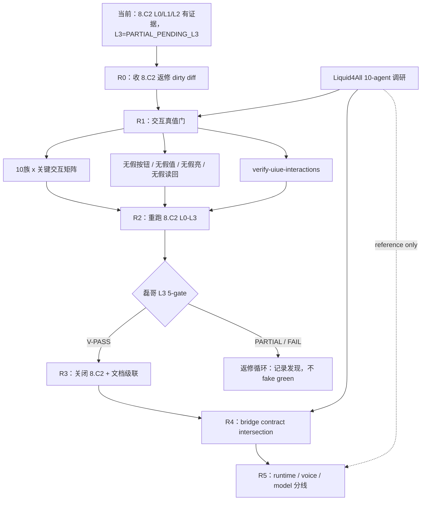

# UIUE 后续路线图基线（2026-06-27，post-8.C2 partial）

## 一句话基线

UIUE 下一阶段不是直接接 runtime，而是先补齐“交互真值门”：当前 `8.C2` 已有 L0/L1/L2 证据，但 L3 人审发现假 affordance、颜色语义和玻璃质感等问题，所以必须先收 8.C2 返修，再建立 10 族关键交互矩阵，随后重新跑 L0-L3。主线 runtime 只在 UIUE 过桥时吸收 bridge contract，不把 UIUE mock 或 Liquid4All 本地 runtime 写成产品 runtime 进度。

## 当前真态

| 线 | 当前状态 | 路线含义 |
|---|---|---|
| UIUE `8.G` | 已完成；`8.G1/2/4/6/7/8/9` 都已有 local/unit 或 simulator L0 边界内收口 | `8.G` 不再是主阻塞，但不等于视觉验收完成 |
| UIUE `8.C2` | `PARTIAL_PENDING_L3`；L0/L1/L2 已有证据，L3 由磊哥发现阻断问题 | 继续 open；修完必须重新人审 |
| A-2 | overall 仍 `PARTIAL` | 不声明 `A-2 complete` |
| 交互层 | 已暴露直接触摸档位、badge、toggle、options、summary/readback 的真值风险 | 需要单独“交互真值门”，不能只靠截图好看 |
| Liquid4All 调研 | `PARTIAL_ADOPT` / `RESEARCH_ONLY` | 可吸收 proof/harness/bridge 形态；禁止直搬 H5、FastAPI、Liquid schema、LFM runner |
| 主线 MAformac | runtime/voice/model 仍是后续分线 | 先做 bridge contract 和 readback smoke，不接真 ASR/LLM/TTS/LoRA |

## 边界

- UIUE 是隔离 presentation lane，证明范围默认是 `local` / `unit` / `simulator_l0_runtime_truth`，不是 mainline proof。
- 当前可做的是 mock 前台的视觉、交互、状态读回、截图取证和合约矩阵。
- 不接真 NLU、ASR、TTS、LoRA、backend，不声明 endpoint-ready、voice-ready、runtime-ready。
- 不用 H5 截图、Preview、ImageRenderer、静态 HTML 或 XCUITest attachment 冒充 UIUE L0/L3。
- Summary 卡片仍以只读和状态摘要为主；展开态可控件必须有真实 mock action、合法值域、外层摘要联动和 readback。
- `continuous_drag` 仍按既有 operator-pass 边界处理；本路线图新增的硬点是“直接触摸档位/选项/开关不能是假 affordance”。

## Grill 标记规则

本文中的 `【SHOULD_GRILL】` 表示：这是后续路线上的候选决策点，进入实现计划前必须再做 grill / pre-mortem / 决策存档。它不是当前已拍板结论，也不能直接当作 OpenSpec SHALL 或完成证据。

需要打 `【SHOULD_GRILL】` 的典型情况：

- 从 Liquid4All、agent-tmux 或其它外部 repo 吸收模式、harness、UI 形态或 runtime 形态。
- 改变 10 族交互语义、控件可点性、summary/readback 规则或直接触摸调节范围。
- 扩大 L0/L1/L2/L3 验收 case、proof class 或人工签核边界。
- 让 UIUE mock 结果进入主线 bridge、runtime、voice、model 或 training 叙事。
- 把临时验证命令升级成长期 make gate。

已由 OpenSpec / grill 决策明确锁定的事项，不重复打标；只按既有 SSOT 执行和回写。

## 2026-06-27 R0-R2 formal grill amendment overlay

本路线图的 R0/R1/R2/R2b `【SHOULD_GRILL】` 已由 `docs/grill-tournament/uiue-r0-r2-grill-decisions-2026-06-27.md` 正式折叠为 canonical groups。该 amendment 的 verdict 是：70 项人审通过，可以正式转写成决策/门禁/债务/预案，但**不是实现授权**，也不关闭 `8.C2`。

| roadmap item | disposition | canonical group | next handling |
|---|---|---|---|
| `StateCellInteractionPolicy` / consumer-side projection | `needs-premortem` | `G-R1-INTERACTION-SSOT` | 已决定不能新增第三份 SSOT；具体落地是 projection、policy 还是 mapper view，进入 R1 前再拍。 |
| `10 族 x 关键交互 cell` 矩阵 | `decided` | `G-R1-MATRIX-PROOF` | 矩阵门成立；实现前还要细化 claimed representative、value type、writeback/readback 和 proof device。 |
| 直接触摸档位、toggle、option/preset、color swatch、badge、summary/readback | `needs-premortem` | `G-R1-VALUE-CONTROL-SEMANTICS`, `G-R1-GEAR-DIRECT-TOUCH`, `G-R1-READONLY-AFFORDANCE` | no fake affordance 已决定；`vehicle.gear` 与 summary direct-control 默认不升级，除非另拍产品边界。 |
| `make verify-uiue-interactions` 或等价专门门 | `needs-premortem` | `G-R1-UIUE-VERIFY-GATE` | UIUE 专门门候选；直接塞进全局 `make verify-all` = `rejected`，除非后续 grill 改判。 |
| R2 visual acceptance case set 扩展 | `needs-premortem` | `G-R2-CASE-MATRIX` | 先分 L0 必跑集、UI test 回归集、unit 补充集，再重跑；不能用 R0/R1 单元绿灯替代 L3。 |
| Layout Integrity Gate | `decided` | `G-R2B-LAYOUT-SPACING` | 作为结构 hard gate 成立；checker 规格和阈值另写，不替代审美/L3。 |
| Visual Spacing Sentinel | `decided` | `G-R2B-LAYOUT-SPACING` | 作为 spacing/zone/safe-area sentinel 成立；输出 PASS/WARN/FAIL，不追 RMSE 当审美裁判。 |
| 胶囊 anchor / GPT Image 2 吸收 | `decided` | `G-R2B-CAPSULE-ANCHOR-ASSET` | anchor 只作方向；内容图不能带预烘焙白壳、白边、内嵌图标或完整 chrome。 |
| VPA/orb 四态与光晕整改 | `decided` | `G-R2B-VPA-ORB-STATES` | idle/listen/think/speak 四态有效；米白主题用实色渐变 + 柔和 shadow，禁止大光晕抢层级。 |
| L3 punchlist 模板 | `decided` | `G-R2-L3-PUNCHLIST` | L0/L1/L2 后先过 punchlist，再问最终 L3 verdict。 |
| Liquid4All bridge/readback/proof harness 借鉴 | `deferred` | amendment non-claims | 仅 `PARTIAL_ADOPT` / `RESEARCH_ONLY`；H5 fullState、FastAPI、Liquid schema、LFM runner 直接迁入 = `rejected`。 |
| UIUE runtime bridge adapter | `needs-premortem` | amendment non-claims | 只允许先谈 mock snapshot 到 bridge adapter 的 presentation 消费；不得声明 runtime-ready。 |
| 非 UIUE runtime、ASR/TTS/Qwen3+LoRA、voice golden、true-device 压力门 | `deferred` | amendment non-claims | 另起 runtime/voice/model proof 线；不由 8.C2 视觉过门自动触发。 |
| Liquid4All `/ws-audio` voice/audio vocabulary | `rejected` for current UIUE; `deferred` as research-only | amendment non-claims | 不能写成 MAformac voice-ready；若吸收 vocabulary，单独 voice/runtime grill。 |

## 路线图

### R0：收当前 8.C2 返修

目标是把现有 8.C2 L3 发现的返修 dirty diff 做成可审计收口：颜色语义、badge/toggle/options、空调模式联动、氛围灯 8 色崩溃、summary/readback 和最小 XCUITest 回归都要闭合。

完成标准：controller 审计通过、subagent 审计问题已修、提交只包含本轮 owned 文件。`8.C2` 仍不能勾选，除非磊哥重新签 L3。

### R1：UIUE Interaction Integrity Hardening

目标是建立“交互真值门”，防止控件看起来能点但没有真实 action、看起来调了但值域/摘要/读回不同步。

路线级交付：

- 【SHOULD_GRILL】新增或等价落地 `StateCellInteractionPolicy` / consumer-side projection：需要拍清这是 presentation consumer policy，还是从现有 mapper 派生，避免第三份 SSOT。
- 【SHOULD_GRILL】建立 `10 族 x 关键交互 cell` 矩阵：需要拍清哪些 cell 必须可控、哪些只读、哪些保留为演示态。
- 【SHOULD_GRILL】覆盖直接触摸档位、toggle、option/preset、color swatch、badge、summary/readback：需要拍清“直接触摸档位”是 10 族通用要求，还是按 value type 分级要求。
- 规则化：可点控件必须写回 mock state；只读/过程态不得显示假按钮；写回必须符合 contract；外层摘要和颜色语义必须跟随。
- 【SHOULD_GRILL】新增 `make verify-uiue-interactions` 或等价专门门：需要拍清它是 UIUE 专门门、预提交门、还是长期主线门；默认先不塞进 `make verify-all`。

### R2：重跑 8.C2 L0-L3

目标是在交互真值门之后重跑视觉验收，而不是用 R0/R1 的单元绿灯替代 L3。

路线级 case 至少覆盖：

- `cooling + ivory`
- 空调制冷/制热模式切换
- 氛围灯 8 色
- 座椅按摩模式
- toggle / option / preset
- 直接触摸档位调节
- golden path deep-space smoke

【SHOULD_GRILL】上述 case 是候选最小集。进入执行前需要拍清是否补齐 10 族代表矩阵、米白/深空组合数量、横竖屏/Reduce Motion/Reduce Transparency 覆盖，以及哪些 case 是 L0 必须、哪些只做 unit/UI test。

L0 继续必须是 on-screen `xcrun simctl io booted screenshot`；L1/L2 继续只做 sentinel/readability/regression evidence；L3 只有磊哥能签 `V-PASS`。

### R2b：胶囊 / VPA / Layout Integrity 整改线

本段是 2026-06-27 8.C2 人审追加基线：胶囊和中间 VPA/orb 已有多轮 SD 决策，不应只按当前截图微调。后续整改必须回到 `SD16`、`SD18`、`SD24`、`SD25` 和 A-2 visual gate 研究，而不是把 anchor 图逐像素照抄，也不能让 GPT 生成图里的预烘焙 artifact 反向决定工程结构。

六点整改线：

1. **收口当前 8.C2 截图阻断**：当前只收 simulator/local 返修，不签 L3；胶囊白边、按钮遮挡、VPA 光晕和四态文案等发现要写入 8.C2 lessons；proof class 仍是 `local/unit/simulator`。
2. **【SHOULD_GRILL】新增 Layout Integrity Gate**：把“遮挡 / 留白 / 右侧按钮外置 / 胶囊居中 / orb 与上下区间距 / mic dock 不遮最后一行卡片”做成 frame 级 UI test 或等价 checker；它挡结构性 UI bug，不替代 L3 审美。
3. **【SHOULD_GRILL】新增 Visual Spacing Sentinel**：在 `Tools/checks/` 增补 layout/spacing sentinel，输入 UI tree frame + screenshot metadata，输出 `overlap_pairs`、`min_gaps`、`zone_budget`、`safe_area_violations`；结果只做 PASS/WARN/FAIL 结构门，不追 RMSE 数字当审美裁判。
4. **胶囊专项整改**：按 SD24/SD25 回到“顶部居中 context surface + 设置/刷新右上 standalone + capsule 最低 ambient + 活体迷你窗 diorama”。当前 `ContextCapsule` 图片只当 placeholder；后续最终 asset 必须是无预烘焙外壳、无内嵌图标的内容图，外层 capsule/mask/glass 由 SwiftUI 负责。
5. **VPA/orb 专项整改**：按 SD16/SD18 回到 `idle/listen/think/speak` 四态生命感光球；米白主题用实色渐变球 + 柔和 shadow，禁止大面积外扩辉光抢层级；注意力链仍是“卡片变化 > TTS 文本 > orb > context capsule”。
6. **L3 前新增人工 punchlist 模板**：L0/L1/L2 之后不直接问“过不过”，先按遮挡、留白、层级、交互手感、玻璃 artifact、状态表达出 punchlist；人审发现一个点，必须用 iceberg teardown 扩到同类组件、同类 value type 和同类 proof gap。

固化边界：

- anchor / GPT Image 2 只定义方向、构图意图和审美 bar；实现必须正向分层逼近，不照抄像素。
- UI tree frame gate 能证明结构不遮挡；截图 sentinel 能挡塌陷；二者都不能签高级感、动效流畅或 V-PASS。
- 胶囊最终美术、true-device GPU/FPS、runtime voice/model 不塞进当前 8.C2 closeout；需要另起 grill / pre-mortem / proof 线。

### R3：UIUE closeout 与文档级联

只有 R2 过 L3 后，才允许关闭 `8.C2`，并同步更新：

- `openspec/changes/ui-presentation/tasks.md`
- `docs/research/2026-06-27-uiue-8c2-l0-l3-visual-acceptance/`
- `docs/grill-checklist/uiue-a2-grill-coverage-index.md`
- `docs/CURRENT.md`
- `docs/README.md`
- 相关 closeout / receipt

如果 L3 给 `PARTIAL` 或 `FAIL`，只回写发现和下一轮返修，不写 V-PASS，不关闭 A-2。

### R4：UIUE 到主线 bridge contract intersection

UIUE 过视觉/交互门后，才进入和主线 runtime-presentation bridge 的交汇。交汇只认 MAformac 自有契约：

- `PresentationSnapshot`
- `DemoRuntimeResult`
- `proofClass`
- `readbacks`
- `scopeOrigins`
- `traceId`
- `VisualEvidenceKind`

【SHOULD_GRILL】Liquid4All 的价值只作为 bridge/readback/proof harness 形态参考；任何吸收项进入 UIUE 或主线前都必须单独 grill，默认 `reference only`。`functions.json`、H5 fullState、FastAPI、Liquid schema 不成为 SSOT。

### R5：runtime / voice / model 分线

UIUE runtime 和非 UIUE runtime 分开推进：

- 【SHOULD_GRILL】UIUE runtime：先做 mock snapshot 到 bridge adapter 的 presentation 消费，不接真 ASR/LLM/TTS/LoRA；进入实现前要拍清 adapter 输入输出、proof class 和回滚点。
- 【SHOULD_GRILL】非 UIUE runtime：后续单独做 Qwen3+LoRA、ASR/TTS、voice golden、移动端/真机压力门；不能让 UIUE 视觉过门自动触发 runtime。
- 【SHOULD_GRILL】Liquid4All `/ws-audio` 只能当 local runtime teardown 和 harness 灵感，不是 MAformac voice-ready；若要借鉴 audio event vocabulary，必须另起 voice/runtime grill。

## 鸟瞰图

## 文档级联规则

- 本文是当前 UIUE 路线图基线，不是 OpenSpec 行为契约，也不是 implementation plan。
- 旧 `docs/uiue-roadmap-2026-06-23.md` 保留为历史推进事实源；当前后续排序以本文为准。
- 每个阶段完成时，先更新 evidence/receipt，再更新 `tasks.md` 或 coverage index；不能用计划文字反推完成。
- 新增 grill 决策才写入 `docs/grill-tournament/`；执行结果写 receipt/coverage，不回改历史决策含义。
- 所有 `【SHOULD_GRILL】` 项如果被推进，必须新增或更新对应 grill 决策文档，并在 closeout 中给出“已 grill / deferred / rejected”状态。
- 主线文档引用 UIUE 时必须标 `isolated UIUE lane` 和 proof class；不能把 UIUE simulator/mock 证据写成 mainline/runtime/mobile proof。

## 非目标

- 不重开投屏验收。
- 不把 8.C2 L1/L2 机器结果升级成审美判断。
- 不把 Liquid4All H5、FastAPI、Liquid schema、LFM runner 迁入 MAformac。
- 不在 UIUE 路线里声明 ASR/TTS/LLM/LoRA/backend ready。
- 不绕过磊哥 L3 人审。

## 下一跳

先完成 formal amendment 的文档级联：storyboard 只轻量引用新 authority；OpenSpec 和 8.C2 evidence 只承接真正行为 SHALL / gate / proof receipt，不勾 `8.C2`。随后才能单独起 R1“UIUE Interaction Integrity Hardening”的 scoped plan。本文只定义路线顺序和边界，不展开实现步骤。
